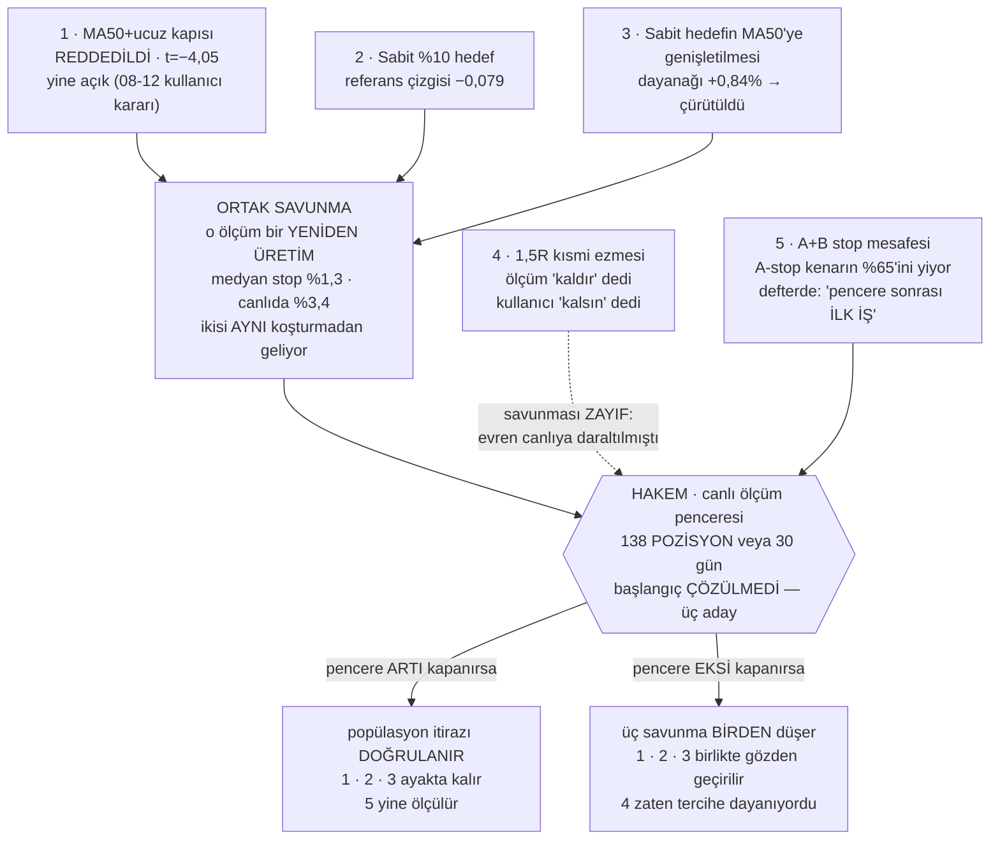

# Durum

Bu dosya **yavaş değişen** şeyleri tutar: kararlar, açık kapılar, bekleyen işler,
bilinen zayıflıklar. **Rakam tutmaz.**

> 🔴 **CANLI RAKAM BURADAN OKUNMAZ.** Kasa, açık pozisyon, PnL, fonlama — bunlar
> **7,5 dakikada bir** değişiyor. Bir kez yazılsa 7 dakika sonra yalan olur.
> Bu ders burada öğrenildi: 2026-08-17 sabahı yazılan rakamlar **aynı gün öğlen**
> bayattı (kasa 228 $ kaymış, 9 işlem geçmiş, bir pozisyon daha açılmıştı).
>
> **Kaynak `testbot_state.json`'dır.** Okumak için:
>
> ```bash
> python -c "import json; s=json.load(open('testbot_state.json',encoding='utf-8')); \
> print('kasa',round(s['equity'],2),'| efektif',s.get('efektif_equity'), \
> '| acik',len(s['acik_pozisyonlar']),'| funding',round(s.get('kumulatif_funding',0),2))"
> ```
>
> Son tur ve süre için `testbot_equity.jsonl`'in son satırı · dört defter için
> `golge_state.json` · `benim_state.json` · `ayna_state.json` · panel için
> `http://127.0.0.1:8787/`.

> Eski `memory/kripto-proje-durumu.md` **güncel değil** (son yazım 2026-08-03; hâlâ
> "Faz 4" ve 1000 $'lık testbot anlatıyor). Tarihsel kayıt olarak duruyor.

---

## Sabit çerçeve

| | |
|---|---|
| Çalışma biçimi | **kâğıt üstünde** — gerçek emir gönderen kod YOK |
| Yayın çıpası | **2026-08-11 12:48:31** — panel bundan sonrasını gösterir |
| 23 Temmuz dönemi | kasa sıfırlamasıyla kapatıldı (delta +1.005,94 $) |
| Süre sınırı | yok (`sure_gun = 0`) |
| Koruma | **düşüş freni** — zirveden %25 geri çekilirse yeni giriş durur, açık pozisyonlar yönetilmeye devam eder |
| Defterler | `testbot` (ölçünün temeli) · `golge` · `benim` · `ayna` — kırılım ve neden hüküm verilemediği `olcumler.md` → defterler |

> ❓ **AÇIK SORU — `benim` defteri dört gündür hareketsiz.** Son işlem 2026-08-13,
> N=6. **Bilinçli olarak mı bırakıldı, yoksa unutuldu mu — hiçbir dosyada yazmıyor.**
> N=6 ile hiçbir şey ölçülemez; dört defterin karar verilemeyecek tek olanı bu.
> Cevap yazılana kadar "çalışan dört defter" demek yanlış.

> ⚠️ **Gölge kasasına bakıp "bot iyi eliyor" DENMEZ.** Defter iki iş yapıyor:
> ~%68'i `pump_long_tezi` (hiç denenmemiş LONG tezi), ~%32'si reddedilen girişler.
> Kaybın büyük kısmı birinciden. Ayrıca gölge LONG ağırlıklı olduğu için fonlamayı
> **tahsil ediyor**, bot ödüyor → **iki kasa doğrudan kıyaslanamaz.**

## Açık kapılar

| kapı | ayar | not |
|---|---|---|
| A+B (funding ≤ −0,05 · oi24 ≥ %10 → SHORT) | **açık** | **ASKIDA** — kanıtlanamadı, çürütülmedi |
| MA50+ucuz (fiyat ≤ $0,07 · MA50 ≥ %3,72) | **açık** | **REDDEDİLDİ** ama kullanıcı kararıyla açık (08-12) |
| Sabit %10 hedef — **A+B *ve* MA50+ucuz** | açık | [testbot.py:1181](testbot.py#L1181) `SABIT_HEDEF_KAPILARI = ("A+B","MA50+ucuz")`. Kısmi kâr %40 payla, trailing kapalı. ⚠️ MA50'ye genişletmenin dayanağı **çürütüldü** — aşağıda madde 3 |
| 1,5R kısmi ezmesi | **açık** | ⚠️ ölçüm "kaldır" dedi, **kullanıcı KALSIN dedi** (08-12) — aşağıda |
| NÖTR LONG | açık | **ölçüm bunu desteklemiyor** — kaynak `fikir-defteri.md` s.1177: *"Ölçüm bunu desteklemiyor — kayda geçer."* 30 LONG hücresinin hiçbiri pozitif değil (s.1101) |
| Gölge LONG pump | açık | gölgede test, pencere dolmadı |
| NÖTR fade | **kapalı** | açıldığı gün ölçülüp kapatıldı |
| R/R kapısı | **kapalı** | ayırt etmiyordu |

## Zamanlı görevler

| görev | sıklık |
|---|---|
| KriptoTestBot | 7,5 dk · `ExecutionTimeLimit` **PT20M** |
| KriptoRadar | 15 dk |
| KriptoNobetci | 5 dk |
| KriptoIzleyici | 5 dk |
| KriptoPiyasa | günlük |

Bildirim: yalnız **giriş** olayı Telegram'a gider (`bildirim.olaylar = ["giris"]`).

---

## Bekleyen kararlar

> **ÖNCE BUNU OKU — 2026-08-12'de verilmiş bir karar var** (`fikir-defteri.md` s.2812).
> Ölçüm `MA50+ucuz`'u kapatmayı öneriyordu (2 yıl, üç rejim, 21.830 olay, t=−4,05).
> **Kullanıcı iki kapıyı da açık bırakmayı seçti.** Bilinçli bir karardı ve defterde
> *"kayda geçiyor ki pencere dolduğunda 'gözden kaçmış' sanılmasın"* diye yazılı.
> Gerekçe: o test bir **yeniden üretim** — medyan stop %1,3, canlıda %3,4. Ölçüm
> "kural geniş uygulanınca negatif" diyor, "canlı kapı negatif" demiyor.
> **Hakem canlı ölçüm penceresi** — tanım, üç aday taban ve sayım komutu aşağıdaki
> *"Üç karar tek hakeme bağlı"* bölümünde. Buraya sayı yazılmaz.

**1. A+B kapısı — nihai karar açık.** İki yıllık **fonlamalı** ölçüm "kapat" diyor
(kontrol sinyali geçti). Fonlamasız 2 yıllık ölçüm ise "kanıtlanamadı ama çürütülmedi"
diyordu (küme-dayanıklı t=+1,51). Canlı 16 işlemlik örnek "kapatmak %1,23 daha kötü
olurdu" diyor. Seçenekler: kapat (`ab_kapisi_acik: 0`) · fonlama-taban filtresi ekle
(ölçülebilir, veri elde) · pencere dolana kadar açık bırak.

**2. `MA50+ucuz` — çürütüldü ama açık, bilerek.** İki kapı **aynı statüde değil**:
A+B *askıda* (kanıtlanamadı, çürütülmedi), MA50+ucuz *reddedildi* (t=−4,05, üç rejimde
negatif). Aynı torbaya konmamalı. Fonlama yükü bu kapı için hiç hesaplanmadı — A+B'yi
bitiren hesap burada yapılmadı.

**3. 1,5R kısmi ezmesi — ölçüm "kaldır" dedi, kullanıcı "kalsın" dedi.** Karar
verilmiş, iş bitmiş; burada duruyor ki sonradan "gözden kaçmış" sanılmasın.

`kismi_pay = 0.40` ayarı fiilen çalışmıyor: [testbot.py:933](testbot.py#L933) her
turda yapısal TP1 ile 1,5×risk'ten **hangisi yakınsa** onu seçiyor (2026-07-04'ten
kalma). Ayrışma sınırı stop < %2,67; `asgari_stop_pct = %2,0` olduğu için bu dar bir
aralık değil — canlı girişlerin **%30'u** bu dilimde. Canlı kanıt: UMA'da stop %0,96
→ 1,5R = %1,43, %40 ayarını ezdi, yarısı **−%1,4'te** satıldı.

**Kullanıcı gerekçesi:** stop dar olduğunda kâr alma erken tetiklenir ve bu istenen
davranış. **Bedeli kayda geçti:** dar-stop diliminde işlem başına −0,016 sermaye,
`t_küme` −0,10 — yani gürültüden ayrışmıyor. Kanıt *"zararlı"* demiyor,
*"bedava değil"* diyor.

Geri dönmek gerekirse tek satır: `tp1_efektif_hesapla` çağrısını
`cikis_modu == "sabit_hedef"` pozisyonlarda atla. **`kismi_kar_r = 0` YAPMA** —
neden olmadığı `CLAUDE.md`'de yazılı (TP1 anında tetikleniyor).

### ⭐ BEŞ İŞ TEK HAKEME BAĞLI — ayrı ayrı tartışılmasın



**Diyagramın söylediği tek şey:** 1, 2 ve 3 bağımsız kararlar değil — **aynı tek
savunmaya** yaslanıyorlar, çünkü 1 ve 2'nin −0,079'u **aynı koşturmadan** geliyor.
4 doğrudan hakeme bağlı ama savunması zayıf (evreni canlıya daraltılmıştı, yani
popülasyon itirazı orada geçerli değil). 5 bir savunma değil, pencereye kilitlenmiş
bir iş.

**Pratik sonuç: pencere dolunca beş ayrı tartışma değil, TEK tartışma yapılır.**

Yukarıdaki maddelerin **1, 2, 3'ü ve sabit %10 hedef** birbirinden bağımsız görünüyor.
Değil. Üçünün savunması **aynı tek argümana** yaslanıyor:

> *"O ölçüm bir yeniden üretim; popülasyonu canlıdan uzak — medyan stop %1,3,
> canlıda %3,4. Yani 'kural geniş uygulanınca negatif' diyor, 'canlı kapı negatif'
> demiyor."*

| ayar | ölçüm ne dedi | savunma |
|---|---|---|
| MA50+ucuz | −0,079 · t=−4,05 · üç rejimde negatif | popülasyon itirazı |
| Sabit %10 hedef | referans çizgisi −0,079 (s.2671) | **aynı koşturmadan** geliyor, aynı itiraz |
| 1,5R kısmi ezmesi | mevcut −0,011 vs kısmi yok +0,038 | kısmen — ama `kismi_15r.py` evreni canlıya **daraltılmıştı** (stop medyanı %3,27), yani burada metodolojik itiraz **zayıf**, karar tercihe dayanıyor |

**Hakem de aynı: canlı ölçüm penceresi.**

> 🔴 **PENCERE BAŞLANGICI ÇÖZÜLMÜŞ DEĞİL — KULLANICI KARARI GEREKİYOR.**
> Üç ayrı "pencere sıfırlandı" ilanı var ve **defter kendi içinde tutarsız.**
> Bu, üç bekleyen kararın hakemi olduğu için önemli; hüküm yazılmadan netleşmeli.
>
> | # | başlangıç | sebep | defter | bugün pozisyon |
> |---|---|---|---|---|
> | 1 | 2026-08-11 12:45 | S9 yürürlüğe girdi | s.1807 | 88 |
> | 2 | **2026-08-11 18:42** | denetim düzeltmeleri | s.2510 | **87** |
> | 3 | 2026-08-12 ~01:17 | cadence 10 dk → 7,5 dk | s.2582 | 84 |
>
> **Çelişki:** En son *ilan edilen* sıfırlama 3 numara (cadence). **Ama projenin
> kendi sonraki muhasebesi 2 numarayı kullanmış:** 2026-08-12 22:56'daki kasa
> sıfırlaması notu pencereyi **"12/138"** diye yazıyor ve **12 yalnızca 18:42
> tabanıyla çıkıyor** (01:17'den 9, 12:45'ten 13). Yani cadence için
> *"PENCERE SIFIRLANDI"* yazılmış ama sayaç fiilen **yeniden tabanlanmamış.**
>
> **Fark 3 pozisyon** (87 vs 84) — hükmü tek başına çevirmez ama ön-kayıt
> disiplini gereği başlangıç keyfî seçilemez. **Karar kullanıcının.**
> Bu not yazılana kadar üç kez üç farklı sayı verildi; sebebi hep aynıydı:
> hangi ön-kaydın geçerli olduğuna bakmadan sayı üretmek.

| | |
|---|---|
| Bitiş ölçütü | **138 kapanmış POZİSYON VEYA 30 gün** — hangisi önce |
| GEÇTİ | toplam net > 0 **ve** ikinci yarı > 0 |
| KALDI | toplam net < 0 **ya da** fren tetiklendi |
| BELİRSİZ | toplam > 0 ama ikinci yarı < 0 → uzat |
| Pencere kuralı | **parametre değişmez, kapı eklenmez, eşik oynatılmaz** |

Üç tabanı birlikte sayan komut — **başlangıç netleşene kadar üçü birlikte okunur:**

```bash
python -c "import json,datetime; k=[json.loads(l) for l in open('testbot_islemler.jsonl',encoding='utf-8') if l.strip()]; \
[print(b,'->',len([x for x in k if x['ts']>=b and not x.get('kismi')]),'/138 pozisyon') \
for b in ('2026-08-11 12:45','2026-08-11 18:42','2026-08-12 01:17')]"
```

*(2026-08-17 öğlen: 88 / 87 / 84 — hangi taban seçilirse.)*

> ⚠️ **İKİ KATLI SAYIM TUZAĞI — pencereyi vaktinden önce dolmuş ilan ettirir.**
> 1. **Yanlış başlangıç:** 12:45'ten sayarsan kayıt sayısı **tam 138** çıkıyor.
> 2. **Kayıt ≠ pozisyon:** o 138 kaydın **50'si `TP1_KISMI`** — kısmi kâr satırları
>    pozisyonu bölüyor.
>
> İkisi birleşince *"pencere bugün doldu"* denir. **Doğru sayı 84.** `--kismi`
> satırları her zaman düşülür (`CLAUDE.md` → pozisyon başına sayım kuralı).

> ⚠️ **Pencerenin ortasında kasa büyüdü — iki tarafı da yazıyorum, karar kullanıcının.**
>
> **2026-08-12 22:56'da** kasa sıfırlamasıyla equity'ye **+1.005,94 $** eklendi.
> Boyutlandırma efektif equity'yle ölçekleniyor ([testbot.py:1120](testbot.py#L1120)),
> yani **pencerenin ikinci yarısında yeni girişlerin boyutu büyüdü.**
>
> **Kararın kendi savunması** (`_kasa_sifirlama` kaydında yazılı): *"Ölçüm penceresi
> SIFIRLANMADI: getiri R ve yüzde ile ölçülüyor, hesap büyüklüğünden bağımsızdır.
> Açık 5 pozisyonun teminatı eski tabana göre hesaplanmıştı; onlar aynen devam eder,
> yalnız YENİ girişler büyür."* Bu savunma geçerli — R ve yüzde ölçek-bağımsızdır.
>
> **Kalan çekince:** dolar cinsinden toplam ve yarı-yarı kıyaslar ölçek-bağımsız
> **değil**; ikinci yarı daha büyük pozisyonlarla çalıştı. Ön-kayıtlı ölçüt
> *"ikinci yarı > 0"* diyor ve o kıyas dolar üzerinden yapılırsa etkilenir.
> **Hüküm yazılırken yarılar R ya da yüzde ile kıyaslanmalı**, dolarla değil.
>
> Buna karşılık **denetim düzeltmeleri ihlal DEĞİL** — 08-11 18:44'te, iki aday
> başlangıcın (18:42 / 01:17) ikisinden de önce ya da onlarla eşzamanlı girdiler.

**Sonuç: tek bir çıktı BEŞ işi birden çözer** — üç ayar kararı (MA50+ucuz · sabit %10
hedef · kısmen 1,5R) + A+B stop mesafesi yeniden ölçümü + sabit hedefin MA50'ye
genişletilmesi. Pencere eksi kapanırsa savunmalar birden düşer; artı kapanırsa popülasyon
itirazı doğrulanır. **Pencere dolduğunda bunları ayrı ayrı tartışma** — aynı sorunun
beş yüzü.

**Aynı pencereye bağlı BEŞİNCİ iş — dayanağı çürütülmüş bir genişletme:**
**Sabit %10 hedefin `MA50+ucuz`'a genişletilmesi.** 08-10 kararı *"A+B'ye özel, diğer
dallar mevcut kısmi+trailing ile kalır"* idi (s.1249). 08-11'de MA50+ucuz da kapsama
alındı ve gerekçe koda yazıldı ([testbot.py:1179](testbot.py#L1179)):
*"ölçümü de %10 hedefle yapıldı (net **+0,84%**, A +0,99 / B +0,72)."*

**O +0,84%, ertesi gün 2 yıllık veride −0,079 · t=−4,05 ile çürütülen ölçümün ta
kendisi** (s.2790). Yani genişletmenin dayanağı çürük ve **bunu şimdiye kadar kimse
bağlamamış.** Pencere sonrası A+B kararıyla **birlikte** gözden geçirilmeli — ayrı
tartışılırsa aynı çürütülmüş ölçüme iki kez dayanılır.

**Aynı pencereye bağlı DÖRDÜNCÜ iş — ve defterde "ilk iş" diye yazılı:**
**A+B'nin stop mesafesi yeniden ölçülecek.** Ölü sinyal taraması A+B'nin ham
kenarının **%65'ini kendi A-stopumuzun yediğini** buldu (+6,10 → +2,14); MA50+ucuz'da
aynı kayıp **%0**. Defterin sözü: *"Pencere kuralı gereği ŞİMDİ UYGULANMAZ
(138 işlem / 30 gün dolana kadar parametre donuk). Pencere sonrası ilk iş bu."*
Ayrıntı ve tablo `olcumler.md` → *"A+B'nin ham kenarının %65'i"*.

Uyarı: 1,5R'nin savunması diğer ikisinden **zayıf.** Onu popülasyon itirazına
yaslamak yanlış olur; o karar açıkça bir tercihti ve bedeli kayıtlı (−0,016/işlem).

**4. `golge.py`'nin `kaydet`'i hâlâ atomik değil** — 2026-08-11'de defteri 314 $
saptıran çift kaydın kök nedeni. `ayna.py` ve `izleyici.py` ilk günden atomik yazıyor;
aynı desen kopyalanacak. Onarım önerildi, uygulanmadı.

⚠️ **2026-08-17'de AĞIRLAŞTI.** Gölge pozisyonları artık `funding_toplam` ve
`funding_yazilan` sayaçlarını taşıyor ve bu sayaçlar **yalnız state'te** yaşıyor —
işlem defterinde karşılıkları yok. Yırtık bir yazım artık sadece equity'yi değil,
**toplamı tutmayan fonlama dilimleri** üretebilir: `funding_yazilan` geri sararsa
aynı dilim iki kez yazılır, ileri kalırsa dilim kaybolur. Fonlama ölçümü gölge
defteri kapsayacaksa bu onarım **önce** yapılmalı.

**5. `ayna` dört defterin git'te izlenen TEK'i — muhtemelen gözden kaçmış.**
`ayna_state.json` · `ayna_islemler.jsonl` · `ayna_equity.jsonl` izleniyor;
`testbot_*` ve diğerleri `.gitignore`'da. **Şimdi karar verilmedi.** Diğerleri gibi
yok sayılacaksa `git rm --cached` gerekir **ve geçmişteki anlık görüntüler yine
kalır** → ilk push öncesi git geçmişi temizliğiyle (madde 6) **birlikte**
düşünülmeli. Not: izlenmesinin bir faydası çıktı — 2026-08-18'deki elle defter
düzeltmesinin tek kalıcı denetim izi git geçmişi oldu (yedek dosyaları
`*.jsonl.yedek-*` deseniyle gitignore'da).

**6. Git geçmişi temizliği** — ilk push'tan önce zorunlu (geçmişte ~920 MB veri).
Depo bugüne kadar hiç push edilmedi.

## Zamana bağlı — ~27 Ağustos

**`d_taker` ölçümü.** İzleyici 2026-08-13 akşamından beri dakika çözünürlüklü
hacim/agresör topluyor (`taker_15`, `taker_60`, `d_taker`, `hacim_x`). Bu veri
**geriye dönük üretilemez**, canlı birikmeli. Birkaç yüz satır olunca ön-kayıtlı
ölçüm yapılacak.

Önem: bugüne kadar ölçülen her şey **seviye** idi ve "erken fiyat hareketinin başka
bir ifadesi" çıktı. `d_taker` **değişim** ölçen ilk sütun.

**Pozisyon başına fonlama** (2026-08-17 eklendi). Aynı sınıf: geri üretilemez veri.
İşlem kaydına `funding_usdt` alanı eklendi; artık "hangi pozisyon ne kadar fonlama
ödedi" sorulabiliyor. **Bu tarihten önce açılmış pozisyonlar için cevap kalıcı
olarak yok.** Alanın tanımı, `null`/`0.0` ayrımı ve süzgeç → **`CLAUDE.md`**.

- **Neden pencere içinde yapıldı:** D/8 ölçütü — *"bu değişiklik botun hangi işlemi
  açacağını değiştiriyor mu?"* Hayır; sayaç ve kayıt alanı, karar dalına dokunmuyor.
  Bug-fix sınıfı, pencereyi beklemesi gerekmiyor.
- **Neden eski pozisyonlara sayaç TAKILMADI:** girişten bugüne kadarki fonlamaları
  kayıp; şimdi biriktirmeye başlasak **yarım ama tam görünen** bir sayı çıkardı.
- **Ne açıyor:** kapı × fonlama kırılımı (`MA50+ucuz` fonlama yükü artık backtest'e
  muhtaç değil), tutuş süresi × fonlama canlı doğrulaması, fonlamalı gerçek R.
- Doğrulama: `scratchpad/funding_pozisyon_testi.py` — 15 kontrol, diske yazım YOK.

## Canlıya geçmeden

Tam liste: `memory/canliya-gecis-kontrol-listesi.md` — kullanıcı hatırlatılmasını
açıkça istedi. Beş madde: `d_taker` ölçümü · fonlamanın canlı doğrulaması · A+B
kararı · MA50 fonlama yükü · gölge atomik kayıt.

---

## Bilinen zayıflık

**⚠️ İKİ `panel_sunucu.py` süreci koşuyor** (2026-08-18'de görüldü): PID 17776
(14 Ağu 00:40) ve PID 29304 (15 Ağu 11:24). İkisi de aynı portu dinleyemez, yani
biri muhtemelen ölü ya da çakışıyor — **ayrı bir soru, araştırılmalı.**

> **Çözerken ÖNCE şunu kaydet: hangi PID gerçekten portu dinliyor?** O bilgi olmadan
> hangisinin öldürüleceği **tahmin** olur.
> ```powershell
> Get-NetTCPConnection -LocalPort 8787 -State Listen |
>   Select-Object LocalPort, OwningProcess
> ```
> **ÖLÇÜLDÜ 2026-08-18** — yanlışı öldürme:
> ```
> PID 29304 (15 Ağu 11:24)  ← 127.0.0.1:8787'yi DİNLİYOR, canlı olan bu
> PID 17776 (14 Ağu 00:40)  ← dinlemiyor, ÖLÜ olan bu
> ```
> Yeniden başlatma panele keep-alive'ı da getirir → iki işi birleştirmek mantıklı.
> Ama **ölçüm penceresi kapanana kadar bekleyebilir**; panel ölçümün parçası değil.

İkinci sonucu: her ikisi de `evren.py`'yi 14/15 Ağustos'ta yükledi, yani panel hâlâ
**eski `get`'i** kullanıyor; keep-alive'ı yeniden başlatılana kadar almayacak.
Gerileme değil (eski davranış korunuyor) ama `keepalive_testi.py`'nin *"panel deseni"*
maddesi **üretimde henüz koşmuyor** — testte geçti, canlıda doğrulanmadı.
Aynı sınıf: `CLAUDE.md` → *"tur ortasında yapılan kod değişikliği o turu etkilemez"*,
uzun ömürlü süreçlerde bu **süreç ömrü boyunca** sürer.

**İnternet/uyku kesintisi.** 13–16 Ağustos arasında toplam **~10 saat** veri akmadı
(en uzunu 124 dk). Makine uyandığında:

- **Dakika verisi geri geliyor** — izleyici son gördüğü bardan devam ediyor, sapma
  1–2 dk (yalnız oluşmakta olan dakika)
- **Bot stop/TP'yi doğru yakalıyor** — geçmiş mumları geri oynatıp stop fiyatından
  kapatıyor
- **Radar kareleri geri GELMİYOR** — noktasal veri (score, funding, oi, comp).
  Kayıp **önlenemez**, ama 2026-08-17'den beri **işaretleniyor**: radar her turda
  önceki arşiv damgasıyla arasındaki boşluğu ölçüyor, eşiği (2× tur = 30 dk) aşarsa
  `radar_bosluk.jsonl`'e kayıt düşüyor. Ayrı dosya — arşive karıştırılırsa onunla
  yapılmış tüm eski ölçümler geçersizleşirdi (`testbot.py:267` ilkesi).
  **Ölçülmüş kayıp oranları ve dönem kırılımı → `olcumler.md`.**

`kesilen_tur` — bitmeden öldürülen tur sayacı; `testbot_state.json`'da yaşıyor, **artar**
(17 Ağustos öğlen: 9). Tur süresi 08-14'ten beri equity satırında ölçülüyor
(`sure_sn`, `sure_yonet`, `sure_giris`, `verisiz_poz`).

**Tur süresi.** ⚠️ *"Yavaşlık tamamen dış kaynaklı"* diye yazılıydı — **2026-08-17'de
çürütüldü.** Ölçüldü: [evren.py:54](evren.py#L54) her çağrıda yeni bağlantı açıyor
(düz `urlopen`, keep-alive yok); günde ~72.000 TCP+TLS el sıkışması. Keep-alive
medyan çağrıyı 2,1 kat, medyan turu **298 → ~145 sn** indiriyor. Yavaşlığın yarısı
**bizim**. Rakamlar ve rate-limit bütçesi → `olcumler.md` "ağ çağrısı bütçesi".
