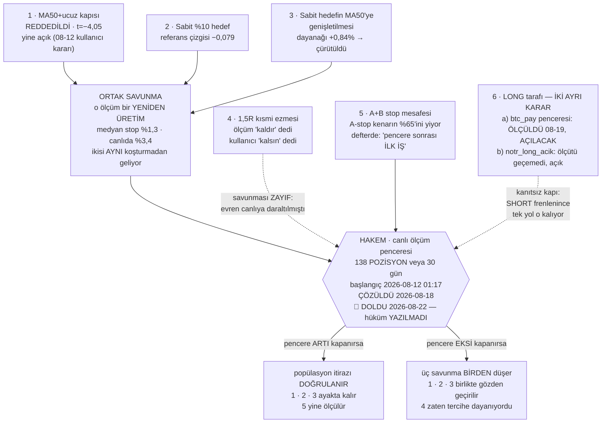

# Durum

Bu dosya **yavaş değişen** şeyleri tutar: kararlar, açık kapılar, bekleyen işler,
bilinen zayıflıklar. **Rakam tutmaz.**

> 🔴 **CANLI RAKAM BURADAN OKUNMAZ.** Kasa, açık pozisyon, PnL, fonlama — bunlar
> **7,5 dakikada bir** değişiyor. Bir kez yazılsa 7 dakika sonra yalan olur.
> Bu ders burada öğrenildi: 2026-08-17 sabahı yazılan rakamlar **aynı gün öğlen**
> bayattı (kasa 228 $ kaymış, 9 işlem geçmiş, bir pozisyon daha açılmıştı).
>
> **Kaynak `testbot_state.json`'dır.** Okumak için:
>
> ```bash
> python -c "import json; s=json.load(open('testbot_state.json',encoding='utf-8')); \
> print('kasa',round(s['equity'],2),'| efektif',s.get('efektif_equity'), \
> '| acik',len(s['acik_pozisyonlar']),'| funding',round(s.get('kumulatif_funding',0),2))"
> ```
>
> Son tur ve süre için `testbot_equity.jsonl`'in son satırı · dört defter için
> `golge_state.json` · `benim_state.json` · `ayna_state.json` · panel için
> `http://127.0.0.1:8787/`.

> Eski `memory/kripto-proje-durumu.md` **güncel değil** (son yazım 2026-08-03; hâlâ
> "Faz 4" ve 1000 $'lık testbot anlatıyor). Tarihsel kayıt olarak duruyor.

---

## Sabit çerçeve

| | |
|---|---|
| Çalışma biçimi | **kâğıt üstünde** — gerçek emir gönderen kod YOK |
| Yayın çıpası | **2026-08-11 12:48:31** — panel bundan sonrasını gösterir |
| 23 Temmuz dönemi | kasa sıfırlamasıyla kapatıldı (delta +1.005,94 $) |
| Süre sınırı | yok (`sure_gun = 0`) |
| Koruma | **düşüş freni** — zirveden %25 geri çekilirse yeni giriş durur, açık pozisyonlar yönetilmeye devam eder |
| Defterler | `testbot` (ölçünün temeli) · `golge` · `benim` · `ayna` — kırılım ve neden hüküm verilemediği `olcumler.md` → defterler |

> ❓ **AÇIK SORU — `benim` defteri dört gündür hareketsiz.** Son işlem 2026-08-13,
> N=6. **Bilinçli olarak mı bırakıldı, yoksa unutuldu mu — hiçbir dosyada yazmıyor.**
> N=6 ile hiçbir şey ölçülemez; dört defterin karar verilemeyecek tek olanı bu.
> Cevap yazılana kadar "çalışan dört defter" demek yanlış.

> ⚠️ **Gölge kasasına bakıp "bot iyi eliyor" DENMEZ.** Defter iki iş yapıyor:
> ~%68'i `pump_long_tezi` (hiç denenmemiş LONG tezi), ~%32'si reddedilen girişler.
> Kaybın büyük kısmı birinciden. Ayrıca gölge LONG ağırlıklı olduğu için fonlamayı
> **tahsil ediyor**, bot ödüyor → **iki kasa doğrudan kıyaslanamaz.**

## Açık kapılar

| kapı | ayar | not |
|---|---|---|
| A+B (funding ≤ −0,05 · oi24 ≥ %10 → SHORT) | **açık** | **ASKIDA** — kanıtlanamadı, çürütülmedi |
| MA50+ucuz (fiyat ≤ $0,07 · MA50 ≥ %3,72) | **açık** | **REDDEDİLDİ** ama kullanıcı kararıyla açık (08-12) |
| Sabit %10 hedef — **A+B *ve* MA50+ucuz** | açık | [testbot.py:1181](testbot.py#L1181) `SABIT_HEDEF_KAPILARI = ("A+B","MA50+ucuz")`. Kısmi kâr %40 payla, trailing kapalı. ⚠️ MA50'ye genişletmenin dayanağı **çürütüldü** — aşağıda madde 3 |
| 1,5R kısmi ezmesi | **açık** | ⚠️ ölçüm "kaldır" dedi, **kullanıcı KALSIN dedi** (08-12) — aşağıda |
| NÖTR LONG | açık | **ölçüm bunu desteklemiyor** — kaynak `fikir-defteri.md` s.1177: *"Ölçüm bunu desteklemiyor — kayda geçer."* 30 LONG hücresinin hiçbiri pozitif değil (s.1101) |
| Gölge LONG pump | açık | gölgede test, pencere dolmadı |
| NÖTR fade | **kapalı** | açıldığı gün ölçülüp kapatıldı |
| R/R kapısı | **kapalı** | ayırt etmiyordu |

## Zamanlı görevler

| görev | sıklık |
|---|---|
| KriptoTestBot | 7,5 dk · `ExecutionTimeLimit` **PT20M** |
| KriptoRadar | 15 dk |
| KriptoNobetci | 5 dk |
| KriptoIzleyici | 5 dk |
| KriptoPiyasa | günlük |
| KriptoPerpSeri | **günlük 03:30** · `ExecutionTimeLimit` PT3H · log `scratchpad/perp_seri_indir.log` |
| **KriptoNotrLong** | **7,5 dk** · `ExecutionTimeLimit` PT20M · log `notrlong_log.txt` |

🔴 **`KriptoPerpSeri` neden var (2026-08-24 kullanıcı kararı):** Binance
`futures/data` uçları (OI · top/global long-short · taker) **yalnız 30 gün** tutuyor.
Bu seriler *çekilemez, ancak arşivlenir* — koşulmadığı her gün pencerenin kuyruğundan
bir gün **kalıcı olarak** düşer. Görev kurulmadan önce bu gerçekten yaşandı: 58
sembolde 07-23…07-26 arası gitti (ayrıntı `CLAUDE.md` → mimari tuzaklar).
Kalıcı uçlar (`klines` · `fundingRate`) bu kapsamda **değil**, onlar her zaman çekilir.

⚠️ **[DEĞİŞTİ 2026-09-06] Yukarıdaki gerekçe ÇÜRÜDÜ** — o veri arşivde 2+ yıl
geriye var, kaydedilen kayıp da geri alınabilir. Görev artık **kritik değil**
(zararsız, koşmaya devam edebilir). Olgu ve kanıt `CLAUDE.md` → *iki sınıf veri*
maddesinde; **buraya kopyalanmıyor.**

Bildirim: yalnız **giriş** olayı Telegram'a gider (`bildirim.olaylar = ["giris"]`).

---

## Bekleyen kararlar

> **ÖNCE BUNU OKU — 2026-08-12'de verilmiş bir karar var** (`fikir-defteri.md` s.2812).
> Ölçüm `MA50+ucuz`'u kapatmayı öneriyordu (2 yıl, üç rejim, 21.830 olay, t=−4,05).
> **Kullanıcı iki kapıyı da açık bırakmayı seçti.** Bilinçli bir karardı ve defterde
> *"kayda geçiyor ki pencere dolduğunda 'gözden kaçmış' sanılmasın"* diye yazılı.
> Gerekçe: o test bir **yeniden üretim** — medyan stop %1,3, canlıda %3,4. Ölçüm
> "kural geniş uygulanınca negatif" diyor, "canlı kapı negatif" demiyor.
> **Hakem canlı ölçüm penceresi** — tanım, taban (ÇÖZÜLDÜ 2026-08-18) ve sayım komutu aşağıdaki
> *"Üç karar tek hakeme bağlı"* bölümünde. Buraya sayı yazılmaz.

**1. A+B kapısı — nihai karar açık.** İki yıllık **fonlamalı** ölçüm "kapat" diyor
(kontrol sinyali geçti). Fonlamasız 2 yıllık ölçüm ise "kanıtlanamadı ama çürütülmedi"
diyordu (küme-dayanıklı t=+1,51). Canlı 16 işlemlik örnek "kapatmak %1,23 daha kötü
olurdu" diyor. Seçenekler: kapat (`ab_kapisi_acik: 0`) · fonlama-taban filtresi ekle
(ölçülebilir, veri elde) · pencere dolana kadar açık bırak.

**2. `MA50+ucuz` — çürütüldü ama açık, bilerek.** İki kapı **aynı statüde değil**:
A+B *askıda* (kanıtlanamadı, çürütülmedi), MA50+ucuz *reddedildi* (t=−4,05, üç rejimde
negatif). Aynı torbaya konmamalı. Fonlama yükü bu kapı için hiç hesaplanmadı — A+B'yi
bitiren hesap burada yapılmadı.

**3. 1,5R kısmi ezmesi — ölçüm "kaldır" dedi, kullanıcı "kalsın" dedi.** Karar
verilmiş, iş bitmiş; burada duruyor ki sonradan "gözden kaçmış" sanılmasın.

`kismi_pay = 0.40` ayarı fiilen çalışmıyor: [testbot.py:933](testbot.py#L933) her
turda yapısal TP1 ile 1,5×risk'ten **hangisi yakınsa** onu seçiyor (2026-07-04'ten
kalma). Ayrışma sınırı stop < %2,67; `asgari_stop_pct = %2,0` olduğu için bu dar bir
aralık değil — canlı girişlerin **%30'u** bu dilimde. Canlı kanıt: UMA'da stop %0,96
→ 1,5R = %1,43, %40 ayarını ezdi, yarısı **−%1,4'te** satıldı.

**Kullanıcı gerekçesi:** stop dar olduğunda kâr alma erken tetiklenir ve bu istenen
davranış. **Bedeli kayda geçti:** dar-stop diliminde işlem başına −0,016 sermaye,
`t_küme` −0,10 — yani gürültüden ayrışmıyor. Kanıt *"zararlı"* demiyor,
*"bedava değil"* diyor.

Geri dönmek gerekirse tek satır: `tp1_efektif_hesapla` çağrısını
`cikis_modu == "sabit_hedef"` pozisyonlarda atla. **`kismi_kar_r = 0` YAPMA** —
neden olmadığı `CLAUDE.md`'de yazılı (TP1 anında tetikleniyor).

**🔴 YENİ — TEŞHİS YER DEĞİŞTİRDİ (2026-08-26). Karar ALINMADI, soru DEĞİŞTİ.**

Dört ön-kayıtlı ölçüm arka arkaya koşuldu ve teşhisi üç kez taşıdı:

```
"skor esigi yanlis yerde"  ->  "LONG tarafinin tamami kaybediyor"  ->  "stop degil, sure degil"
```

Sırayla: `skor` ileri getiriyi **ters** tahmin ediyor · ters kenar **mekanikle**
tutmuyor · `skor ≥ 45` **fren** olarak da doğru teşhis değil (her skor bandı negatif) ·
kenarı **stop yemiyor** (stop eşleşmiş sürede yardım ediyor) ve **süre ayarı da
kurtarmıyor** (hiçbir ufukta pozitif yok).

**Bekleyen karar:** yok — hiçbir kural önerilmedi, bota dokunulmadı.
**Açık soru:** botun LONG tarafı, giriş kapısı ve çıkış ayarı ne olursa olsun bu
evrende kaybediyorsa, sıradaki inceleme **yön/rejim** tarafındadır.
⚠️ Tek pencere (2 ay). İkinci bir pencerede görülmeden kural yazılmaz.

Hüküm metinleri, N, betik ve ölçütler **`olcumler.md`**'de — buraya rakam yazılmaz.
Ön-kayıtlar: `ON_KAYIT_skor_tahmin.md` · `ON_KAYIT_skor_mekanik.md` ·
`ON_KAYIT_skor_fren.md` · `ON_KAYIT_stop_mu_sure_mu.md`.

### ⭐ ALTI İŞ TEK HAKEME BAĞLI — ayrı ayrı tartışılmasın

> 🔴🔴 **PENCERE DOLDU — 2026-08-22 03:13:43** (2026-09-04'te fark edildi).
> Ölçüt *"138 pozisyon **veya** 30 gün"* idi; **pozisyon ölçütü önce doldu.**
> Takvim ölçütü 2026-09-11'de dolacaktı, ona gerek kalmadı.
> **13 gün boyunca fark edilmedi** — aşağıdaki graf doğru kaydedilmişti ama
> onu tetikleyen bir kontrol yoktu. Bu satır o boşluğu kapatmak için var.
>
> **Rakam buraya yazılmaz — koştur:**
>
> ```bash
> python -c "import json,datetime as dt; K=[json.loads(l) for l in open('testbot_islemler.jsonl',encoding='utf-8') if l.strip()]; g={}; [g.__setitem__(r['id'], min(g.get(r['id'], dt.datetime.max), dt.datetime.strptime(r['ts'],'%Y-%m-%d %H:%M:%S')-dt.timedelta(hours=float(r.get('tutma_saat') or 0)))) for r in K]; T=dt.datetime(2026,8,12,1,17); print(len([i for i in {r['id'] for r in K if not r.get('kismi')} if g[i]>=T]),'/138 pozisyon')"
> ```
>
> 🔴 **AMA HÜKÜM HENÜZ YAZILAMAZ.** Pencere içinde fren üç kez değişti ve
> 2026-08-27'de tamamen kapatıldı → pencere **dilimli**. Bu dosyanın kendi
> kuralı (aşağıda, *"DÖRT dilim"*): *"hüküm yazan bu dilimleri ayrı raporlamak
> zorundadır; tek sayı üretmek dört farklı kural setini toplamaktır."*
> Dilim listesi 08-27 kapatmasıyla **güncellenmemiş** — hüküm yazmadan önce
> dilimler yeniden çıkarılmalı.
>
> **Durum: hakem düdüğü çaldı — RAPOR YAZILDI 2026-09-04:**
> **`hakem-penceresi-hukmu.md`** (dilimli rapor + altı kararın açılışı).
>
> Özet: pencere **eksi** kapandı → 1·2·3'ün ortak savunması **düştü**;
> 5 numaralı iş (A+B stop mesafesi) **serbest kaldı**; 6 (LONG tarafı)
> **acil hâle geldi** — bot 24 Ağustos'tan beri tek SHORT açmadı, 176
> ardışık LONG, hepsi zararda. ⚠️ Pencere **kirlendi** (parametreler beş kez
> değişti) ve dilim listesi **dörde değil sekize** bölünüyor; ikisi de
> raporda. **Hiçbir kapı kapatılmadı — statüko korundu.**



**Diyagramın söylediği tek şey:** 1, 2 ve 3 bağımsız kararlar değil — **aynı tek
savunmaya** yaslanıyorlar, çünkü 1 ve 2'nin −0,079'u **aynı koşturmadan** geliyor.
4 doğrudan hakeme bağlı ama savunması zayıf (evreni canlıya daraltılmıştı, yani
popülasyon itirazı orada geçerli değil). 5 bir savunma değil, pencereye kilitlenmiş
bir iş.

**Pratik sonuç: pencere dolunca altı ayrı tartışma değil, TEK tartışma yapılır.**

Yukarıdaki maddelerin **1, 2, 3'ü ve sabit %10 hedef** birbirinden bağımsız görünüyor.
Değil. Üçünün savunması **aynı tek argümana** yaslanıyor:

> *"O ölçüm bir yeniden üretim; popülasyonu canlıdan uzak — medyan stop %1,3,
> canlıda %3,4. Yani 'kural geniş uygulanınca negatif' diyor, 'canlı kapı negatif'
> demiyor."*

| ayar | ölçüm ne dedi | savunma |
|---|---|---|
| MA50+ucuz | −0,079 · t=−4,05 · üç rejimde negatif | popülasyon itirazı |
| Sabit %10 hedef | referans çizgisi −0,079 (s.2671) | **aynı koşturmadan** geliyor, aynı itiraz |
| 1,5R kısmi ezmesi | mevcut −0,011 vs kısmi yok +0,038 | kısmen — ama `kismi_15r.py` evreni canlıya **daraltılmıştı** (stop medyanı %3,27), yani burada metodolojik itiraz **zayıf**, karar tercihe dayanıyor |

**Hakem de aynı: canlı ölçüm penceresi.**

> ✅ **PENCERE BAŞLANGICI ÇÖZÜLDÜ [ÇÖZÜLDÜ 2026-08-18] — İKİ AYRI TABAN vardı,
> karıştırılmışlardı.** Defter tutarsız değildi; iki farklı soruya iki doğru cevap
> veriyordu ve ikisi tek soru sanılmıştı.
>
> | soru | taban | dayanağı |
> |---|---|---|
> | **Bot ne zaman başladı?** (muhasebe tabanı) | **2026-08-11 12:48** | Kullanıcının kendi kararı, `testbot_state.json` → `_kasa_sifirlama`: *"Eski bot (23 Tem – 11 Ağu 12:48)"*. Git: `34524ad` S9 12:46:24. Sayım: o tabandan **tam 12 pozisyon** hem açıldı hem kapandı = notun *"botun KENDİ 12 işlemi"* ifadesi |
> | **Hakem penceresi ne zaman başlıyor?** (parametre-kararlılık tabanı) | **2026-08-12 01:17** | Pencere kuralı *"parametre değişmez"* diyor. 12:48'den sonra **iki gerçek davranış değişikliği** var: `b5123b6` kısmi kâr (08-11 22:38) ve `0b3f3e3` cadence 10→7,5 dk (08-12 01:17). Son değişiklikten önce başlayan bir pencere kendi kuralını ihlal eder |
>
> **Eski üç aday (D/9 gereği silinmez):**
>
> | # | başlangıç | sebep | defter |
> |---|---|---|---|
> | 1 | 2026-08-11 12:45 | S9 yürürlüğe girdi | s.1807 |
> | 2 | 2026-08-11 18:42 | denetim düzeltmeleri | s.2510 |
> | 3 | **2026-08-12 ~01:17** | cadence 10 dk → 7,5 dk | s.2582 |
>
> **Kaydedilen "çelişki" neydi:** *"'12/138' yalnız 18:42 tabanıyla çıkıyor"* denmişti.
> **Yanlıştı** — o sayım yalnız *kapanan* işlemleri sayıyordu. Notun ifadesi *"botun
> **KENDİ** işlemi"*, yani **yeni botun kendi açtığı**. Doğru sayımla:
>
> | taban | pencerede kapanan | **açılıp kapanan** |
> |---|---|---|
> | 11 Ağu 12:45/12:48 | 13 | **12** ✅ |
> | 11 Ağu 18:42 | 12 | 9 |
> | 12 Ağu 01:17 | 9 | 5 |
>
> 18:42'nin "12"si **eski yapılandırmanın açtığı** pozisyonların kapanışlarını içerir —
> onlar tanımı gereği "botun kendi işlemi" değildir.
>
> **2 numaralı aday (18:42) düşer:** ne muhasebe tabanı (o 12:48), ne parametre-kararlılık
> tabanı (o 01:17). Denetim düzeltmeleri **bug onarımıydı** (D/8: tasarlanmış davranışı
> geri getiriyor), yeni bir pencere gerektirmiyordu.
>
> **Hüküm yazılırken kullanılacak taban: 2026-08-12 01:17.** Muhasebe tabanı (12:48)
> kasanın hangi bota ait olduğunu söyler, hakem penceresini değil.

| | |
|---|---|
| Bitiş ölçütü | **138 kapanmış POZİSYON VEYA 30 gün** — hangisi önce |
| GEÇTİ | toplam net > 0 **ve** ikinci yarı > 0 |
| KALDI | toplam net < 0 **ya da** fren tetiklendi |
| BELİRSİZ | toplam > 0 ama ikinci yarı < 0 → uzat |
| Pencere kuralı | **parametre değişmez, kapı eklenmez, eşik oynatılmaz** |

Sayım komutu — **taban 2026-08-12 01:17** (hakem penceresi):

```bash
python -c "import json; k=[json.loads(l) for l in open('testbot_islemler.jsonl',encoding='utf-8') if l.strip()]; ids={}; [ids.setdefault(x['id'],[]).append(x) for x in k]; print(len([i for i,v in ids.items() if any(not y.get('kismi') and y['ts']>='2026-08-12 01:17' for y in v)]),'/138 pozisyon')"
```

Rakam buraya **yazılmaz** — komut koşturulur. Muhasebe tabanını (2026-08-11 12:48)
merak eden aynı komutta tarihi değiştirir; ikisi **farklı soruların** cevabıdır.

> ⚠️ **İKİ KATLI SAYIM TUZAĞI — pencereyi vaktinden önce dolmuş ilan ettirir.**
> 1. **Yanlış taban:** muhasebe tabanından (12:48) sayarsan hakem penceresinden
>    **fazla** çıkar — hakem tabanı 01:17.
> 2. **Kayıt ≠ pozisyon:** kayıtların yaklaşık üçte biri `TP1_KISMI` — kısmi kâr
>    satırları pozisyonu bölüyor.
>
> İkisi birleşince *"pencere bugün doldu"* denir. `kismi` satırları **sayarken** her
> zaman düşülür, **toplarken düşülmez** (`CLAUDE.md` → süzgeç kuralı). Güncel sayı
> yukarıdaki komutla okunur, buraya yazılmaz.

> ⚠️ **Pencerenin ortasında kasa büyüdü — iki tarafı da yazıyorum, karar kullanıcının.**
>
> **2026-08-12 22:56'da** kasa sıfırlamasıyla equity'ye **+1.005,94 $** eklendi.
> Boyutlandırma efektif equity'yle ölçekleniyor ([testbot.py:1120](testbot.py#L1120)),
> yani **pencerenin ikinci yarısında yeni girişlerin boyutu büyüdü.**
>
> **Kararın kendi savunması** (`_kasa_sifirlama` kaydında yazılı): *"Ölçüm penceresi
> SIFIRLANMADI: getiri R ve yüzde ile ölçülüyor, hesap büyüklüğünden bağımsızdır.
> Açık 5 pozisyonun teminatı eski tabana göre hesaplanmıştı; onlar aynen devam eder,
> yalnız YENİ girişler büyür."* Bu savunma geçerli — R ve yüzde ölçek-bağımsızdır.
>
> **Kalan çekince:** dolar cinsinden toplam ve yarı-yarı kıyaslar ölçek-bağımsız
> **değil**; ikinci yarı daha büyük pozisyonlarla çalıştı. Ön-kayıtlı ölçüt
> *"ikinci yarı > 0"* diyor ve o kıyas dolar üzerinden yapılırsa etkilenir.
> **Hüküm yazılırken yarılar R ya da yüzde ile kıyaslanmalı**, dolarla değil.
>
> Buna karşılık **denetim düzeltmeleri ihlal DEĞİL** — 08-11 18:44'te, hakem
> tabanından (2026-08-12 01:17) **önce** girdiler. Aynı şekilde kısmi kâr (08-11 22:38)
> ve cadence (08-12 01:17) de tabandan önce ya da onunla eşzamanlı; pencere zaten
> **son davranış değişikliğinden** başlatıldığı için içeride parametre değişimi yok.

**Sonuç: tek bir çıktı ALTI işi birden çözer** — üç ayar kararı (MA50+ucuz · sabit %10
hedef · kısmen 1,5R) + A+B stop mesafesi yeniden ölçümü + sabit hedefin MA50'ye
genişletilmesi + **NOTR-belirsiz LONG kapısı** (2026-08-19 eklendi).

> ### 🟢 6a ÖLÇÜLDÜ (2026-08-19) — **KARAR: 21 Ağustos'ta kilit açılacak**
>
> `btc_pay` LONG penceresinin `AYI` kilidi **ölçümle sınandı ve haksız çıktı**: kenar
> `NOTR`'da da var ve aynı büyüklükte (**+0,306%** vs AYI **+0,344%**, iki-örneklemli
> **t=+3,13**, iki yarıda da pozitif). Dört ön-kayıtlı ölçütün dördü de geçti.
>
> 🔴 **AMA `BOGA`'da pencere ZARARLI: lift −2,043%, t=−9,95.** Yani kilit kaldırılmaz,
> **YERİ DEĞİŞİR:** `AYI` yerine **`BOGA` HARİÇ**. Bu, orijinal ölçümün kendi uyarısının
> (*"yükselen piyasada ilişki tersine dönebilir — ölçülmedi"*) doğrulanmasıdır.
>
> **Kullanıcı kararı (2026-08-19): 21 Ağustos'ta uygulanacak.** Ölçüm, sınırlar ve
> kümelenme uyarısı → `olcumler.md`. ⚠️ Uygulama **kapı değişikliğidir**, pencereyi
> etkiler.
>
> ### 6b hâlâ açık soru — `notr_long_acik`
>
> Soru *"LONG'u nasıl dengeleriz"* **DEĞİL**. `btc_pay` ölçümü LONG için de sonuç üretmişti (`UST + para durgun → LONG R
> +0,24/+0,16`, holdout) ama o kapı **AYI dalına gömülü**; şu an `bant=UST` ve
> `para=DURGUN` olduğu hâlde `rejim=NOTR` olduğu için erişilemiyor. Boşluğu **ölçülmemiş**
> `notr_long_acik` dolduruyor → 3 işlem, −450 $. Yani **elde güçlü kanıt varken zayıf
> kanıtla işlem açılıyor.** Doğru soru: *"kanıtsız kapıyı neden açık tutuyoruz?"*
> Ayrıntı ve asimetri tablosu `olcumler.md`. Pencere eksi kapanırsa savunmalar birden düşer; artı kapanırsa popülasyon
itirazı doğrulanır. **Pencere dolduğunda bunları ayrı ayrı tartışma** — aynı sorunun
altı yüzü.

**Aynı pencereye bağlı BEŞİNCİ iş — dayanağı çürütülmüş bir genişletme:**
**Sabit %10 hedefin `MA50+ucuz`'a genişletilmesi.** 08-10 kararı *"A+B'ye özel, diğer
dallar mevcut kısmi+trailing ile kalır"* idi (s.1249). 08-11'de MA50+ucuz da kapsama
alındı ve gerekçe koda yazıldı ([testbot.py:1179](testbot.py#L1179)):
*"ölçümü de %10 hedefle yapıldı (net **+0,84%**, A +0,99 / B +0,72)."*

**O +0,84%, ertesi gün 2 yıllık veride −0,079 · t=−4,05 ile çürütülen ölçümün ta
kendisi** (s.2790). Yani genişletmenin dayanağı çürük ve **bunu şimdiye kadar kimse
bağlamamış.** Pencere sonrası A+B kararıyla **birlikte** gözden geçirilmeli — ayrı
tartışılırsa aynı çürütülmüş ölçüme iki kez dayanılır.

**Aynı pencereye bağlı DÖRDÜNCÜ iş — ve defterde "ilk iş" diye yazılı:**
**A+B'nin stop mesafesi yeniden ölçülecek.** Ölü sinyal taraması A+B'nin ham
kenarının **%65'ini kendi A-stopumuzun yediğini** buldu (+6,10 → +2,14); MA50+ucuz'da
aynı kayıp **%0**. Defterin sözü: *"Pencere kuralı gereği ŞİMDİ UYGULANMAZ
(138 işlem / 30 gün dolana kadar parametre donuk). Pencere sonrası ilk iş bu."*
Ayrıntı ve tablo `olcumler.md` → *"A+B'nin ham kenarının %65'i"*.

Uyarı: 1,5R'nin savunması diğer ikisinden **zayıf.** Onu popülasyon itirazına
yaslamak yanlış olur; o karar açıkça bir tercihti ve bedeli kayıtlı (−0,016/işlem).

**4. `golge.py`'nin `kaydet`'i hâlâ atomik değil** — 2026-08-11'de defteri 314 $
saptıran çift kaydın kök nedeni. `ayna.py` ve `izleyici.py` ilk günden atomik yazıyor;
aynı desen kopyalanacak. Onarım önerildi, uygulanmadı.

⚠️ **2026-08-17'de AĞIRLAŞTI.** Gölge pozisyonları artık `funding_toplam` ve
`funding_yazilan` sayaçlarını taşıyor ve bu sayaçlar **yalnız state'te** yaşıyor —
işlem defterinde karşılıkları yok. Yırtık bir yazım artık sadece equity'yi değil,
**toplamı tutmayan fonlama dilimleri** üretebilir: `funding_yazilan` geri sararsa
aynı dilim iki kez yazılır, ileri kalırsa dilim kaybolur. Fonlama ölçümü gölge
defteri kapsayacaksa bu onarım **önce** yapılmalı.

**5. `ayna` dört defterin git'te izlenen TEK'i — muhtemelen gözden kaçmış.**
`ayna_state.json` · `ayna_islemler.jsonl` · `ayna_equity.jsonl` izleniyor;
`testbot_*` ve diğerleri `.gitignore`'da. **Şimdi karar verilmedi.** Diğerleri gibi
yok sayılacaksa `git rm --cached` gerekir **ve geçmişteki anlık görüntüler yine
kalır** → ilk push öncesi git geçmişi temizliğiyle (madde 6) **birlikte**
düşünülmeli. Not: izlenmesinin bir faydası çıktı — 2026-08-18'deki elle defter
düzeltmesinin tek kalıcı denetim izi git geçmişi oldu (yedek dosyaları
`*.jsonl.yedek-*` deseniyle gitignore'da).

**6. Git geçmişi temizliği** — ilk push'tan önce zorunlu (geçmişte ~920 MB veri).
Depo bugüne kadar hiç push edilmedi.

## Zamana bağlı — ~27 Ağustos

**`d_taker` ölçümü.** İzleyici 2026-08-13 akşamından beri dakika çözünürlüklü
hacim/agresör topluyor (`taker_15`, `taker_60`, `d_taker`, `hacim_x`). Bu veri
**geriye dönük üretilemez**, canlı birikmeli. Birkaç yüz satır olunca ön-kayıtlı
ölçüm yapılacak.

Önem: bugüne kadar ölçülen her şey **seviye** idi ve "erken fiyat hareketinin başka
bir ifadesi" çıktı. `d_taker` **değişim** ölçen ilk sütun.

**Pozisyon başına fonlama** (2026-08-17 eklendi). Aynı sınıf: geri üretilemez veri.
İşlem kaydına `funding_usdt` alanı eklendi; artık "hangi pozisyon ne kadar fonlama
ödedi" sorulabiliyor. **Bu tarihten önce açılmış pozisyonlar için cevap kalıcı
olarak yok.** Alanın tanımı, `null`/`0.0` ayrımı ve süzgeç → **`CLAUDE.md`**.

- **Neden pencere içinde yapıldı:** D/8 ölçütü — *"bu değişiklik botun hangi işlemi
  açacağını değiştiriyor mu?"* Hayır; sayaç ve kayıt alanı, karar dalına dokunmuyor.
  Bug-fix sınıfı, pencereyi beklemesi gerekmiyor.
- **Neden eski pozisyonlara sayaç TAKILMADI:** girişten bugüne kadarki fonlamaları
  kayıp; şimdi biriktirmeye başlasak **yarım ama tam görünen** bir sayı çıkardı.
- **Ne açıyor:** kapı × fonlama kırılımı (`MA50+ucuz` fonlama yükü artık backtest'e
  muhtaç değil), tutuş süresi × fonlama canlı doğrulaması, fonlamalı gerçek R.
- Doğrulama: `scratchpad/funding_pozisyon_testi.py` — 15 kontrol, diske yazım YOK.

## 🔴🔴 DÜŞÜŞ FRENİ KAPATILDI (2026-08-27, KULLANICI KARARI)

> **`testbot.maks_dusus_pct`: 25 → 0.** Config `.gitignore`'da olduğu için bu
> değişikliğin **git izi YOK** — kalıcı kaydı burası ve config içindeki
> `_maks_dusus_pct_not` alanı (eski değer orada korunuyor, D/9).
> **Geri alma:** o alanı `25` yap. **Yedek:** oturum scratchpad'inde
> `kripto-config.YEDEK-20260827.json`.

**Kullanıcı gerekçesi:** *"freni kaldır bu bizim veri almayı engeller."*

**Tetikleyen olgu:** fren 08-24 00:06 ve 08-26 17:58'de **iki kez** tetikledi.
İkincisinden sonra testbot ~30 saat boyunca **hiç taramadı** (tur başına taranan
sembol 0). 🔴 **Ve bu dört defteri birden durdurdu:** `golge` · `ayna` · `defter2`
kendi taramalarını yapmıyor, adaylarını testbot'un döngüsünden alıyorlar — üçü de
`AKTIF` yazıp veri üretmez hâle geldi. Son girişleri HALT ile aynı saatte kesildi.

**İki adım uygulandı:** (1) config'de eşik 0, (2) `python testbot.py --devam`
ile `HALT_DUSUS` temizlendi (zirve referansı sıfırlandı).

⚠️ **Bunun bedeli kayda geçiyor:** `min_equity_dur = 50` pratikte hiç tetiklenmez,
yani botta artık **sermaye koruması yok**. Kâğıt üstünde çalıştığı için kabul edildi.

⚠️ **ÖLÇÜM PENCERESİ NOTU** (`CLAUDE.md` → BUG İSTİSNASI sınaması: *"bu değişiklik
botun hangi işlemi açacağını değiştiriyor mu?"*): **EVET değiştiriyor** — fren
kapalıyken bot, açık olsaydı açmayacağı işlemleri açar. Yani 2026-08-27'yi **aşan**
her karşılaştırma iki farklı kural setini karıştırır. Hüküm yazan bunu okumak zorunda.

---

## 🔴🔴 FREN — 2026-08-19'da ÜÇ KEZ DEĞİŞTİ (hepsi KULLANICI KARARI)

> **`esikler.btc_pay_short_freni`.** Config `.gitignore`'da olduğu için bu
> değişikliklerin **git izi YOK** — tek kalıcı kaydı burası ve config içindeki
> `_btc_pay_short_freni_not` alanı (üç kararı da sırayla taşır).
> **Geri alma:** o alanı `1` yap.

| saat | değişiklik | gerekçe (özet) | yedek |
|---|---|---|---|
| 13:44 | 1 → **0** | ölçüm akışı; 2 gündür SHORT girişi yoktu | `...yedek-20260819-134420` |
| 19:30 | 0 → **1** | ölçüm eşit ağırlıkta değil + frenlenen 13 aday −1,198% | `...yedek-20260819-192809` |
| 21:40 | 1 → **0** | ölçüm süreci frenin kararına bağlı kalmasın | `...yedek-20260819-214013` |

⚠️ **19:30 geri açma bu dosyaya 21:40'a kadar İŞLENMEMİŞTİ.** Yani `durum.md` iki
saat boyunca frenin kapalı olduğunu söylerken fren açıktı. Kaydedilmemiş indeks
yalan söyler — bu maddenin kendisi o kuralın kanıtı.

**Kullanıcının gerekçesi:** *"8 gündür fren açıktı ve bot poza giriyordu, devam etsin;
2 gün içinde oluşan pozlardan doğru sonuç çıkmaz."* Öncül **doğrulandı** — 7-17 Ağustos
arası **11 gün** fren hiç devreye girmedi; 18-19'da açıldı ve SHORT girişi sıfırlandı.

### ⚠️ BU BİR ÖLÇÜM PENCERESİ İHLALİDİR — hüküm yazan bunu okumak zorunda

Pencere kuralı: *"parametre değişmez, kapı eklenmez, eşik oynatılmaz."* Kural seti
**92 pozisyonda** değişti. Kullanıcıya üç seçenek sunuldu (sıfırla / devam / vazgeç);
**"pencereyi DEVAM ettir" seçildi.**

**[DEĞİŞTİ 2026-08-19 — D/9, eski ölçüt SİLİNMEDİ]** Pencere artık **tek sayı olarak
raporlanamaz.** Hüküm yazılırken iki dönem **ayrı** verilir:

```
12 Agu 01:17 - 19 Agu 13:44   FRENLI    (92 pozisyon)
19 Agu 13:44 - 19 Agu 19:30   FRENSIZ   (5 sa 46 dk, 4 SHORT, realize+acik -46,22)
19 Agu 19:30 - 19 Agu 21:40   FRENLI    (2 sa 10 dk, 14 aday vetolandi)
19 Agu 21:40 - pencere sonu   FRENSIZ   (yeni)
```

**Pencere artık DÖRT dilim taşıyor.** Hüküm yazan bu dilimleri ayrı raporlamak
zorundadır; tek sayı üretmek dört farklı kural setini toplamaktır.

Ön-kayıtlı *"toplam net > 0 **ve** ikinci yarı > 0"* ölçütü bu yüzden **belirsiz** hâle
geldi: "ikinci yarı" artık farklı bir botu ölçüyor. Ölçüt metni değiştirilmedi, ama
**uygulanabilirliği tartışmalı** — 21-22 tartışmasının ilk maddesi bu olmalı.

### ⚠️ Ölçüm frenin HAKLI olduğunu söylüyordu

2026-08-19'da frenlenen 13 aday ileri oynatıldı: **ortalama −1,198%, 9'u STOP**
(`olcumler.md`). Yani fren kapatmak **kaybettiren işlemleri açar.** Kullanıcı bunu
bilerek seçti; gerekçesi kâr değil **ölçüm akışı**.

Ayrıca `btc_pay`, projenin **tek gerçek out-of-sample sinyali** (12 ay · 37.271 gözlem ·
saklı dönem +0,46). **SHORT bacağı şu an devre dışı; LONG bacağı (AYI kolu) dokunulmadı.**

### Fren GERÇEKTEN gecikmeli mi? — ölçüldü (2026-08-19, `scratchpad/fren_gecikme.py`)

Üçüncü değişikliğin gerekçesi *"fren gecikmeli çalışıyor"* idi. 380 günlük
`btc_pay_log` üzerinde tanımsal çözümleme yapıldı — **önerme desteklenmedi:**

| soru | bulgu |
|---|---|
| UST günleri neyle tetikleniyor | **%44,7 bugünün kendi hareketi** · %25,5 dün · %29,8 iki gün önce |
| fren bırakırken ne oluyor | **%83,6 gerçek düşüş** · %16,4 referans yürümesi |
| UST serisinin ömrü | medyan **1 gün** · ortalama 1,7 · en uzun 4 |
| kalibrasyon | UST günleri %24,9 — tasarım %25, **doğru** |

**Gecikme genel değil, BU seriye özgü:** 19 Ağustos'un 3 günlük değişimi +0,4048'in
+0,3022'si 18 Ağustos adımından taşınıyor, günün kendi adımı yalnız +0,0658.

Karar bu bulguya **rağmen** alındı; kullanıcının ikinci gerekçesi (*ölçüm penceresi,
rejimde sınanmamış bir kapının kararına bağlı kalmasın*) bu ölçümden bağımsızdır.

### ✅ Frenin kendi sınırı ÖLÇÜLDÜ (2026-08-19 gece, ön-kayıt `43d2cf5`)

**Sonuç `olcumler.md`'de.** Karar açısından üç madde:

1. **Fren AYI ve NOTR'da GERÇEK.** Ay-kümeli, üç tohumda, baskın ay atılarak
   sınandı; ayakta kaldı (t −2,7 … −4,0).
   ⚠️ **[KAPSAM DARALDI 2026-08-19 gece]** Buraya önce *"şu anki rejim NOTR, yani
   ölçüm frenin şimdi çalışması gerektiğini söylüyor"* yazılmıştı — **fazla ileri
   gitmiş.** BTC'nin 3 günlük getirisi bugün **+8,95%**, bu NOTR gözlemlerinin
   **%99,3 dilimi**. O kuyrukta ölçüm **susuyor** (ham işaret dönüyor, ay-kümeli
   t=−0,79, 9 ay). Doğrusu: **NOTR ortalamasında fren desteklenir; bugünkü keskin
   hareket bölgesinde hüküm yoktur.** Ayrıntı `olcumler.md`. Fren 21:40'ta kapatıldı
   ve bu karar **ölçümle çelişmiyor.**
2. **Frenin BOĞA'da zararlı olduğu iddiası GÜRÜLTÜ.** Ham ölçüt geçti, karıştırıcı
   kontrolü çürüttü (tamamı tek aydan, 2024-12). Ön-kaydın *belirsiz* dalı
   uygulandı: **rejim sınırlaması önerilmiyor.**
3. 🔴 **BUGÜN SABAHKİ LONG KARARININ DAYANAĞI ÇÖKTÜ** → aşağıdaki maddeye bak.

### 🔴 YENİDEN AÇILDI — "21 Ağustos'ta btc_pay LONG kilidi açılacak" kararı

**Bu karar bugün sabah alındı**, dayanağı LONG/NOTR lifti **+0,306% (t=+3,13)** idi.
Aynı akşam ay-kümeli bakışla sınandı: **t = +0,36 / −0,10 / +0,02** (üç tohum) —
**saf gürültü.** Ham lift bile tohuma göre +0,306 → +0,098 → +0,080 oynuyor.

**Kararın "BOĞA HARİÇ" niteleyicisi doğruydu** (LONG BOĞA'da zararlı, t −2,2…−3,0
ayakta). **"AÇ" kısmının dayanağı yok.** 21-22 tartışmasına *karar* olarak değil
**yeniden açık soru** olarak gidiyor.

**Genel ders:** `btc_pay`'in **SHORT bacağı gerçek, LONG bacağı değil.** Aynı vekil,
aynı mekanik, aynı tohumlar — biri görünüyor, diğeri görünmüyor.

⚠️ İki kusur `olcumler.md`'de itiraf edildi: ön-kayıtta **kümelenmiş t** yerine
iki-örnekli t belirtilmişti, ve faz kaydırma **tekrarlanabilir değil**
(`random.seed` modül düzeyinde). Ay-kümeli hükümler üç tohumda kararlı; ham
gözlem-t değil.

### Fren kendiliğinden ne zaman düşecekti

**21 Ağustos.** `btc_d_xs` 17→18 Ağustos'ta tek günde +0,3022 sıçradı; sıçrama 3 günlük
pencereden 21'inde çıkıyordu. Yani ihlal **2 günlük** bir bekleme yerine yapıldı.

Kontrol komutu (rakam buraya yazılmaz, okunur):

```bash
python -c "import json,datetime; r=[json.loads(l) for l in open('btc_pay_log.jsonl',encoding='utf-8') if l.strip()]; d={x['gun']:x['btc_d_xs'] for x in r}; g=r[-1]['gun']; v=r[-1]['btc_d_xs']; ref=(datetime.date.fromisoformat(g)-datetime.timedelta(days=3)).isoformat(); print(g, round(v,4), 'degisim', round(v-d.get(ref,v),4), '-> UST(fren bandi)' if v-d.get(ref,v)>=0.287 else '-> serbest')"
```

## ~~🔴 BTC-pay SHORT freni AÇIK (2026-08-18'den beri)~~ [KAPATILDI 2026-08-19]

**Eski durum (kayıt için korundu):** SHORT girişi kapalıydı; bot yalnız
`NOTR-belirsiz long` kapısından girebiliyordu.

**Ne zaman kalkar:** fren *seviyeye* değil **3 günlük değişime** bakar. `btc_d_xs`
17→18 Ağustos'ta tek günde **+0,3022** sıçradı; sıçrama 3 günlük pencerede kaldığı
sürece fren açık. **21 Ağustos'ta referans noktası 18 Ağustos olur** → sıçrama
pencereden çıkar → fren düşer. Koşul: `btc_d_xs` bugünkü seviyesinde kalırsa
(BTC pay kazanmaya devam ederse fren sürer).

Kontrol komutu (rakam buraya yazılmaz, okunur):

```bash
python -c "import json,datetime; r=[json.loads(l) for l in open('btc_pay_log.jsonl',encoding='utf-8') if l.strip()]; d={x['gun']:x['btc_d_xs'] for x in r}; g=r[-1]['gun']; v=r[-1]['btc_d_xs']; ref=(datetime.date.fromisoformat(g)-datetime.timedelta(days=3)).isoformat(); print(g, round(v,4), 'degisim', round(v-d.get(ref,v),4), '-> FREN' if v-d.get(ref,v)>=0.287 else '-> SERBEST')"
```

**Ölçüldü — fren DOĞRU çalışıyor:** frenlenen 13 aday ileri oynatıldı, ortalama
**−1,198%**, 9'u stop. Kapıyı gevşetmek o işlemleri almak demek. Ayrıntı ve uyarılar
`olcumler.md`.

**KARAR (2026-08-19): hiçbir şey değiştirilmedi.** Gerekçe: (a) fren ölçümle haklı,
(b) pencere hâlâ artıda, (c) parametre değişikliği pencereyi sıfırlar ve **92
pozisyonluk kanıt** ile altı işin hakemi kaybolur, (d) fren iki gün içinde
kendiliğinden kalkıyor.

## Canlıya geçmeden

Tam liste: `memory/canliya-gecis-kontrol-listesi.md` — kullanıcı hatırlatılmasını
açıkça istedi. Beş madde: `d_taker` ölçümü · fonlamanın canlı doğrulaması · A+B
kararı · MA50 fonlama yükü · gölge atomik kayıt.

---

## Bilinen zayıflık

**⚠️ İKİ `panel_sunucu.py` süreci koşuyor** (2026-08-18'de görüldü): PID 17776
(14 Ağu 00:40) ve PID 29304 (15 Ağu 11:24). İkisi de aynı portu dinleyemez, yani
biri muhtemelen ölü ya da çakışıyor — **ayrı bir soru, araştırılmalı.**

> **Çözerken ÖNCE şunu kaydet: hangi PID gerçekten portu dinliyor?** O bilgi olmadan
> hangisinin öldürüleceği **tahmin** olur.
> ```powershell
> Get-NetTCPConnection -LocalPort 8787 -State Listen |
>   Select-Object LocalPort, OwningProcess
> ```
> **ÖLÇÜLDÜ 2026-08-18** — yanlışı öldürme:
> ```
> PID 29304 (15 Ağu 11:24)  ← 127.0.0.1:8787'yi DİNLİYOR, canlı olan bu
> PID 17776 (14 Ağu 00:40)  ← dinlemiyor, ÖLÜ olan bu
> ```
> Yeniden başlatma panele keep-alive'ı da getirir → iki işi birleştirmek mantıklı.
> Ama **ölçüm penceresi kapanana kadar bekleyebilir**; panel ölçümün parçası değil.

İkinci sonucu: her ikisi de `evren.py`'yi 14/15 Ağustos'ta yükledi, yani panel hâlâ
**eski `get`'i** kullanıyor; keep-alive'ı yeniden başlatılana kadar almayacak.
Gerileme değil (eski davranış korunuyor) ama `keepalive_testi.py`'nin *"panel deseni"*
maddesi **üretimde henüz koşmuyor** — testte geçti, canlıda doğrulanmadı.
Aynı sınıf: `CLAUDE.md` → *"tur ortasında yapılan kod değişikliği o turu etkilemez"*,
uzun ömürlü süreçlerde bu **süreç ömrü boyunca** sürer.

**İnternet/uyku kesintisi.** 13–16 Ağustos arasında toplam **~10 saat** veri akmadı
(en uzunu 124 dk). Makine uyandığında:

- **Dakika verisi geri geliyor** — izleyici son gördüğü bardan devam ediyor, sapma
  1–2 dk (yalnız oluşmakta olan dakika)
- **Bot stop/TP'yi doğru yakalıyor** — geçmiş mumları geri oynatıp stop fiyatından
  kapatıyor
- **Radar kareleri geri GELMİYOR** — noktasal veri (score, funding, oi, comp).
  Kayıp **önlenemez**, ama 2026-08-17'den beri **işaretleniyor**: radar her turda
  önceki arşiv damgasıyla arasındaki boşluğu ölçüyor, eşiği (2× tur = 30 dk) aşarsa
  `radar_bosluk.jsonl`'e kayıt düşüyor. Ayrı dosya — arşive karıştırılırsa onunla
  yapılmış tüm eski ölçümler geçersizleşirdi (`testbot.py:267` ilkesi).
  **Ölçülmüş kayıp oranları ve dönem kırılımı → `olcumler.md`.**

`kesilen_tur` — bitmeden öldürülen tur sayacı; `testbot_state.json`'da yaşıyor, **artar**
(17 Ağustos öğlen: 9). Tur süresi 08-14'ten beri equity satırında ölçülüyor
(`sure_sn`, `sure_yonet`, `sure_giris`, `verisiz_poz`).

**Tur süresi.** ⚠️ *"Yavaşlık tamamen dış kaynaklı"* diye yazılıydı — **2026-08-17'de
çürütüldü.** Ölçüldü: [evren.py:54](evren.py#L54) her çağrıda yeni bağlantı açıyor
(düz `urlopen`, keep-alive yok); günde ~72.000 TCP+TLS el sıkışması. Keep-alive
medyan çağrıyı 2,1 kat, medyan turu **298 → ~145 sn** indiriyor. Yavaşlığın yarısı
**bizim**. Rakamlar ve rate-limit bütçesi → `olcumler.md` "ağ çağrısı bütçesi".

## 🔴 ÖLÇÜM YÖNTEMİNDE KUSUR BULUNDU VE DÜZELTİLDİ (2026-08-20)

**Nasıl çıktı:** kullanıcı sordu — *"bu ölçümlerin doğruluğuna güvenmemi
gerektirecek sebep ne?"* Haklı çıktı.

**Kanıt:** aynı 117 işlem, ölçüm mekaniğiyle **−2.400 $**; botun gerçek sonucu
**−489 $**. Ölçümler botu değil **başka bir sistemi** tarif ediyordu.

**Kök sebep:** `CLAUDE.md`'nin *ham getiri → mekanik → portföy* sırası atlandı.
Kural yazılıydı; eksik olan **sınamaydı**. Sınama artık `CLAUDE.md`'de:
*karşılaştırılan hücrelerde stop genişliği eşit mi?*

### Karara etkisi — üç grup

| grup | durum |
|---|---|
| `chg24` bant hükümleri | **DÜZELTİLDİ** — `>40 LONG` yanlış öldürülmüştü; `0..20 SHORT` hükmü kaldırıldı. Ayrıntı `olcumler.md` |
| `btc_pay` hükümleri (dün gece) | ✅ **DENETİMDEN GEÇTİ** — hücreler oynaklıkta yalnız 1,2 kat ayrışıyor, ham getiri üç rejimde de aynı işaret. Tek düzeltme: *"BOĞA'da gürültü"* → **"aynı yönde ama zayıf"** |
| Canlı defter analizleri | ✅ **etkilenmedi** — gerçek sonuçlar kullanıldı, replay değil |

### Ortaya çıkan asıl soru — 21-22 tartışmasına

**Stop, sinyalin üçte ikisini yiyor.** Ölçüldü (`olcumler.md`): stop 1,5 ATR
uzakta, 72 saatlik ufkun doğal menzilinin **%17,7'si**; işlemlerin **%15,1'i**
kazanacakken stopla ölüyor ve bunların **%64'ü ilk 6 saatte**.

Proje 30 çıkış varyantı denedi, hepsi **hedef** ve **kısmi kâr** tarafındaydı.
**Stopun kendisi hiç sorgulanmadı.** Bu, altı bağlı işin yanına yedinci olarak
gidiyor — **karar değil, açık soru.**

## 🆕 DEFTER-2 KURULDU VE BAŞLATILDI (2026-08-20 17:28, KULLANICI KARARI)

**Soru:** *"Mevcut bot yanlış evrende mi avlanıyor?"*

**Neden ayrı defter — mevcut bota EKLENEMEZ.** Ölçüldü: botun **117 gerçek
pozisyonunun %100'ü** bu yapılandırmadan geçemezdi. Botun iki giriş kapısı
**tam olarak** bu evreni dışlıyor (`A+B → funding ≤ −0,05` · `MA50+ucuz →
fiyat ≤ $0,07`). Filtreleri bota eklemek onu *hiç işlem açmayan bot* yapar.

| | bot | defter2 |
|---|---|---|
| evren | funding ≤ −0,05 **veya** fiyat ≤ $0,07 | fiyat > $0,07 · funding > −0,05 · chg24 < %20 · btc_pay ≠ UST |
| yön | LONG + SHORT | **yalnız SHORT** |
| çıkış kuralları | — | **birebir aynı** (bilinçli) |
| pozisyon limiti | 8 | 8 |
| ilk gün açtıkları | `EDEN $0,057` `MOODENG $0,041` `BIO $0,031` `MEGA $0,038` `PENGU $0,007` | `BEAT $0,137` `KAITO $0,368` |

**Sıfır örtüşme** — aynı piyasada, aynı anda, tamamen ayrı coinler.

**Kapanış bildirimi açık (2026-08-20, kullanıcı isteği).** Pozisyon kapanınca
ve TP1'de yarısı kapanınca Telegram'dan mesaj gelir. İki tuzak bilinçli geçildi:
bildirim `_defterde` takasının **dışında** gönderilir (içeride telegram
susturuluyor), ve **olay etiketi verilmez** — config'teki `"olaylar": ["giris"]`
süzgeci olaysız çağrıları geçirir, böylece **botun bildirim ayarı değişmedi.**
Sınama: `scratchpad/defter2_bildirim_testi.py` (25/25).

### 🔴 DEFTER-2 YARIM RİSKLE KOŞUYOR — kıyas yazılmadan ÖNCE okunacak

Ölçüldü (2026-08-20 21:57, 10 pozisyonun 10'u): **`smart_giriste` her girişte
`LONG`**, defter2 ise yalnız SHORT açıyor. `testbot.py:1225` smart-para ters
yöndeyse hedef riski **yarıya** indiriyor:

```
hedef risk = kasa x %1,5  = 151,96 $
smart TERS -> YARI        =  75,98 $      <- her girişte
```

Bu istisna değil, bu evrende **kural**: evren *funding pozitif + pump yok*
coinleri seçiyor, orada smart okuması neredeyse hep LONG çıkıyor.

**Sonucu:** defter2 ile bot **aynı risk seviyesinde koşmuyor** — defter2'nin
toplam maruziyeti tasarlananın yarısı. İki kasayı doğrudan kıyaslayan her cümleye
bu not düşülmelidir (gölge/bot kıyasındaki fonlama asimetrisiyle aynı sınıf hata).
Kaynak: `defter2_state.json` → `risk_usdt` · `smart_giriste`.

⚠️ `defter2.durum()` **kapanan pozisyonu yanlış sayıyor** — `id` sayıyor, TP1
kaydı almış ama hâlâ açık pozisyonları da kapanmış gösteriyor (21:57'de 7 dedi,
gerçek 4). `CLAUDE.md`'nin kayıt/pozisyon tuzağı. Düzeltilmedi.

### Kurulum ayrıntısı

```
dosyalar : defter2_state.json · defter2_islemler.jsonl · defter2_equity.jsonl
           defter2_veto.jsonl   (botun veto_log'una SIZMASIN diye AYRI)
gorev    : KriptoDefter2 · PT7M30S · baslangic 2026-07-02T18:03:41
           testbot ile AYNI periyot, +5 dk kaydirilmis -> faz sabit
kasa     : 10.000 $ sanal  ·  bir tur ~6 saniye
```

#### ⚠️ ZAMANLANMIŞ GÖREV KURARKEN İKİ TUZAK — ikisi de ısırdı, ikisi de düzeltildi

`New-ScheduledTaskSettingsSet`/`New-ScheduledTaskTrigger` **varsayılanları
mevcut görevlerinkinden farklı.** Görev "kuruldu, Ready" göründü ama **koşmadı**:

| ayar | PowerShell varsayılanı | çalışan görevlerde | sonuç |
|---|---|---|---|
| `Repetition.Duration` | **boş** | `P3650D` | tekrar hiç olmuyor |
| `DisallowStartIfOnBatteries` | **True** | `False` | makine bataryadayken görev `Queued`'da takılıyor |

**Teşhis yolu:** `LastTaskResult = 0` ve `State = Ready` **yanıltıcıydı** —
görevin gerçekten koştuğunun tek kanıtı `defter2_state.json`'ın **mtime**'ı.
`State` alanı `Queued` görülünce sebep anlaşıldı.

📌 **Yeni görev kurulurken referans olarak `Export-ScheduledTask -TaskName
"KriptoTestBot"` alınmalı ve XML karşılaştırılmalı.**

🔴 **`testbot.py` dahil hiçbir bot dosyasına DOKUNULMADI** — `git diff` boş.
Defter aday arşivini **salt okur**, kendi sürecinde koşar, botun kilidini almaz.

### Doğrulama (kullanıcı: *"çakışma olmasın, öbür bot akışını değiştirme"*)

| kontrol | sonuç |
|---|---|
| `scratchpad/defter2_testi.py` | **30/30 geçti**, "diske yazım: YOK" |
| import yan etkisi | yok (dosya değişmedi/oluşmadı) |
| kilit çekişmesi | yok — `defter2` `_kilit_al` çağırmaz, ayrı süreç |
| ad çakışması | yok |
| ilk canlı tur sonrası bot dosyaları | **10/10 dosya AYNI** (md5) |
| `veto_log.jsonl` sızıntısı | yok |

### ⚠️ Bilinen zayıflıklar — bilerek kayda geçiyor

1. **Sıralama ölçülmedi.** 8 slot olduğu için adaylar **skora göre** sıralanıyor.
   Ama `A+B` notu *"skor eklemek düşürüyor"* diyor (+0,396 → +0,338). Bu bir
   kapı değil **kapasite kuyruğu**; hüküm yazarken not düşülmeli.
   📌 **Kullanıcı kararı (2026-08-20): "sonra duruma göre değiştiririz."**
   📌 **[2026-08-26] `skor` artık ölçüldü** — sıralama ölçütü olarak kullanılan
   bu alan ileri getiriyi **ters** tahmin ediyor. Hüküm ve sınırlar
   `olcumler.md` → *"`skor` İLERİ GETİRİYİ TAHMİN EDİYOR MU"*. Karar değişmedi.
2. **Dayanak anlamlı değil.** Geçmiş ölçüm ay-kümeli **t=+1,33** ve
   **örneklem içi inşa**. 2 yılın tamamı kullanıldı → tek geçerli hakem
   **ileri zaman**. Bu defter o hakemdir.
3. **Stop onarımı KONMADI** (ölçülmüş +0,057). Konsaydı fark iki kaynaktan
   gelir ve ayrılamazdı.

### Yan bulgu — `golge.py`'de SIZINTI (düzeltilmedi, bildirildi)

`_veto_logla` modül düzeyindeki `VETO_LOGF`'e **korumasız** yazar. `golge.ac`
canlı-aday kapılarında `zorla=False` kullandığı için `rr_veto` tetikleyip
**botun `veto_log.jsonl`'ine** kayıt düşürebiliyor. Dosyada 18 `rr_veto` kaydı
var ve kaynak alanı yok — ayırt edilemiyorlar. `defter2` bu hatayı yapmıyor
(dördüncü takas). **`golge.py`'ye dokunulmadı.**

### Ne zaman hüküm yazılır

Karşılaştırma **eşzamanlı** olduğu için rejim farkı yok. Ölçüt sayısı ve
penceresi **henüz belirlenmedi** — 21-22 tartışmasının maddesi.

## 🆕 DEFTER-3 KURULDU VE BAŞLATILDI (2026-08-25, KULLANICI KARARI)

**Soru:** *"Defter-2 kaybediyor — kayıp EVRENDEN mi geliyor, YÖN KISITINDAN mı?"*

`defter2` yalnız SHORT açtığı için boğa haftasında **yapısı gereği** kaybeder.
O kaybın hangi kaynaktan geldiği ayrılamıyordu. `defter3` bu iki kaynağı ayırır.

| | defter2 | defter3 |
|---|---|---|
| evren | fiyat > $0,07 · funding > −0,05 · chg24 < %20 · btc_pay ≠ UST | **birebir aynı** |
| yön | yalnız SHORT | `chg24 ≥ 0 → SHORT` · `chg24 < 0 → LONG` |
| çıkış · stop · boyutlandırma · `MAKS_POZ` | — | **birebir aynı** (bilinçli) |

**Tek değişken YÖN.** `defter3 − defter2` = yönün etkisi. Ayrıca `chg24 < 0`
alt kümesinde **aynı isimler üzerinde** doğrudan yön kıyası olur (biri SHORT,
diğeri LONG).

🔴 **LONG kolunun KAYBETMESİ BEKLENİYOR.** Bu evrende LONG, ölçümün beş
adımının hepsinde `t < −4` ile reddedilmişti (`CLAUDE.md` → defter tablosu).
Defter o hükmü **ileri zamanda** sınamak için kuruldu; *"gerçekten kötü"* de
tam bir cevaptır. **Hüküm bu kolun kârına göre yazılmaz.**

⚠️ **FORMASYON İCAT EDİLMEDİ.** Kullanıcı *"en iyi formasyonu uygula"* dedi;
uygulanmadı, çünkü 2026-08-25'te yapılan yedi ölçümün **yedisi de olumsuz**
sonuçlandı — konacak ölçülmüş bir formasyon yok. Uydurmak yerine tek değişken
bırakıldı. *(Bu, "en iyi hücre seçilmez" kuralının uygulanmasıdır.)*

### Kurulum ayrıntısı

```
dosyalar : defter3_state.json · defter3_islemler.jsonl · defter3_equity.jsonl
           defter3_veto.jsonl   (botun veto_log'una SIZMASIN diye AYRI)
gorev    : KriptoDefter3 · PT7M30S · trigger baslangici 2026-08-25T16:12:40
kasa     : 10.000 $ sanal
okuma    : python defter3.py --durum   (LONG/SHORT kirilimi + defter2 yan yana)
```

⚠️ **`--durum` fonlamayı AYRI sütunda gösterir.** LONG kolu fonlamayı **öder**,
SHORT kolu **tahsil eder**; net kârı tek sayıya indirgemek iki kolu haksız
kıyaslar. (2026-08-25 ölçümü: fonlama 24 saatte ham kenarın **%85'ini** yiyor.)

### Doğrulama

| kontrol | sonuç |
|---|---|
| kuru test (diske yazan **her** yol stub'lu) | **"DİSKE YAZIM: YOK"** · `defter3_*` dosyası oluşmadı |
| `testbot._DEFTER` geri alındı | evet (`finally`) |
| `VETO_LOGF` takası | var — `golge.py`'de eksik olan dördüncü koruma |
| `pyflakes` + `py_compile` | temiz |
| bot dosyalarına dokunma | **hiçbiri değişmedi** — `testbot.py` dahil |

### ⚠️ Zamanlanmış görevde SAPMA — ölçüldü, çalışıyor, ama referanstan farklı

```
KriptoTestBot  Interval PT7M30S  Duration 'P3650D'
KriptoDefter2  Interval PT7M30S  Duration 'P3650D'
KriptoDefter3  Interval PT7M30S  Duration ''        <- BOS
```

`durum.md`'nin defter2 bölümü boş `Duration`'ı *"tekrar hiç olmuyor"* diye
kaydetmişti. **Bu vakada olmadı:** trigger 16:12:40'ta başladı, son koşum
19:27:41 — yani `16:12:40 + 26 × 7dk30sn` **tam tutuyor**, 26 tekrar koştu
(`LastTaskResult = 0`). Batarya ayarları da doğru (`DisallowStart=False`).

📌 **Karar: statüko.** Görev kanıtlanmış şekilde koşuyor; şüphede statüko
kuralı gereği dokunulmadı. **Ama eski kayıt bu haliyle eksik** — boş `Duration`
tek başına tekrarı öldürmüyor, öldüren muhtemelen batarya ayarıydı. İkisi
birlikte teşhis edilmiş, ayrılmamış.
🔎 **Denetim:** `Get-ScheduledTaskInfo -TaskName KriptoDefter3` → `LastTaskResult`
ve `defter3_state.json`'ın **mtime**'ı. `State = Ready` tek başına kanıt DEĞİL.

### Ne zaman hüküm yazılır

Ölçüt ve pencere **henüz belirlenmedi** — defter2 ile aynı açık madde.
~~Bir hafta öncesi anlamsız; iki kol da tek haneli N taşır.~~
**[DEĞİŞTİ 2026-08-30]** LONG kolu artık tek haneli değil ve **belirgin
biçimde eksi** (`olcumler.md` → *DEFTER2 vs DEFTER3*). Ön-kayıtın
*"LONG bu evrende `t < −4`"* beklentisiyle aynı yönde. **Hüküm yine de
yazılmadı:** pencere tek, ayı verisi yok, ölçüt hâlâ konmadı.

---

## 🆕 ÖLÇÜMLERİN SIRASI DEĞİŞTİ (2026-08-30)

Bu bölüm **kararları** taşır. Rakamlar `olcumler.md`'dedir ve buraya kopyalanmaz.

### 1. 🔑 ÖDEME ORANI — yeni ölçüt, kural DEĞİL

Dört defterin (`testbot` · `golge` · `defter2` · `defter3`) seçim kuralları
tamamen farklı, kazanma oranları geniş bir aralığa yayılıyor — **ama ödeme
oranı (`ort kazanç / ort kayıp`) dar bir bantta sıkışık ve dördü de 1'in
altında.** Dördü de aynı çıkış kodunu paylaşıyor.

**Karar:** bundan sonra bir **çıkış varyantı** denendiğinde başarı ölçüsü
kazanma oranı değil, **ödeme oranıdır.** `golge` kazanma oranı yüksek olduğu
hâlde kaybediyor — kazanma oranı bu projede yanıltıcı olduğunu kanıtladı.

⚠️ **Bu bir kural ya da kapı değişikliği DEĞİL, ölçüttür.** Çıkış varyantı
denenirse ayrı ön-kayıt gerekir ve **29 varyantın 30.'su olarak sayılır.**
Sıkılaştırma öneriliyorsa **29/29**'a karşı savunma zorunlu
(**[DÜZELTİLDİ 2026-08-31]** — ilk yazımda `28/28` yazmıştım, sayım bayattı).

📌 **Sırada birinci.** Gerekçe: kaybın tamamına dokunuyor, veri elde, maliyet sıfır.

⚠️ **AMA ÖNCE OKU — aynı gün üç ölçüm daha yapıldı ve çıtayı yükseltti:**
`65043f6` (TP1 **döngüseldir**, her ayrıştırmada kontrol katmanı olmalı) ·
`b386738` (zarar seçimden değil **boyut ağırlığından**, ama boyut da TP1
kanalından geçiyor → eyleme dönüştürülemez) · `f6eebc3` (*"artıya geçip geri
verme"* düştü, **çıkış tarafında eyleme dönüşebilir bulgu YOK**).
Ödeme oranı ölçütü bu üçüyle **çelişmiyor** — ana hesabı TP1 koşullaması
içermiyor. Ama *"çıkışı değiştirelim"* önerisi artık bu üçüne de cevap vermeli.

### 2. REJİM DÖNÜŞ DEDEKTÖRÜ — ödül ÖLÇÜLDÜ, küçük

08-24 kaydı *"bot rejim döndüğünde eski yönde işlem açıyor"* diyordu ve bu
uzun süre bir sonraki iş sanıldı. **Ödülün üst sınırı ölçüldü** ve mükemmel bir
dedektörün ana defterde kurtardığı pay küçük çıktı — çünkü kaybın büyük kısmı
**BTC yatayken** oluşuyor, BTC'ye ters düşerken değil.

**Karar:** sıraya **arkaya** kondu. Kapatılmadı, çürütülmedi — ödülü küçük.

🔴 **Yöntem kuralı buradan çıktı:** *"şu veri kaynağını ekleyelim"* önerisi,
**ödülün üst sınırı ölçülmeden** yapılmaz. Bu vakada üst sınır elde olan veriyle
dakikalar içinde hesaplanabiliyordu ve öneriyi çürüttü.

### 3. OPSİYON SKEW / DERIBIT — ertelendi, erişim KAPALI

Bir X gönderisi üzerine incelendi. **Gönderi doğrulandı ve uydurma çıktı**
(Cboe SKEW günde bir kez kapanışta hesaplanıyor, skew gün-sonu ürünü olarak
satılıyor, ücretsiz kaynaklar gecikmeli, iddia edilen 2019 makalesi yok) —
ayrıntı `olcumler.md`'de, **tekrar araştırılmasın diye kayıtlı.**

Altındaki tek gerçek kaynak Deribit (BTC/ETH IV skew + DVOL, genel API).
Üç engel ölçüldü:

- 🔴 **Deribit bu makineden erişilemiyor** (Binance ve genel internet açık) → VPN gerekir
- botun sembollerinin **hiçbirinin** likit opsiyonu yok → ancak piyasa geneli rejim girdisi olabilir
- geçmiş verinin var olup olmadığı **ölçülemedi** (bağlanılamadı); yoksa `perp_seri` gibi ileriye biriktirme gerekir

**Karar:** ertelendi. Denenirse **taban = BTC mumundan üretilen rejim** olarak
sabitlenir (bedava ve kurulu) — TimesFM'i öldüren kıyasın aynısı.

⚠️ Skew'in *"oynaklık girdisi"* olarak ikinci bir kullanımı **bilerek
önerilmedi**: ödül ölçülüp küçük bulunduktan sonra aynı veriye ikinci gerekçe
üretmek, gerekçeyi sonuca uydurmaktır. Denenirse ayrı soru, ayrı ön-kayıt,
**ödül önce ölçülür.**

### 4. TabFM — ELEME TAM, karar kullanıcıda

Kutu dışı (radar tam tarama, skorsuz, doğru ufuk) ölçüldü ve düştü.
Önceki düşüşlerin hükmü *"model botun kısa listesinin içinde bir şey
bulamadı"* idi; artık piyasanın tamamı da gösterildi.

**Sonuç: *"evren dardı / kutu daraltıyordu"* savunması ARTIK KULLANILAMAZ.**
Yeni bir deneme için gereken şey daha geniş evren değil, **bandın dışında yeni
bir girdi.**

📌 **Açık karar (kullanıcıda):** kurulum diskte duruyor (venv + ağırlık,
GB mertebesinde; yeniden indirmesi saatler sürer, silme geri alınamaz).
Artık *"bir sonraki denemede lazım olur"* gerekçesi yok — tek kalan dürüst rolü,
henüz toplanmamış bant-dışı veri için **tavan bulucu** olmak.

### ⚠️ Bu bölümdeki hiçbir madde BOTA DOKUNMUYOR

Dördü de ölçüm/sıralama kararıdır. `testbot.py`, altı defterin dosyaları,
`testbot_state.json` ve zamanlanmış görevler **değiştirilmedi.**

---

## 🆕 GROK/X ÖNERİSİ — AŞAMA 1 ÖLÇÜLDÜ, "HABER KOVALAMA" KOLU KAPANDI (2026-09-01)

Bu bölüm **kararı** taşır. Rakamlar `olcumler.md` → *OLAY KUYRUĞU* bölümündedir
ve buraya kopyalanmaz. Ön-kayıt: `ON_KAYIT_olay_kuyrugu.md` (commit `dd5b94d`).

### Ne soruldu

Kullanıcının önerisi üç koldu: (1) Grok'tan sayısal parametre, (2) Grok'un
**rejim etiketi** olması, (3) *"AVAX'la ilgili haber gelince sana bildirir, sen
analiz edip poz almamı sağlarsın."*

Üçünden **yalnız (3) geriye test edilebilirdi** — ve edildi.

### Karar 1 — 🔴 HABER KOVALAMA AKIŞI KURULMAYACAK

Binance'in resmî duyuru arşivi (dakika kesinliğinde damgalı) ile ölçüldü:
**hareket ilk 5 dakikada bitiyor.** `Grok → bildirim → analiz → kullanıcı kararı`
zinciri bunun altına inemez. Medyan olayda bile kaçan hareket büyük ve uç
değerlerden gelmiyor.

**Sonuç:** Aşama 2 (Grok alt botları) *"haber kovalama"* gerekçesiyle **kurulmaz.**
Kurulacaksa başka bir gerekçe gerekir ve o gerekçe ayrıca ölçülür.

### Karar 2 — ⚠️ "KENAR YOK" DENMEDİ, "GÖREMİYORUZ" DENDİ

Birincil hücrenin ileri-getiri testi düştü **ama örneklem, kabul barının altı
katı büyüklükte bir etkiyi bile saptayacak güçte değil** (MDE ölçüldü ve
ön-kayıtta zorunluydu). Bu soru **kapanmadı, cevaplanamadı.**

🔴 Bir gün *"duyuru sonrası kenar denendi, yoktu"* denirse **bu satır yanlıştır.**
Denenen ve düşen şey **insan gecikmesiyle kovalanabilirlik**tir.

### Karar 3 — `perp_listeleme` tanım gereği kovalanamaz

Bir perp kendi listelenmesinden önce var olmadığı için olay öncesi fiyatı da yok:
260 adayın **0'ı** ölçülebildi. Bu tip bir daha aday olarak önerilmez.

### Sırada ne var — DEĞİŞMEDİ

Yukarıdaki *"ÖLÇÜMLERİN SIRASI"* bölümü aynen geçerli: **ödeme oranı birinci.**
Grok kollarından (1) ve (2) hâlâ ölçülmedi; (2) rejim etiketi kolu geriye test
edilemiyor (hindsight), yalnız **ileriye** ölçülebilir ve belirleyici kontrolü
*"`sezon`/`hava`/SMA20/`btc_chg24` sabitken ek bilgi taşıyor mu"* sorusudur.

### Yöntem kuralı — ön-kayıta GÜÇ DENETİMİ eklendi

Bu ölçümden itibaren, *"düştü"* hükmü veren her ön-kayıt **asgari saptanabilir
etkiyi** (MDE) de raporlar. MDE kabul barından büyükse hüküm *"etki yok"* diye
değil **"göremiyoruz"** diye yazılır. Gerekçe: `chg24 >40 LONG` bir kez
"gürültü" diye gömüldü ve ham getiride canlıydı.

---

## 🆕 GROK/X — DUYGU KOLU KAPANDI, TAKVİMLİ MAKRO KOLU DA (2026-09-01)

Kararlar burada; rakamlar `olcumler.md` → *X DUYGUSU* ve *MAKRO KUYRUK*.
Ön-kayıt: `ON_KAYIT_makro_kuyruk.md` (`df8eb1e`).

### Karar 1 — 🔴 DUYGU ÖLÇÜMÜ BİR DAHA ADAY OLARAK ÖNERİLMEZ

Kontrol günleriyle ölçüldü: BTC ne yaparsa yapsın kripto X aynı oranda boğa
konuşuyor. Sert düşüş gününde bile fark ayırt edilemiyor. **Anahtar-kelime
duygu sayımı yön bilgisi taşımıyor.**

⚠️ Bu, `x_sentiment.py`'yi çürütmez — o betik D4'te *okunacak tweet seçmek* için
var, **yön etiketi üretmek** için değil. Zaten skill'de *"auto BOĞA/AYI etiketi
ZAYIF, CEO tweet'leri OKUR"* yazıyordu. Ölçüm o uyarıyı **doğruladı.**

### Karar 2 — 🔴 TAKVİMLİ MAKRO OLAY KOVALANMAZ

FOMC kararları ve tutanakları gerçekten oynatıyor (ilk 5 dakika normalin ~3 katı),
**ama yönlü devamı yok** — 5 dakikada da yok, 2 saatte de. Ve bu kez örneklem
bunu görecek güçte (MDE barın altında), yani hüküm *"göremiyoruz"* değil.

**Sonuç:** takvimli makro olay Grok boru hattı için gerekçe **olamaz**.

### Karar 3 — ⚠️ SÜRPRİZ MAKRO HABER HÂLÂ AÇIK

19 Ağustos'u açıklayan şey Hazine geri-alım haberiydi ve o **sürprizdi**; ölçülen
FOMC ise **takvimli**. Bu iki şey aynı değil. Ayrıca 19 Ağustos'ta ikisi aynı güne
düştü → anekdot **karıştırıcı** taşıyor.

🔴 Bir gün *"makro haber denendi, çıkmadı"* denirse **yanlış olur.** Denenmiş olan
**takvimli** makro olaydır. Sürpriz makro haber ölçülmedi çünkü geçmiş damgaları
doğrulanabilir biçimde alınamadı (`bls.gov` 403; Hazine duyuru arşivi).

### Sırada ne var — DEĞİŞMEDİ

**Ödeme oranı hâlâ birinci.** Grok kollarının bugünkü durumu:

| kol | durum |
|---|---|
| haber kovalama (borsa duyurusu) | 🔴 kapandı — hareket 5 dakikada bitiyor |
| duygu / rejim etiketi | 🔴 kapandı — duygu yön taşımıyor |
| takvimli makro olay | 🔴 kapandı — devam hareketi yok, güç yeterli |
| **sürpriz makro haber** | ⚠️ **açık, ölçülmedi** — damga kaynağı gerekiyor |

### Yöntem — kayda geçen iki şey

1. **Ücretli kazıyıcı sahte kayıt döndürebilir.** Apify aktörü sonuç bulamayınca
   `type="mock_tweet"` yer tutucu döndürüp yine ücret alıyor. Gerçek gönderi
   sanılırsa sayımı kirletir. **Her çekimde damga/mock denetimi zorunlu**
   (`scratchpad/x_mock_denetim.py`).
2. **Zaman penceresi sessizce düşebilir.** Aktörün `since_time`/`until_time`/
   `max_id` alanları saat bileşenini atıp yalnız günü uyguluyor — *doğru gün,
   yanlış saat* döndürüyor. Yalnız X gelişmiş-arama sözdizimi
   (`since:YYYY-MM-DD_HH:MM:SS_UTC`) tutuyor. **"Döndü" başarı değildir.**

---

## 🆕 LONG KİLİDİ ÖLÇÜLDÜ — kapı suçlu değil, YÖN suçlu (2026-09-04)

Karar burada; rakamlar `olcumler.md` → *BOĞA'da LONG — HAM getiri*.
Ön-kayıt `ON_KAYIT_boga_long_ham.md` (`59b7a67`).

### Bulgu 1 — "LONG kilidi" mecaz değil, tam

BOĞA rejiminde SHORT bir **istisnadır** ve istisna pratikte **ulaşılamaz**:
24 Ağustos'tan beri 12.594 aday satırında SHORT şartlarını sağlayan **sıfır**
satır. İlk iki şartı sağlayan 35 satırın tamamı **tek sembol, tek gün**, ve
üçüncü şart (agresif alım) hepsini kesiyor. Yapısal: bir coin başlarken akıllı
para short'sa agresif alım zaten yüksek oluyor — **iki şart birbirini yiyor.**

### Bulgu 2 — 🔴 KAPIYI DARALTMAK ÇÖZÜM DEĞİL

Ham getiri ölçüldü (mekaniksiz): kapı kolu eksi, **ama taranan evrenin tamamı
daha da eksi.** Kapı, tabandan (anlamsız da olsa) **iyi** seçiyor.

**Yani sorun botun neyi seçtiği değil, hangi yöne bastığı.** Bu pencerede BTC
yükselirken alt paralar düşüyordu; bot BTC-hâkimiyeti artan bir fazda alt para
satın alıyordu.

⚠️ **Sonuç:** *"BOĞA-LONG'a ek şart koyalım"* önerisi bu ölçüme karşı savunma
yapmak zorundadır — ek şart kapıyı daraltır, ama kapı zaten tabandan kötü değil.

### Bulgu 3 — `taker` şartı ayırmıyor

SHORT istisnasını kesen şart bu. İki tarafı da ölçüldü: **ikisi de negatif.**
Şartı gevşetmek SHORT adayı üretir ama *"kazananı seçtiği için"* değil,
sadece popülasyonu genişlettiği için. Gevşetme gerekçesi **bu ölçümden çıkmaz**.

### Karar — HENÜZ KARAR YOK, ve bu bilinçli

`CLAUDE.md`: **"Şüphede DAİMA statüko."** Bu Aşama 1'dir (ham getiri).
Kural çıkarmadan önce **mekanik aşaması** gerekiyor: ters yöndeki ham kenarın
botun kendi stopundan sağ çıkıp çıkmadığı. Kayıt duruyor: A-stop bir kez
A+B'nin ham kenarının **%65'ini** yemişti.

🔴 **Ve en büyük sınır:** ölçüm **13 gün ve tek rejim epizodu** — üstelik tam
olarak botun kaybettiği pencere. *"Kaybı kayıp dönemiyle açıklama"* riski
gerçek. Sonraki BOĞA epizodu için hüküm vermez.

### Sırada

1. **Mekanik aşaması** — ters yön botun stop/hedefiyle sağ kalıyor mu (ayrı ön-kayıt).
2. **Stop mesafesi** — hakem raporunun 5. maddesi, pencere kilidi kalktı, hâlâ serbest.
3. Kapıya dokunmak ancak 1 ve 2'den sonra ve **yeni pencere** tanımlanarak.

### Yöntem — kayda geçen

Ön-kayıt birimi **sembol-gün** idi; sembol-günler aynı gün içinde bağımsız
değil (düşüş gününde bütün altlar birlikte düşer). **Gün-kümeli t ek olarak
hesaplandı** ve hüküm zayıflamadı, güçlendi. Bundan sonra sembol-gün birimi
kullanan her ölçüm **gün-kümeli t'yi de raporlar**; ayrıca *"en kötü N gün
çıkarılınca"* dayanıklılık satırı eklenir — bu ölçümde kapı kolunun kırılgan,
taban kolunun sağlam olduğunu tam o satır gösterdi.

---

## 🆕 İKİ REJİM, TEK PİYASA — teşhis yer değiştirdi (2026-09-04)

Karar burada; rakamlar `olcumler.md` → *NOTR'da SHORT — HAM getiri*.
Ön-kayıtlar: `ON_KAYIT_boga_long_ham.md` (`59b7a67`) · `ON_KAYIT_notr_short_ham.md` (`107b2e4`).

### Kullanıcı itirazı haklıydı ve ölçümü genişletti

*"İki rejim var, SHORT ayağı başarılıydı"* — doğrulandı. İlk ham ölçüm yalnız
BOĞA'ya bakıyordu; NOTR eklendi. `MA50+ucuz` çıkarılınca NOTR-SHORT **artıda**.

### Karar 1 — 🔴 TEŞHİS KAPIDA DEĞİL, YÖNDE

Süzgeçsiz taranan evren **iki rejimde de** aşağı sürükleniyordu. Rejim etiketi
botun **yönünü** çevirdi; piyasa çevrilmedi. Bot NOTR'da SHORT'tu (doğru),
BOĞA'ya dönünce LONG'a geçti (yanlış), kaybın %70'i orada.

**Sonuç:** *"kapıyı ayarlayalım"* işi teşhisin merkezinde değil. Merkez,
**rejim etiketinin yön çevirmesi**. Etiketin geç ve yapışkan olduğu zaten
kayıtlı (yukarıdaki rejim bölümü).

### Karar 2 — 🔴 SIRA DEĞİŞTİ: BOYUTLANDIRMA BİRİNCİ

Üç ayrı kesitte aynı şey: **ortalama yüzde getiri ARTI, dolar EKSİ.**
SHORT +%1,52 / −1.815 $ · LONG +%0,77 / −3.861 $ · `MA50+ucuz` +%1,10 / −1.924 $.

Botun **seçimi** ortalama pozitif; parayı kaybettiren **boyutlandırma**.
Bu bulgu üçüncü kez ve iki ayrı rejimde doğrulandı.

⚠️ Kayıtlı engel duruyor: boyut **TP1 kanalından** geçiyor (döngüsel), o yüzden
daha önce eyleme dönüştürülememişti. **Yeni ölçüm bu döngüselliği kırmayı
hedeflemeli** — yoksa dördüncü kez aynı yere varılır.

### Karar 3 — ⚠️ A+B'nin UFKU 12-24 SAAT, 4 SAAT DEĞİL

Ön-kayıtlı hücre (4 saat) düştü ve **güçsüzdü**. Ama ufuk eğrisi 12-24 saatte
anlamlı pozitif ve bu, A+B'nin canlı medyan tutma süresiyle (10,9 saat) ve
canlı yüzde getirisiyle (+%2,51) **birebir tutuyor**.

🔴 **POST-HOC gözlem — kural değil.** Kendi ön-kaydını hak ediyor; bu satır
onu bir bulgu olarak değil, **sınanacak hipotez** olarak kaydeder.

### Karar 4 — ⚠️ `MA50+ucuz` ÇELİŞKİSİ AÇIK BIRAKILDI

Bu ölçümde ham sinyali **pozitif** çıktı (11 gün, NOTR, mekaniksiz); önceki
**dört** ölçüm negatifti (en güçlüsü 2 yıl / 21.830 olay / t=−4,05).
**2 yıllık ölçüm baskın kabul edilir; kapı hakkında karar DEĞİŞMEDİ.**
Çelişki kaydedildi, çözülmedi.

### Sırada — güncellendi

1. **Boyutlandırma** — TP1 döngüselliğini kıracak bir tasarımla (yeni ön-kayıt).
2. **Rejim etiketi** — yön çevirdiği için artık kapılardan önemli.
3. A+B ufku (12-24 saat) — ayrı ön-kayıt.
4. Stop mesafesi — hâlâ serbest, hâlâ ölçülmedi.

### Yöntem — kayda geçen

**Ön-kayıtlı ufuk yanlış seçilebilir.** A+B'nin birincil hücresi 4 saatti ve
düştü; kapının gerçek ufku 12-24 saatti ve bu **canlı tutma süresinden
önceden bilinebilirdi**. Bundan sonra bir kapı için ufuk seçilirken
**o kapının canlı medyan tutma süresine bakılır**, varsayılan kullanılmaz.

---

## 🆕 BOYUTLANDIRMA ÖLÇÜLDÜ — teşhis RİSK PARİTESİNE kaydı (2026-09-04)

Rakamlar `olcumler.md` → *BOYUTLANDIRMA*. Ön-kayıt `ON_KAYIT_boyutlandirma.md` (`161271f`).

### Karar 1 — 🔴 "EŞİT AĞIRLIK" RAKAMI KURAL ÜRETMEZ

Ön-kayıtlı üç ölçüt de geçti (bölünmüş yarı · permütasyon · uç değer) ve
kayda geçiyor. **Ama yorumu geri çekiyorum:** `notional` yapısı gereği stop
mesafesiyle ters orantılı, dolayısıyla `|ret| ∝ 1/notional` **mekanik** bir
bağıntı. Karşı-olgu kısmen boyutlandırma formülünün kendi aritmetiğini ölçüyor.

Ayrıca TP1 katmanı gradyanı çökertiyor (kazanma oranı %82/%53/%26/%17 →
TP1 almayanlarda %21/%11/%14/%12). Bu, projenin **bir kez geri çektiği** aynı çöküş.

### Karar 2 — 🔑 EYLEME DÖNÜŞEBİLEN KISIM: RİSK PARİTESİ TUTMUYOR

Yüzdeden bağımsız ölçüyle (R katı): defter **R cinsinden ARTIDA**
(t=+2,05), **dolar cinsinden EKSİDE**. Fark tamamen riskin sabit olmamasından —
pozisyon başına gerçekleşen dolar riski **4,8 kat** yayılıyor.

**Sebep kodda:** `kaldirac_min`/`kaldirac_max` kırpmaları ve
`kaldirac_guvenlik_kirp`, hedeflenen sabit riski bozuyor.

📌 **Sıradaki iş bu** — ve **kendi ön-kaydını** gerektirir. Soru dar ve
mekanik: *"kaldıraç kırpmaları hedef riski ne sıklıkta ve ne kadar bozuyor,
düzeltilse defter ne olurdu?"*

### Karar 3 — skor boyutu BELİRLEMİYOR

`marjin_pct_hesapla` skoru **%8–12 bandına** sıkıştırıyor ve bant doyuyor
(`skor~notional` = −0,03). *"Skor boyutu şişiriyor"* açıklaması **yanlış**;
bir daha bu gerekçeyle öneri yapılmaz.

### Yöntem — pahalı ders, CLAUDE.md'ye de yazıldı

**Ön-kayıta yazılmış bir gerekçe yanlış olabilir.** *"TP1'e koşullamak aşırı
kontrol olur, çünkü TP1 nedensel yolun üzerinde"* diye yazmıştım. Yanlıştı:
boyut fiyatı etkilemediği için o yol **hiç yok**; TP1 ile boyutun **ortak
nedeni** var (stop mesafesi). Bir değişkeni *"yolun üzerinde"* ilan etmeden
önce **yolun var olup olmadığı** sorulmalı.

---

## 🆕 BOYUTLANDIRMA KOLU KAPANDI — kusur bulunamadı (2026-09-04)

Rakamlar `olcumler.md` → *RİSK PARİTESİ*. Ön-kayıt `ON_KAYIT_risk_paritesi.md` (`cd97004`).

### Karar 1 — 🔴 ÖNCEKİ TURUN "EYLEME DÖNÜŞEBİLİR BULGUSU" ÇÜRÜDÜ

Bir önceki blokta *"risk paritesi tutmuyor, risk 4,8 kat yayılıyor"* yazıp bunu
sıradaki iş ilan etmiştim. Ölçüldü: **gerçekleşen/hedef oranının medyanı 1,000**
ve **hedefin kendi yayılımı da 4,8 kat**. Yayılım kusur değil, tasarımın kendisi
(hedef = equity × %1,5; equity 2,26 kat düştü; smart-karşıda yarılama 2 kat).

`kaldirac_max` **hiç bağlamıyor**. Bağlayan `kaldirac_min` (%54).

⚠️ Bir daha *"kaldıraç kırpmaları riski bozuyor"* gerekçesiyle öneri yapılmaz.

### Karar 2 — BOYUTLANDIRMADA KUSUR YOK

İki tur, iki ön-kayıt, elde eyleme dönüşebilir hiçbir şey yok:

| iddia | akıbet |
|---|---|
| eşit ağırlık daha iyiydi | ölçütler geçti ama **yorum geri çekildi** — formülün kendi aritmetiği |
| risk paritesi bozuk | **çürüdü** |
| `ΣR > 0` → parite tutsa defter artıda | **ZAYIF** — K3 düştü, ikinci yarıda t=+0,78 |
| bot en iyi işlemlerinde riski kısıyor | **desteklenmedi** (t=+1,17 vs +1,69) |

**Bu bir başarısızlık değil, sonuçtur.** Ön-kayıt olmasaydı bu koldan yanlış bir
kod değişikliği çıkardı — üstelik ima ettiği değişiklik *"riski zamanla
azaltmayı bırak"*, yani **düşüş korumasını kaldırmak** olurdu.

### Sırada — güncellendi

1. ~~boyutlandırma~~ **kapandı**
2. **Rejim etiketi** — yön çevirdiği için en büyük kaldıraç (ölçülmedi)
3. A+B'nin 12-24 saatlik ufku — post-hoc gözlem, kendi ön-kaydını bekliyor
4. Stop mesafesi — hâlâ serbest, hâlâ ölçülmedi

---

## 🆕 REJİM ETİKETİ ÖLÇÜLDÜ — bilgi taşıyor, bot TERS kullanıyor (2026-09-04)

Rakamlar `olcumler.md` → *REJİM ETİKETİ*. Ön-kayıt `ON_KAYIT_rejim_etiketi.md` (`32b908f`).

### Karar 1 — 🔴 BOĞA'DA LONG AÇMANIN ÖLÇÜLMÜŞ DAYANAĞI YOK

2 yıl, 611 gün, 566 sembol: `BOGA` günlerinde alt evrenin günlük getirisi
**ortalamada sıfırın anlamlı biçimde altında**. `NOTR` ve `AYI`'dan da düşük.
Bot tam orada geniş LONG kuralı işletiyor.

**7 BOĞA epizodunun 6'sı negatif** ve **güncel epizot 7'nin 5'incisi** —
yani *"bu sefer şanssızlıktı"* savunması **kurulamıyor**.

### Karar 2 — 🔑 ETİKET GÜRÜLTÜ DEĞİL, BU YÜZDEN DAHA CİDDİ

`btc_chg24` sabitlendiğinde fark **duruyor** (%123 korunuyor) → etiket
fiyatın kılığı değil, **bağımsız bilgi taşıyor**. Gürültü olsaydı zararsız
olurdu; bilgi taşıyıp ters kullanılması daha kötüdür.

### Karar 3 — ⚠️ AMA "SÜRÜKLENME" DEĞİL, "KUYRUK"

BOĞA'nın negatifliği **en kötü 5 gün** çıkarılınca anlamlılığını kaybediyor
(medyan yalnız −0,36%). Doğru ifade: *"BOĞA'da her gün düşüyor"* değil,
**"BOĞA alt evrenin en şişman negatif kuyruğunu taşıyor"** — ve bot orada
kaldıraçlı LONG açıyor. Bu bir **risk** ifadesidir, sürüklenme değil.

⚠️ Bu yüzden çözüm *"BOĞA'da SHORT aç"* **değildir**. Ölçüm bunu söylemiyor.

### Karar 4 — kullanıcı uyarısı ölçümü kurtardı

*"11-19'u başka rejim, unutma"* → epizot kırılımı zorunlu kılındı.
O NOTR dilimi (07-25…08-20) alt evrende **+0,231%**, yani hafif **pozitif**
zemin; bot orada SHORT açıp **yine de kazandı**. **Kapıların lehine** bir
gözlem ve havuzda erimişti.

### Sırada

1. ~~boyutlandırma~~ kapandı · 2. ~~rejim etiketi~~ **ölçüldü**
3. **BOĞA-LONG kuralının ne yapılacağı** — üç seçenek var ve hiçbiri henüz
   ölçülmedi: (a) BOĞA'da LONG'u daraltmak (b) BOĞA'da hiç işlem açmamak
   (c) etiketin **kuyruk riskini** boyuta yansıtmak. **Yeni ön-kayıt gerekir.**
4. A+B'nin 12-24 saatlik ufku · 5. Stop mesafesi

### Yöntem — koşumdan önce yakalanan hata

Rejim serisini kendim yeniden yazdım, doğrulanmışla **uyuşmadı** (745 gün vs
611). Üç hata: SEZON ısınması · HAVA'nın SMA'sı günü içeriyordu ·
`TEPKI_RALLISI` NOTR'a haritalanmıştı (**doğrusu AYI**).
**Kural: doğrulanmış kod yeniden YAZILMAZ, ÇAĞRILIR** — ve çağıran betiğe
seri sınaması konur, uyuşmazsa çalışmayı reddeder.

---

## 🆕 BOĞA'DA SEÇİM ÖLÇÜLDÜ — ayırıcı yok, ama HUNİDE iki kusur var (2026-09-04)

Rakamlar `olcumler.md` → *BOĞA'DA SEÇİM*. Ön-kayıt `ON_KAYIT_boga_secim.md` (`2866b50`).

### Kabul edilen kısıt

🔴 **"BOĞA'da işlem açma" seçeneği MASADAN KALKTI** (kullanıcı kararı,
2026-09-04). Aranan şey **BOĞA içinde daha iyi seçim**.

### Karar 1 — botun verisinde ayırıcı YOK

43 hücre tarandı ve **permütasyonla düzeltildi**: 1.000 kez etiketler
karıştırılıp tüm tarama tekrarlandı. Şans eseri bulunan en iyi |t|'nin
**medyanı 2,30**, %95'i **3,12**. Gerçek en iyi **2,94** → eşiği **geçemedi**.

Kazananlar ve kaybedenler 20 alanda birbirine benziyor.

🔑 **Permütasyon olmasaydı bu bir "bulgu" olurdu** ve projenin dördüncü geri
çekmesi olurdu. Bundan sonra **çok alanlı her tarama permütasyonla düzeltilir**.

### Karar 2 — 🔴 HUNİDE İKİ KUSUR (ikisi de zayıf, ikisi de ön-kayıtlı aşama)

1. **`skor ≥ 45` popülasyonu KÖTÜLEŞTİRİYOR**: taranan −0,816% → skor süzgeci
   sonrası **−1,132%**. Botun skoru BOĞA'da **ters seçici**.
2. **`long_veto` TERS çalışıyor**: engellediği dilim **+0,128%**, geçirdiği
   **−0,855%** (fark +0,983%, t=+1,71). 1.170 satırda devreye girdi.

⚠️ İkisi de **istatistiksel olarak zayıf** (t≤1,71). **Kendi ön-kayıtlarını
hak ediyorlar** — özellikle `long_veto`, çünkü kaldırmak **kapı değişikliğidir**.

`blowoff` vetosu **doğru** çalışıyor (kötüyü engelliyor) — dokunulmaz.

### Karar 3 — kapı hiçbir şey eklemiyor

Kapıyı geçenle taranan arasındaki fark **+0,071%, t=+0,18**. Yani mevcut
LONG kapısı seçim değeri **üretmiyor**; ne iyileştiriyor ne kötüleştiriyor.

### Sırada

1. **`long_veto` ölçümü** — engellediği 1.170 satırın karnesi, kendi ön-kaydıyla.
   En somut aday; ters çalışan bir vetoyu düzeltmek kapıyı **daraltmıyor, açıyor**.
2. **Skorun BOĞA'daki ters seçiciliği** — skor bandı × getiri, ayrı ön-kayıt.
3. A+B'nin 12-24 saatlik ufku · 4. Stop mesafesi

---

## 🆕 `long_veto` ÖLÇÜLDÜ — birincil ölçüt GEÇTİ, ilk kez (2026-09-04)

Rakamlar `olcumler.md` → *`long_veto`*. Ön-kayıt `ON_KAYIT_long_veto.md` (`76d1f08`).

### Karar 1 — ✅ VETO, KESTİĞİ DİLİMDE HAKSIZ (4 saatlik ufukta)

`pos < 0.25` (vetonun %68'i, "düşen bıçak" koruması) sağlayan coinler
**+0,131%**, sağlamayanlar **−1,127%** → fark **+1,259%**, gün-t **+2,24**,
ve örneklem bu büyüklüğü görecek güçte.

**Bandın dibindekiler, botun aldıklarından daha iyi gitti.**

### Karar 2 — 🔴 AMA BİLEŞEN KALDIRILMAZ. Üç sebep:

1. **İşaret 24 saatte DÖNÜYOR** (+1,259% → −1,087%). Mekanizma tutarlı:
   düşen bıçak önce **sekiyor**, sonra düşmeye devam ediyor. Veto 4 saatlik
   tutucu için yanlış, 24 saatlik için doğru. Bot 2,2 saat tutuyor.
2. **Vetonun GERÇEKLEŞEN etkisi anlamlı değil** (+0,676%, t=+1,20). Anlamlı
   olan, koşulun **genel popülasyondaki** etkisi — aynı şey değil.
3. **Tüm veto kalksa bile LONG havuzu eksi** (−0,804% → −0,442%). Veto kaybın
   **kaynağı değil**, bir miktar büyüteni.

### Karar 3 — sıradaki adım KOD DEĞİL, MEKANİK AŞAMASI

Soru dar ve ölçülebilir: *"`pos<0.25` adayları botun kendi stopuyla
oynatılsaydı ne olurdu?"* Sekme 4 saat sürüyor; botun stopu 2 saatte
tetikleniyor olabilir — o hâlde ham kenar mekanikte kaybolur.

⚠️ Ve ikinci bir BOĞA epizodu görülmeden kapıya dokunulmaz (13 günlük tek epizot).

### Not — skor kolu bırakıldı

Kullanıcı kararı: *"skorun yanılttığını biliyoruz, hatta ters yönü gösteriyor."*
Huni ölçümündeki *"skor ≥ 45 popülasyonu kötüleştiriyor"* bulgusu kayıtlı,
ölçülmedi.

### Sırada

1. **`pos<0.25` mekanik aşaması** (botun stop/hedefiyle) — ayrı ön-kayıt
2. İkinci BOĞA epizodu — veri birikmesi bekleniyor
3. A+B'nin 12-24 saatlik ufku · 4. Stop mesafesi

---

## 🆕 `pos<0.25` MEKANİK AŞAMASI — kol KAPANDI (2026-09-04)

Rakamlar `olcumler.md` → *`pos<0.25` MEKANİK AŞAMASI*.
Ön-kayıt `ON_KAYIT_pos_mekanik.md` (`5338860`).

### Karar — 🔴 `long_veto`'nun `pos<0.25` bileşeni KALDIRILMAZ

Ham kenar gerçekti (+%1,43, birincil ölçütü geçmişti). **Mekanik onu
tüketti ve tersine çevirdi** (−%0,33). Korunan pay **−%23**.

**Mekanizma çıkış sebeplerinde görünüyor:** sekme 4 saat sürüyor, bot medyanda
**6 saat** tutuyor — yani tam dönüşe kadar. Stop-olma **%91 vs %83**,
TP2'ye ulaşma **%5 vs %15**.

**Kenar var; botun onu alacak mekaniği yok.**

⚠️ **K3 (mekanik eşitliği) GEÇTİ** (1,18× / 1,09×) — *"kıyas bozuk"* itirazı
kurulamıyor. Sonuç sağlam.

### 🔑 Bu, mekanik aşamasının neden zorunlu olduğunun kanıtı

Bu aşama atlansaydı *"vetoyu kaldır, +%1,26 kenar var"* önerisi yazılacaktı ve
bot stop'a yem olan işlemler açacaktı. `CLAUDE.md`'nin
`ham → mekanik → portföy` sırası bu vakada **doğrudan para kurtardı**.

### Kenarı almanın yolu iki bağımsız gerekçeyle KAPALI

~4 saatte çıkmak gerekir = **çıkış sıkılaştırması** → bu projede sıkılaştıran
**30 varyantın 30'u da kaldı**. Ayrıca 13 günlük tek epizot.

### Sırada

1. ~~boyutlandırma~~ · ~~rejim etiketi~~ · ~~BOĞA seçimi~~ · ~~`long_veto`~~ — **dördü de kapandı**
2. **A+B'nin 12-24 saatlik ufku** — post-hoc gözlem, ölçülmedi, canlı veriyle
   tutarlı (medyan tutma 10,9 saat · canlı +%2,51 ≈ ham 12sa +%2,25)
3. **Stop mesafesi** — hakem raporunun 5. maddesi, hâlâ ölçülmedi
4. **İkinci BOĞA epizodu** — veri birikmesi bekleniyor

⚠️ **Bu oturumda dört kol kapandı ve dördü de ön-kayıtla kapandı.**
Hiçbiri "işe yaramadı" değil; dördü de **yanlış bir kod değişikliğini
engelledi.**

---

## 🆕 `pos`'a GÖRE KOŞULLU MEKANİK — İLK AÇIK KALAN ADAY (2026-09-04)

Rakamlar `olcumler.md` → *`pos`'a GÖRE KOŞULLU MEKANİK*.
Ön-kayıt `ON_KAYIT_pos_kosullu_mekanik.md` (`bd92dab`).

### Karar 1 — 🔑 ÇARPICI OLGU: kâr VAR, alınamıyor

`pos<0.25` pozisyonlarının **%99'u artıya geçiyor**, MFE medyanı **+%4,98** —
ve **%91'i stopla** kapanıyor. Kâr yok değil; **tutulamıyor**.

Stopların **%59'u 4. saatten sonra** → teşhis: **çıkış çok geç.**

### Karar 2 — kaldıraç ZAMAN STOPUNDA

| varyant | fark | eşli t |
|---|---|---|
| V1 zaman stopu 6 saat | **+0,721%** | +1,69 |
| V2 TP1'de %100 çıkış | −0,076% | −0,48 |
| **V3 (V1+V2)** | **+0,797%** | **+1,94** |
| V4 stop 2,5×ATR | −1,499% | −2,23 |

**V2 hiçbir şey katmıyor; kazancın tamamı zaman stopundan.** V4 (gevşetme)
belirgin biçimde **kötü**.

### Karar 3 — 🔴 BU KOL KAPANMIYOR, "VERİ BEKLİYOR"

Ön-kayıtlı K1 **düştü** (t=+1,94 < +2,5) **ama**:
- K2 (iki yarı) ✅ · K3 (koşulsuz kontrol) ✅ · K4 (büyüklük) ✅
- **MDE 0,821 > |fark| 0,797 → "GÖREMİYORUZ"**

**K3 kritik:** V3 herkese uygulansa kazanç +%0,797 → **+%0,172**'ye iniyor.
Yani bu **30/30 duvarına çarpan sıradan bir sıkılaştırma DEĞİL** — koşulluluk
gerçek fark yaratıyor.

**Bağlayıcı kısıt N:** `pos<0.25` diliminde yalnız **87 sembol-gün / 13 gün**.
İkinci bir BOĞA epizodu N'i kabaca ikiye katlar; aynı fark o zaman
**t ≈ 2,7** verir ve eşiği geçer.

⚠️ Bu oturumda kapanan dört kolun aksine burada bulgu **yanlışlanmadı** —
yön tutarlı, mekanizma ölçülmüş, koşulsuz kontrolü geçti. **Eksik olan N.**

### Sırada

1. 🔑 **İkinci BOĞA epizodu bekleniyor** — bu aday o zaman yeniden koşulur.
   Ölçüt **şimdiden sabit** (`ON_KAYIT_pos_kosullu_mekanik.md`), sonradan
   gevşetilmeyecek.
2. **Portföy aşaması** — V3 için (8 slot, marjin tavanı). K1 geçmeden yapılmaz.
3. A+B'nin 12-24 saatlik ufku · 4. Stop mesafesi

🔴 **Kod değişmez.** Ne K1 geçti ne portföy aşaması yapıldı; ayrıca koşullu
mekanik çıkış kodunu dallandırır ve bakım maliyeti ölçüme dahil değil.

---

## 🆕 SKOR ÖLÇÜLDÜ — ters değil, BOŞ (2026-09-04)

Rakamlar `olcumler.md` → *SKORUN TERSİ*. Ön-kayıt `ON_KAYIT_skor_tersi.md` (`c83e4a8`).

### Karar 1 — 🔴 "SKOR TERS YÖNÜ GÖSTERİYOR" NOTU DÜZELTİLDİ

Ters-işlem tezi **düştü**: fark +0,392% ama t=+1,22, **ilk yarıda negatif**,
ve gerçek defterde **tam tersi** (yüksek skorlu pozisyonlar daha iyi yüzde
getiri verdi). MDE farkı görecek güçte değil.

**Doğru ifade: skor TERS değil, AYIRMIYOR.**

⚠️ Önceki huni notu (08-**21**'den) *"skor kötüleştiriyor"* diyordu; aynı
ölçüm 08-**22**'den yapılınca fark kayboluyor. **Tek günlük hassasiyet** —
o not kırılgandı, kayda geçti.

### Karar 2 — 🔑 SKOR EŞİĞİNİN KATTIĞI DEĞER: +0,006 PUAN

Eşik adayların **%64'ünü** kesiyor ve taranan evrene göre **+0,006 puan**
katıyor. Ne iyi ne kötü — **etkisiz bir filtre**.

📌 Bu, *"girişi engelleyen kısır kapı olmamalı"* kullanıcı kısıtıyla doğrudan
ilgili: eşik aday sayısını üçte bire indiriyor, karşılığında hiçbir şey vermiyor.
**Ama gevşetmek de ölçülmüş bir kazanç getirmiyor** — ölçüm "etkisiz" diyor,
"kaldır" demiyor.

### Karar 3 — skor boyutlandırmayı da belirlemiyor (TEYİT)

`marjin_pct_hesapla` %8-12 bandına doyuyor; `skor ~ notional = −0,105`.
Daha önce ölçülmüştü, burada teyit edildi. **Kapanmış konu.**

### Sırada

1. 🔑 **`pos<0.25` koşullu mekanik (V3)** — açık aday, veri bekliyor
   (`ON_KAYIT_pos_kosullu_mekanik.md`, ölçüt sabit)
2. ⚠️ **Kullanıcı V3'ün uygulanmasını istedi** — portföy aşaması yapılmadı,
   ön-kayıtlı ölçüt geçmedi. Karar kullanıcıya ait; uygulanırsa
   **yeni pencere** tanımlanmalı ve `[DEĞİŞTİ tarih]` protokolü işletilmeli.
3. A+B'nin 12-24 saatlik ufku · 4. Stop mesafesi

---

## 🆕 SKOR BİLEŞENLERİ ÖLÇÜLDÜ — yetki vardı, DEĞİŞİKLİK YAPILMADI (2026-09-04)

Rakamlar `olcumler.md` → *SKORUN BEŞ BİLEŞENİ*.
Ön-kayıt `ON_KAYIT_skor_bilesenleri.md` (`81c95fb`).

### Karar 1 — 🔴 KOD DEĞİŞMEDİ, ve sebebi ön-kayıt

Kullanıcı **tam yetki** verdi (*"istediğin ayarlamayı yap"*). Ön-kayıt
**koşumdan önce** yazılmıştı ve ölçüt **tutmadı** (K1: t=+1,58 < +2,0,
üstelik MDE farkı görecek güçte değil). **`radar.py` değiştirilmedi.**

### Karar 2 — skor "yanlış ayarlı" değil, BİLGİ TAŞIMIYOR

| bileşen | payı | durum |
|---|---|---|
| `s_oi` | %41 | anlamsız (t=−1,12) **ve rejimler arası işaret değiştiriyor** |
| `s_vol` | %23 | anlamsız **ve işaret değiştiriyor** |
| `s_fund (abs)` | %22 | **t=+0,03 — sıfır bilgi** |
| `s_brk` | %11 | tek sinyalli terim, **ama TERS yönde** (skor puan ekliyor) |
| `s_comp` | %3 | 🔴 **ölü terim** — çeyrekleri çöküyor, dağılımı yok |

🔑 **Skorun %64'ü (`s_oi`+`s_vol`) BOĞA'da bir şey, NOTR'da tersini söylüyor.**
Ön-kayıtın yapısal şüphesi doğrulandı: **tek skorla iki yön seçilemez.**
Ağırlık ayarı bunu çözmez — çözülecek sinyal yok.

### Karar 3 — kodun vadesi geçmiş talimatı KAPANDI

`squeeze_bonus` için kodda *"boğaya girildiğinde yeniden ölçülmelidir"*
yazıyordu. Ölçüldü: **zararlı tersine dönüş yok**, fayda da yok (BOĞA
+0,493%, t=+0,97). **Terim etkisiz.** Talimat yerine getirildi.

⚠️ Yöntem notu: terim ikili olduğu için çeyrek kesimi çöktü; ön-kayıtlı
**soru** değişmeden doğru yöntemle (ikili kesim) koşturuldu ve öyle raporlandı.

### Sırada — iki "veri bekleyen" aday

1. **`pos<0.25` koşullu mekanik (V3)** — t=+1,94, MDE'nin hemen altı
2. **`s_brk`'ın ters çevrilmesi** — ayrı yarıda +0,97 puan, t=+1,58, MDE'nin altı

**İkisi de aynı sınıfta:** yön tutarlı, mekanizma anlaşılır, **N yetersiz**.
İkinci bir BOĞA epizodu ikisini de sınanabilir hâle getirir.
Ölçütleri **şimdiden sabit**, sonradan gevşetilmeyecek.

3. A+B'nin 12-24 saatlik ufku · 4. Stop mesafesi

---

## 2026-09-05 · STOP MESAFESİ ÖLÇÜLDÜ — hakem raporunun 5. maddesi **KAPANDI**

**Ön-kayıt:** `ON_KAYIT_stop_mesafesi.md` (commit `409e514`, koşumdan önce).
**Rakamlar:** `olcumler.md` → *STOP MESAFESİ (2026-09-05)*. Buraya yazılmaz.

### Karar 1 — 🔴 KOD DEĞİŞMEDİ, ölçüt geçmedi

Ön-kayıtlı K1 (`R` farkı · gün-kümeli t ≥ +2,0 · permütasyon p ≤ 0,05) **düştü**.
En iyi varyant eşiğin **kılpayı altında** ve MDE'yle başa baş → hüküm
*"etkisiz"* değil **"göremiyoruz"**. K2/K3/K4 uygulanmadı.

### Karar 2 — asimetri iddiası ÇÜRÜTÜLDÜ, iş kapandı

Bu maddenin gerekçesi *"A+B'nin stopu kapısına uymuyor, MA50+ucuz'unki uyuyor"*
idi. Aynı tarama iki kapıda koşturuldu: **altı karşılaştırmanın altısı da aynı
yön.** Ön-kayıtlı yorum kuralı gereği asimetri **desteklenmedi**.

Kaynak kaydına (`olcumler.md`, %65 kutusu) **şerh düşüldü** — kayıt silinmedi.
🔴 **Bu iş listeden düşer.** Hakem raporunun 5. maddesi kapandı.

### Karar 3 — yeni ve daha keskin soru doğdu (henüz ölçülmedi)

Ön-kayıtlı ikincil kol şunu gösterdi: **hedef stopla birlikte ölçeklendiğinde
botun mevcut stopu EN İYİ kol.** Genişletmenin kazancı yalnız **sabit %10
hedefle** var. Yani sorun stop değil, **dar stop ile uzak sabit hedefin
uyuşmazlığı.**

⚠️ **Betimleyicidir, hüküm değildir** — ön-kayıtta öyle ilan edildi. Kural adayı
olması için kendi ön-kaydı gerekir. Ve bu, zaten açık olan **beşinci işle**
(sabit %10 hedefin `MA50+ucuz`'a genişletilmesi, dayanağı çürütülmüş) **aynı yere
bakıyor** — ikisi ayrı tartışılırsa aynı soruya iki kez dayanılır.

### `CLAUDE.md`'ye yeni tuzak eklendi

*"Stopsuz kıyas SÜREYİ de değiştirir"* — üç vakayla. Bu hata sınıfı iki ayrı
anlatıyı haftalarca ayakta tuttu.

### Sırada — üç iş

1. **`pos<0.25` koşullu mekanik (V3)** — veri bekliyor, ölçütü sabit
2. **`s_brk`'ın ters çevrilmesi** — veri bekliyor, ölçütü sabit
3. **A+B'nin 12-24 saatlik ufku** — kendi ön-kaydını bekliyor

*(4. sıradaki "stop mesafesi" bu tarihte kapandı.)*

---

## 2026-09-05 (2) · REJİM KIRILIMI — kullanıcı itirazı DOĞRULANDI

**Ön-kayıt:** `ON_KAYIT_stop_rejim.md` (commit `272f62e`, koşumdan önce).
**Rakamlar:** `olcumler.md` → *STOP MESAFESİ, REJİME GÖRE*. Buraya yazılmaz.

### Karar 1 — önceki hüküm NÖTR'ün hükmüymüş

Kullanıcı *"2 yıllık veri rejim ayı rejim"* dedi. Örneklem ayı değil **NÖTR**
ağırlıklı, ama itirazın çekirdeği **haklı çıktı**: işlemlerin dörtte üçü NÖTR ve
etki orada **düz**. Trendli rejimlerde (BOĞA/AYI) etki **kat kat büyük**.

🔴 **Bu, sadece bu ölçüm için değil, PROJE GENELİ İÇİN bir uyarıdır:**
2 yıllık havuzlanmış her hüküm fiilen **NÖTR'ün hükmüdür.** Geçmiş
"2 yılda çürütüldü" kayıtları bu gözle yeniden okunmalı.

### Karar 2 — 🔴 KOD DEĞİŞMEDİ, ölçüt tek bacakta düştü

K1 iki koşuldu (`t ≥ +2,0` **ve** permütasyon `p ≤ 0,05`); t geçti, permütasyon
geçmedi. **Ölçüt gevşetilmedi.** K2/K3/K4 uygulanmadı — ama üçü de **geçecekti**;
bu dürüstlük gereği kütüğe yazıldı.

**Üçüncü "veri bekleyen" aday** oldu: `pos<0.25` · `s_brk` · **BOĞA'da geniş stop**.

### Karar 3 — önceki iki notumu KISITLIYORUM

1. *"Asimetri desteklenmedi"* — havuzlanmış örneklem için doğru, ama soruyu
   kapatır gibi sunuldu. **Rejim kırılımında iki kapı gerçekten ayrışıyor**
   (`A_funding` trendde, `B_ma50ucuz` NÖTR'de).
2. *"Sorun stop değil, hedef"* — bu bir **NÖTR olgusuymuş.** Trendli rejimlerde
   hedef orantılı olsa bile stop gerçekten dar.

### Karar 4 — operasyonel bulgu: ana SHORT kapısı boğada SUSUYOR

`A_funding` tetiği BOĞA'da gün payının **üçte biri** kadar. Botun ana SHORT
kapısı tam boğada devre dışı kalıyor — bu, BOĞA'da %100 LONG'a kayma olgusuyla
aynı madalyonun yüzü. **Kayıtlı gözlem, kural değil.**

### Tahmin karnem bu turda 4'te 1

Üç yanlış tahminin ortak kökü: *"etki her rejimde aynı büyüklükte"* varsaydım.
Kullanıcının sezgisi benimkinden iyiydi. Aynen kaydedildi.

### Sırada

1. `pos<0.25` koşullu mekanik (V3) — veri bekliyor
2. `s_brk` ters çevirme — veri bekliyor
3. **BOĞA'da geniş stop** — veri bekliyor, ölçütü sabit *(YENİ)*
4. A+B'nin 12-24 saatlik ufku — kendi ön-kaydını bekliyor

---

## 2026-09-05 (3) · BOĞA HOLDOUT — ölçüm KOŞMADI, kapıda durduruldu

**Ön-kayıt:** `ON_KAYIT_boga_holdout.md` (`5144a45` + şerh `6843bd8`).
**Ayrıntı:** `olcumler.md` → *BOĞA HOLDOUT — KOŞMADI*.

### Karar 1 — kullanıcı iki kez haklı çıktı, veri VAR

*"22 Ağustos sonrası ölçülemez"* ve *"`oi24` ölçülemez"* — **ikisi de yanlıştı.**
Tek dizine bakıp genelleme yaptım. Israr edilmeseydi bu iş hiç açılmayacaktı.
**55 bağımsız olay · 13 gün** hazır duruyor.

### Karar 2 — ⛔ ölçüm koşmadı ve zorlanmadı

Ön-kayıtlı geçerlilik kapısı (zaman hizalaması ≥ 0,80) üç sürümde de açılmadı.
Ofsetin **−3 olduğu kanıtlandı**, ama eşiğe ulaşılamadı çünkü `radar_archive`'ın
`ts` alanı bir **döngü damgası** (50 sembol aynı dakika) — sembol başına çekim
anı **hiç kaydedilmemiş**. Tavan yapısal.

🔴 **Eşiği üçüncü kez değiştirmedim.** Sınamayı iki kez düzeltmiştim; üçüncüsü
*"geçene kadar ayarlamak"*tan ayırt edilemezdi.

### Kullanıcının kararına bırakılan üç seçenek

| # | seçenek | bedeli |
|---|---|---|
| **1** | **Kapıyı gevşet** — ofset ayrımını (−3 ≫ komşular) yeterli say | ön-kayıtlı eşik esnetilmiş olur; **kullanıcı kararı olarak** kaydedilir |
| **2** | **Veri indir** — `fapi/v1/klines` + `fundingRate` kalıcı sınıf, ücretsiz. Tek sorun mevcut arşivi **ezmeyen** bir indirici; deseni `perp_seri_indir.py`'de var | ~10 dk, indirme yasağı kalkmalı |
| **3** | **Bırak** — güç zaten kötüydü (MDE ~0,56 vs etki ~0,29) | soru ikinci BOĞA epizoduna kalır |

**Şüphede statüko** kuralı gereği varsayılan **3**. Ama seçenek **2** bu sorunun
tek temiz çözümü: `klines_1h_uzun`'a taze mum eklenirse hem bu pencere hem
sonraki bütün ölçümler düzelir.

---

## 2026-09-05 (4) · MA50 KAPISI BOĞA'DA ÖLÇÜLDÜ — **DÜŞTÜ**, ama kilit doğrulandı

**Ön-kayıt:** `ON_KAYIT_ma50_boga.md` (`42e6452`). **Rakamlar:** `olcumler.md`.

### Karar 1 — kapı BOĞA'da para kaybettiriyor, ama sebep kapı değil

Üç kolun **üçü de** negatif; kapı yalnızca **en az kötü** olanı seçiyor.
Sıralama doğru, seviye yanlış → sorun **kapıda değil, YÖNDE.**
K1 ve K2 düştü, güç yetersiz (`|fark| < MDE`).

### Karar 2 — ⭐ BOTUN MEVCUT KİLİDİ DOĞRULANDI, değişiklik gerekmiyor

Her iki SHORT kapısı da `rejim in ("AYI","NOTR")` koşullu → **BOĞA'da kapalı.**
Bu ölçüm bir **karşı-olgu**: kapı açık olsaydı işlem başına **zarar** ederdi.
🔴 **Bu, ilk kez bir ölçümün "değiştir" değil "olduğu gibi bırak" dediği yer.**

### Karar 3 — kodun vadesi geçmiş talimatı KAPANDI

`_ma50_kapisi_not`: *"rejim değişince ilişki dönebilir, yeniden ölçülmeden
bırakılmamalı."* Ölçüldü. İlişki dönmedi; kapı zaten kapalıydı.

### Karar 4 — 🔴 "BOĞA'da stopu genişlet" GENEL KURAL DEĞİL

```
BOGA'da 2,5x'e genislet:  A_funding +0,2934   ·   MA50+ucuz -0,1703 (GORULUR)
```

Kapıya bağlı, ve **ters yönde.** Bot geneline uygulanırsa MA50 kapısını bozar.
Üçüncü "veri bekleyen" aday bu kısıtla birlikte kaydedildi.

### Tahmin karnem: 4'te 4 (önceki tur 4'te 1'di)

### Kullanıcının "3 şey" çerçevesi — bugünkü durum

| # | kaldıraç | durum |
|---|---|---|
| **pos** | `pos<0.25` koşullu mekanik (V3) | veri bekliyor, ölçütü sabit |
| **ma50** | MA50+ucuz kapısı | ✅ **ölçüldü — DÜŞTÜ**, mevcut kilit doğru |
| **kapının gevşemesi** | BOĞA holdout geçerlilik kapısı | kullanıcı kararı bekliyor (indir / gevşet / bırak) |

---

## 2026-09-05 (5) · TAZE VERİ İNDİRİLDİ, İKİ KAPI YENİDEN ÖLÇÜLDÜ

**Ön-kayıtlar:** `5144a45` · `42e6452` (+ şerhler `14d03e1`).
**Rakamlar:** `olcumler.md` → *BOĞA PENCERESİ, TAZE VERİYLE*.

### Karar 0 — veri indirildi, hiçbir arşiv ezilmedi

567 sembol · 0 hata · 27,5 dk. Ayrı dizinlere (`taze_1h/`, `taze_funding/`),
birleştirme **bellekte**. Eski arşivler sağlam. `klines_1h_uzun`'un 11 günlük
gecikmesi artık ölçümlerde kapanıyor (dosya olarak **birleştirilmedi** —
istenirse ayrı bir adım).

### Karar 1 — `A_funding`: **DÜŞTÜ**, ama yalnız K4'te

K1 (birincil işaret testi) **geçti** (10/13 gün, p=0,046), K2 ve K3 de geçti;
**K4** (tam A+B alt kümesi) ters işaretle düştü → ön-kaydın harfine göre **DÜŞTÜ**.
**Kod değişmedi.**

⚠️ İki öz-eleştiri kütüğe yazıldı: (a) betiğim yanlış etiket bastı ve hata
**lehe** yöndeydi — düzeltildi; (b) **K4'ü, bilgisiz kalacağını kendi
ön-kaydımda ÖNGÖRDÜĞÜM bir büyüklük üzerine kurmuştum.** Bu bir tasarım hatası;
hükmü değiştirmez ama gelecekteki ön-kayıtlar için kural: *öngörülen gürültü
geçme ölçütü yapılmaz.*

### Karar 2 — 🔴 aday GÜÇLENDİ: iki bağımsız pencere aynı yönü söylüyor

```
2 yillik BOGA dilimi  +0,2934   K1 DUSTU (perm p 0,095)
TAZE holdout          +0,1771   K1 GECTI (10/13 gun, p 0,046)
```

Farklı kaynak, farklı pencere, aynı yön, benzer büyüklük. **Resmî hüküm DÜŞTÜ**
ama bu, üç "veri bekleyen" adayın **en çok desteklenmişi** oldu.

### Karar 3 — `MA50+ucuz`: **GEÇTİ**, ama K2 kırılgan ve önceki hükmü tersine çevirdi

151 sembollük koşum **DÜŞTÜ** demişti; 566 sembollük koşum **GEÇTİ** diyor.
İkisi de kütükte. Geniş evren daha iyi kestirim (151'lik küme **seçilmişti**).

🔴 **Ama K2 kırılgan:** gün-ortalaması +0,148 (t=+0,44) ile işlem-ortalaması
−0,193 **ters işaretli**. *"Kapı kâr ediyor"* **kanıtlanmadı**; kanıtlanan tek
şey kapının kontrolden **ayrıştığı** (K1, görülür).
**Kapı BOĞA'da zaten kapalı** → uygulama kararı gerektirmiyor.

### Karar 4 — önceki bir cümlemi zayıflatıyorum

*"MA50'de stop genişletmek zararlı, görülür"* demiştim (t=−2,86, 151 sembol).
Geniş örneklemde **hiçbiri görülür değil** (2.5x −0,088, t=−1,51). İşaret hâlâ
`A_funding`'in tersi, ama *"zararlı"* iddiası kanıtlanmış değil.

### Sırada

1. **BOĞA'da geniş stop** — iki pencerede tutarlı, resmî hüküm hâlâ DÜŞTÜ.
   Temiz bir sınama için **kendi ön-kaydıyla, K4'süz** yeniden kurulmalı
2. `pos<0.25` (V3) · 3. `s_brk` ters çevirme — veri bekliyor
4. `klines_1h_uzun`'a taze veriyi **dosya olarak** birleştirmek (ayrı onay)

---

## 2026-09-05 (6) · UCUZ vs PAHALI — **DÜŞTÜ**, ve kapının fiyat bacağı şüpheli

**Ön-kayıt:** `ON_KAYIT_pahali_ayna.md` (`5f213c2`). **Rakamlar:** `olcumler.md`.

### Karar 1 — pahalıya çevirmek işe yaramıyor

BOĞA'da iki kol arasındaki fark **−0,026**, MDE **1,019** — kırkta biri.
K1 ve K3 düştü. **Kod değişmedi.**

### Karar 2 — 🔴 KAPININ FİYAT BACAĞINI DOĞURAN BULGU ŞÜPHELİ

Ön-kayıta *"NÖTR/AYI'da ucuz önde olacak; üretilemezse o bulgu da şüpheli
demektir"* yazmıştım. **Üretilemedi, tersi çıktı** (NÖTR +0,078 · AYI +0,521
pahalı lehine). 2026-08-10 yön avının *"ucuz coinler BTC'nin altında kalır"*
bulgusu 2 yıllık veride **yeniden üretilemiyor.**

### Karar 3 — ⭐ fiyat seviyesi hiçbir rejimde bilgi taşımıyor

Post-hoc mutlak kârlılık: **altı hücrenin altısı da görülemiyor** (en büyük
`|t|` = 1,36). Ne ucuz ne pahalı. Kapının fiyat bacağı muhtemelen **boş**;
geriye MA50 bacağı kalır. **Ayrı ön-kayıt ister** — bugün bu pencerede onlarca
hücreye bakıldı.

### Karar 4 — config'in eşiği kaymış

`$0,07`, kayıtlı gerekçesindeki **%20 dilimi değil** (gerçek: $0,0318).
Kapı olması gerekenden **gevşek** çalışıyor. Config'in kendi uyarısı doğrulandı.

### Tahmin karnem 4'te 1 (+1 kısmi)

### 🔴 "Yeni bot" envanteri — bugünkü hâl

| aday | durum |
|---|---|
| `pos<0.25` koşullu mekanik | tutarlı, **güçsüz** |
| BOĞA'da geniş stop (`A_funding`) | iki pencerede tutarlı, **en güçlü aday**, resmî hüküm DÜŞTÜ |
| `s_brk` ters çevirme | tutarlı, **güçsüz** |
| MA50 kapısı | ayırıyor, **kâr kanıtlanmadı** · BOĞA'da kapalı kalmalı |
| **fiyat seviyesi (ucuz/pahalı)** | ❌ **hiçbir rejimde bilgi yok** *(YENİ)* |
| skor (5 bileşen) | ❌ bilgi yok |
| boyutlandırma / risk paritesi | ✅ çalışıyor, dokunma |

**Karar-değeri taşıyan tek bir kaldıraç yok.** Yeni bot kurmak için malzeme
henüz **yetersiz**.

---

## 🔴 2026-09-05 · YENİ GİRİŞLER DURDURULDU — uygulandı

**Kullanıcı talimatı:** *"yeni girişleri durdur."*

### Ne değişti — üç dosya

| dosya | değişiklik | geri alma |
|---|---|---|
| `kripto-config.json` | `testbot.maks_pozisyon` **8 → 0** | değeri **8** yap |
| `defter2.py` | `MAKS_POZ` **8 → 0** (config'ten okumuyor) | değeri **8** yap |
| `defter3.py` | `MAKS_POZ` **8 → 0** | değeri **8** yap |

Üçünde de eski değer **silinmedi**, `[DEĞİŞTİ 2026-09-05]` notuyla yanında duruyor (D/9).
Config yedeği: `kripto-config.json.yedek-20260905-151054`.

### ✅ Çıkış yönetimi ETKİLENMEDİ — koddan doğrulandı

```
testbot._cycle_ic :  yonet_acik_pozisyonlar()  1728   <- CIKISLAR ONCE
                     yeni_giris_ara()          1761   <- 1376'da hemen doner
defter2/3 tur()   :  yonet_acik_pozisyonlar()         <- CIKISLAR ONCE
                     giris_ara()                      <- 194/195'te hemen doner
```

`golge` · `ayna` kancaları `yeni_giris_ara` **içinde** olduğu için onlar da durdu.
`benim` zaten ölüydü (son işlem 08-13).

### Açık pozisyonlar — doğal kapanışa bırakıldı (kullanıcı kararı)

`testbot 5 · golge 7 · ayna 5 · defter2 8 · defter3 8` — hepsi yerinde,
stop/hedef/zaman ile kendi kapanacak.

### 🔴 UYGULAMA SIRASINDA HATA YAPTIM — kayda geçiyor

İlk denemede config'e not eklerken **sondaki virgülü unuttum** ve
`kripto-config.json` geçersiz JSON oldu. Bot bu dosyayı her turda okuyor.
Yedekten **anında** geri alındı, sonra doğru desenle yapıldı:

> **Yazmadan ÖNCE doğrula.** Aday metin bellekte `json.loads` ile ayrıştırıldı,
> `maks_pozisyon` dışındaki **her alan** eskisiyle karşılaştırıldı, ancak
> ondan sonra diske yazıldı.

Eski desen (yaz → sonra kontrol et) bir tur boyunca bozuk config bırakabilirdi.

### Ne DURMADI — bilerek

`KriptoRadar` · `KriptoPerpSeri` · `KriptoPiyasa` · `KriptoNobetci` **çalışıyor.**
Bunlar defter değil, **veri toplar**; durursa 30 günlük sınıfta kalıcı kayıp olur.
Zamanlanmış görevler de **kapatılmadı** — kapatılırsa çıkış yönetimi de durur ve
açık pozisyonlar asılı kalır.

### Sırada

1. Bir sonraki turda **teyit**: yeni giriş yok, çıkışlar çalışıyor
2. Açık pozisyonlar kapanınca zamanlanmış görevler devre dışı bırakılabilir
3. AYI ayağı için **11-19 Ağustos yapılandırması** git geçmişinden çıkarılacak

---

## 🔴 2026-09-05 · NOTR-AYI BOTU — 11-19 yapılandırması geri getirildi, KAPALI duruyor

**Kullanıcı talimatı:** *"a yolunu yap ve bu NOTR-AYI botu olarak kalsın,
çalışmasın sadece söylediğimde çalışsın. Ve başka hiçbir yapıyı etkilemesin."*

### Ne değişti — SADECE iki ayar

| ayar | idi | oldu | ne yapar |
|---|---|---|---|
| `esikler.btc_pay_short_freni` | 0 | **1** | SHORT freni — geri açıldı |
| `testbot.maks_dusus_pct` | 0 | **25** | düşüş freni — geri açıldı |

Bu ikisi, **19 Ağustos'tan bugüne değişen tek şeydi** (ölçüldü, `olcumler.md` →
*11-19 AĞUSTOS PENCERESİ*). İkisi de **korumaydı** ve kaldırılmıştı.
Eski değerler silinmedi, `_notr_ayi_not` içinde duruyor (D/9).
Yedek: `kripto-config.json.yedek-20260905-...-notr-ayi-oncesi`.

### ✅ "Başka hiçbir yapıyı etkilemesin" — koddan doğrulandı

```
btc_pay_short_freni -> yalniz testbot.py:378   (+ panel gosterimi)
maks_dusus_pct      -> yalniz testbot.py:1742  (+ panel gosterimi)

defter2.py · defter3.py · golge.py · ayna.py  ->  0 referans
```

**Hiçbir uydu defter bu ayarları okumuyor.** ✓

### ✅ "Çalışmasın" — `maks_pozisyon = 0` kapalı tutuyor

Bot turlarına devam ediyor ama **giriş açmıyor**; çıkış yönetimi çalışıyor
(açık pozisyonlar 32 → 19'a indi, hepsi doğal kapanışla).

⚠️ **Düşüş freni bir sonraki turda TETİKLENECEK:** zirve 6.320,77 · efektif
4.357,74 = **−%31,1**, eşik −%25 → `durum = HALT_DUSUS` + Telegram bildirimi.
Bu **beklenen ve doğru** davranış: fren kapatılmasaydı bot zaten durmuş olacaktı.
Açık pozisyonlar **etkilenmez** (kodun kendi notu: *"yeni giriş durur; açık
pozisyonlar yönetilmeye DEVAM eder"*).

### 🔑 ÇALIŞTIRMA — iki adım

```
1. kripto-config.json -> testbot.maks_pozisyon : 0 -> 8
2. durum HALT_DUSUS ise:  python testbot.py --devam
```

### 🔴 SINIR — "yalnız NOTR/AYI" garantisi PROSEDÜREL, kod değil

BOĞA dalı config'le kilitlenemiyor: `esik_short` hem **AYI-SHORT
([testbot.py:571](testbot.py#L571))** hem **BOĞA-LONG
([testbot.py:617](testbot.py#L617))** tarafından kullanılıyor. Eşiği yükseltmek
AYI ayağını da öldürür.

**Yani:** bot BOĞA rejiminde çalıştırılırsa LONG açar. *"Yalnız NOTR/AYI"*
garantisi şu an **ne zaman çalıştırıldığına** bağlı. Kod düzeyinde kilit
istenirse ayrı ve küçük bir değişiklik gerekir.

### Değişmeyenler

`maks_pozisyon` (0, kapalı tutan anahtar) · `islem_risk_pct` (1,5) ·
`asgari_stop_pct` (2,0) · kapı eşikleri · uydu defterler ·
zamanlanmış görevler (**hiçbiri kapatılmadı** — kapatılırsa çıkış yönetimi durur) ·
veri toplayıcılar (`Radar` · `PerpSeri` · `Piyasa` · `Nobetci`).

⚠️ Uygulama sırasında nota **Kiril harf** (`ду`) sızdı, tarama ile yakalandı ve
düzeltildi. Projede kayıtlı bir hata sınıfı.

---

## 🆕 NOTR-LONG BOTU KURULDU VE BAŞLATILDI (2026-09-06, KULLANICI KARARI)

**Ön-kayıt:** `ON_KAYIT_notr_long_botu.md`, commit `4927f3d` — **kurulmadan önce**.
**Kod:** `notrlong.py` · **görev:** `KriptoNotrLong` (7,5 dk).

**Karar:** rejim etiketi **zorla `NOTR`**, **yalnız LONG**, sabit %10 hedef,
kısmi kâr kapalı, iz-süren kapalı. İki kol — tek değişken **skor kapısı**:

| kol | fark |
|---|---|
| `n1` | skor kapısı **YOK** |
| `n2` | skor kapısı **VAR** (`score ≥ 45`), gerisi birebir aynı |

Tek tarama, iki kola **aynı adaylar** → `n1 − n2` doğrudan *"skor kapısı ne
katıyor"*un cevabı.

**Dayanak:** 2026-09-05 karşı-olgu ölçümü — bugüne kadar **yoğunlaşma testini
geçen tek olumlu sonuç**. Rakamlar `olcumler.md`'de; **buraya yazılmıyor.**

### Bu botun `defter2`/`defter3`'ten AYRILDIĞI iki yer — ikisi de zorunluydu

1. **Kendi taramasını yapar.** `testbot.maks_pozisyon=0` olunca `yeni_giris_ara`
   aday taramasından **önce** dönüyor ([testbot.py:1376](testbot.py#L1376)) ve
   `testbot_aday_arsiv.jsonl` **yazılmıyor**. `defter2`/`defter3` o arşivden
   besleniyor; bu bot beslenseydi **hiç aday görmezdi**.
   ⚠️ Aday arşivine **yazmaz** — 6 çözümleyici okuyor.
2. **Sabit %10 hedefi elle kurar.** `testbot` sabit hedefi yalnız `sebep`
   `"A+B"`/`"MA50+ucuz"` ile başlarsa atıyor ([testbot.py:1293](testbot.py#L1293));
   bizim sebebimiz öyle **olamaz** (o alanı 6 çözümleyici okuyor). Pozisyon
   açıldıktan **sonra** kendi state'inde düzeltiliyor.

### Dokunulmayanlar

`testbot.py` · `golge.py` · `ayna.py` · `benim.py` · `defter2/3` · `radar.py` ·
`evren.py` · **`kripto-config.json`** · mevcut state/defterler · mevcut
zamanlanmış görevler: **hiçbiri.**
Config'te değişiklik **gerekmedi** — `asgari_stop_pct` · `islem_risk_pct` ·
`kaldirac` · `maks_dusus_pct` · `zaman_stop` zaten ön-kayıtla birebirdi.

### Doğrulamalar

- Güvenli test `scratchpad/notrlong_test.py` — **20/20**, diske yazım **yok**
  (21 izlenen dosyanın, botun kendi defterleri ve `veto_log.jsonl` dahil,
  hiçbiri büyümedi).
- İlk gerçek tur: 3 dk 12 sn, 0 pozisyon → teşhisle **meşru** olduğu gösterildi
  (10 aday · 2 SHORT kararı yalnız-LONG kuralıyla atıldı · 1 blowoff · 7 karar-yok).
- Yapısal: `esikler.notr_long_acik = 1` → NOTR-LONG yolu **açık**
  ([testbot.py:674](testbot.py#L674)); bot ölü doğmamış.

### 🔴 Pencere ve kapatma ölçütü — ön-kayıt bölüm 5 ve 7

```
SURE : 30 gun          N : kol basina >= 80 KAPANMIS pozisyon
IKISI BIRDEN dolmadan hukum YOK.
Pencere boyunca parametre DEGISTIRILMEZ (D/8) — degistirilirse pencere yeniden baslar.
Dusus freni tetiklenirse (-%25) o kol DURUR.
N 30 gunde 80'e ulasmazsa -> "olculemedi", UZATILMAZ.
```

⚠️ **Bilinen risk:** `n2` skor kapısı yüzünden daha az işlem açacak; 80'e
ulaşamayabilir. Ulaşamazsa ön-kayıt gereği *"ölçülemedi"* yazılır — pencere
uzatılmaz.

**Okuma komutu:** `python notrlong.py --durum` · canlı rakam hiçbir `.md`
dosyasından okunmaz.

### 🔴 PENCERE-3 — KÂR KİLİDİ EKLENDİ, PENCERE SIFIRLANDI (2026-09-07)

**Kullanıcı kararı, kendi cümlesiyle:** *"ben 100 usd poz, 20 usd kazanınca
pozun yüzde 20 sini alsın, yüzde 5 alta stop koysun demek istiyorum"* ·
*"kendi açtığım pozlarda da böyle yapacağım"* · *"şu anda açık olan pozlara
da bunu uygula."*

```
TETIK  kar = KOYULAN PARANIN %20'si   ->  fiyat = giris x (1 + 0.20/kaldirac)
ALIM   pozisyonun %20'si kapanir       (kalan %80 kosmaya devam)
STOP   "%5 alta" = 20-5 = +%15 karda   ->  fiyat = giris x (1 + 0.15/kaldirac)
```

🔴 **"POZ" = KOYULAN PARA = `marjin`.** Notional değil. Doğrulaması ve
`ROI vs fiyat-yüzdesi` aritmetiği `notrlong.py` başlığında.

🔴 **D/8 GEREĞİ PENCERE SIFIRLANDI.** Bu değişiklik botun hangi işlemi
**kapatacağını** değiştiriyor. Sıfırlama anındaki sayaç: **1 gün / 5
pozisyon** — yani kayıp ihmal edilebilir.

⚠️ **Ön-kayıt bölüm 2'nin *"kısmi kâr KAPALI"* kararı DEĞİŞTİ.** Eski karar
silinmedi; `[DEĞİŞTİ 2026-09-07]` olarak bu satır eklendi (D/9).

⚠️ **Açık pozisyonlar geriye dönük dahil edildi** — elle state düzenlenmedi;
`kilit_geri_doldur()` botun kendi turunda yazıyor (eşzamanlı yazım riski yok).
İlk tur `03:16:12`'de üçünü de doldurdu ve **TIA aynı turda tetikledi.**

**Geri alma:** `kripto-config.json` → `esikler.kilit_tetik_roi: 0`
**Test:** `scratchpad/notrlong_kilit_test.py` — 33 sınama, diske yazım yok.

---

## 🆕 TEMİZ SAYFA — ESKİ DEFTERLER KAPATILDI (2026-09-06, KULLANICI KARARI)

**Kullanıcı:** *"paneli düzenle, panelde sadece bu bot olsun. açık tek poz kalmış
zaten onu da kapat, diğer bütün defterleri kapat, temiz bir sayfa olsun."*

⚠️ **Kullanıcıya düzeltme bildirildi:** açık pozisyon **1 değil 5**'ti — üç ayrı
işlem, beş kayıt (`AZTEC` testbot+ayna · `VANA` defter2+defter3 · `NEAR` golge).

### Yapılanlar

| ne | nasıl |
|---|---|
| 5 pozisyon kapatıldı | `scratchpad/defterleri_kapat.py --uygula` · piyasa fiyatı · sebep **`ELLE_KAPAT_TEMIZ_SAYFA`** |
| `testbot` · `golge` · `ayna` · `benim` · `defter2` · `defter3` | `durum = KAPANDI_TEMIZ_SAYFA` |
| `KriptoTestBot` · `KriptoDefter2` · `KriptoDefter3` | görev **Disabled** |
| panel | **yeni** `notrlong_panel.py`, port 8787 (eski `panel_sunucu.py`'ye dokunulmadı) |

🔴 **Elle müdahale bilinçliydi ve kapanış kayıtlarına etiketlendi.** Sonraki her
çözümleme `ELLE_KAPAT_TEMIZ_SAYFA` etiketini görüp bu işlemlerin **doğal
kapanmadığını** ayırt edebilir. Yedekler: `*_state.json.yedek-temizsayfa-20260906`.

### 🔴 KOŞUM SIRASINDA BİR HATA SINIFI ISIRDI — ayrıntı `CLAUDE.md`

`pozisyon_kapat` kaydı yazıyor ama pozisyonu **listeden silmiyor**; beş kapanış
yazıldı, beş pozisyon açık kaldı. Zamanlanmış görev bir daha koşsaydı **çift
P&L** üretecekti. Görevler önce devre dışı bırakıldığı için olmadı; çift kapanış
**olmadığı doğrulandı**. Kural `CLAUDE.md` → mimari tuzaklar; **buraya
kopyalanmıyor.**

### Çalışmaya devam edenler — ve NEDEN

```
KriptoNotrLong   yeni bot (7,5 dk)
KriptoPiyasa     notrlong'un para_rejim() kapisi buradan besleniyor  <- KAPATILAMAZ
KriptoRadar      radar_archive.jsonl arsivi surer (olcum varligi)
KriptoPerpSeri   arsiv (artik kritik degil, bkz. yukarisi)
KriptoIzleyici · KriptoNobetci   izleme/bildirim
```

### Yeni panel

`python notrlong_panel.py` → `http://127.0.0.1:8787`
**Salt-okunur** — eski panelde bulunan `ayna_kapat` gibi eylem uçları **bilerek
yok** (ölçüm penceresine panelden müdahale edilemesin diye).
Gösterdiği: iki kol yan yana · pencere ilerlemesi (gün/30 ve N/80) · **`N1 − N2`
farkı** · açık pozisyonlar · son kapanışlar · log.

---

## 🆕 SKOR KAPISI KALDIRILDI — İKİ KOL → TEK KOL (2026-09-06, KULLANICI KARARI)

**Tetikleyen soru (kullanıcı):** *"n1 skor kapısı yok, skorun etkisi var mı?"*
**Karar:** *"skor kapısını kaldır."*

**Ön-kayıt:** `ON_KAYIT_notr_long_botu.md` **bölüm 11** `[DEĞİŞTİ 2026-09-06]`
— eski metin silinmedi (D/9). Bölüm 4 ve bölüm 6'nın *"İkincil soru (skor)"*
satırı **geçersiz**; bölüm 5 · 6 (K1–K4) · 7 · 8 **aynen geçerli**.

### Neden — soru bir tasarım kusuru açığa çıkardı

*"N1: skor kapısı YOK"* ifadesi **yanlıştı**; skor zaten üç yerde iş görüyordu.
Ve `karar_yon` BAŞLIYOR için zaten `≥45` istediğinden N2'nin kapısı yalnız
HAZIRLANIYOR dalında `[40,45)` aralığını kesiyordu. **Ölçüldü:** iki kol
adayların yalnız **%8,5**'inde ayrışıyordu → fark gürültüden ayırt edilemezdi.
Rakamlar `olcumler.md` değil, ön-kayıt bölüm 11'de; **buraya kopyalanmıyor.**

### Yapılanlar

| ne | |
|---|---|
| `notrlong.py` | tek kol · `SKOR_KAPISI` ve `KOLLAR` sabitleri **kaldırıldı** |
| dosyalar | `notrlong_state.json` · `_islemler.jsonl` · `_equity.jsonl` · `_veto.jsonl` |
| eski `n1`/`n2` kasaları | `arsiv/notrlong_ilk_kurulum/` |
| panel | tek kol · **skor bandına göre sonuç** tablosu eklendi |
| güvenli test | **20/20**, diske yazım yok · yeni iddia: *"EK skor kapısı YOK → düşük skorlu aday ALINIR"* |

🔴 **Pencere SIFIRDAN başladı.** Maliyeti yok — değişiklik anında pencere
1,5 saatlikti ve **0 pozisyon** açılmıştı, yani **sonuç görülmeden** yapıldı.

### Skor sorusu kaybolmadı

Defter her girişin `skor_giriste` alanını yazıyor. Kapı kurmadan, **sonradan**
aynı defterde ölçülecek (`skor_gercek.py` deseni). Panel bunun için **skor
bandına göre net/kazanan** tablosunu şimdiden gösteriyor.

### İzleme

```
python scratchpad/notrlong_akis.py    "yolunda mi, ne zaman mudahale" (sayisal esik)
python scratchpad/notrlong_huni.py    o anki adaylar NEREDE oluyor (6 basamak)
python notrlong.py --durum            kasa raporu
http://127.0.0.1:8787                 panel
```

**Müdahale eşiği:** ~2 gün (384 tur) hiç pozisyon açılmazsa — o noktada
*"hiç açmama"* olasılığı **%0,4**. Öncesinde beklenir.

---

## 🆕 ELENEN ADAY KAYDI EKLENDİ (2026-09-06, KULLANICI KARARI)

**Kullanıcı sorusu:** *"botun kurduğumuzdan beri elediği coinlere bak, bunlara
poz açsaydı şimdi ne olurdu?"* → cevap verilemedi çünkü **bot reddettiklerini
kaydetmiyordu**. `testbot`'ta bu işi `golge` yapıyor; bu botun karşılığı yoktu.
**Kullanıcı kararı:** *"yap, botu yeni kurduk müdahale edebiliriz maliyeti yok."*

### Ne eklendi

`notrlong_elenen.jsonl` — her reddedilen aday için bir satır:

```
ts · sym · kapi · detay · price · score · stage · chg24 · smart · taker
   · top_ls · glob_ls · funding · pos · vol_x · comp
```

`kapi` alanı adayın **hangi basamakta** öldüğünü söyler:

| basamak | anlamı |
|---|---|
| `0_zaten_acik` · `0_tekrar_bekleme` | kapasite elemesi (filtre değil) |
| `1_stage_izle` · `2_skor_dusuk` · `3_smart_degil` | NOTR-LONG zincirinin ilk üçü |
| `4_<veto>` | `karar_yon`'un **gerçek** veto kategorisi (blowoff/long_veto/taker_soguma) |
| `5_short_karari` | SHORT kararı çıktı, yalnız-LONG kuralıyla atıldı |
| `6_giris_<kapi>` | karar verildi ama giriş kapısında öldü (rr_veto/asgari_stop…) |

### 🔴 D/8 — pencere SIFIRLANMADI

Bu ekleme **hangi işlemin açılacağını değiştirmiyor**, yalnızca yazıyor.
`CLAUDE.md`'nin BUG İSTİSNASI ölçütü tam olarak bu: *"bu değişiklik botun hangi
işlemi açacağını değiştiriyor mu?"* → **hayır**. Ayrıca yazım **fail-safe**;
hata botu durdurmaz.

⚠️ **Bilinen sınır, koda da yazıldı:** 1-3. basamaklar burada **yeniden
üretiliyor**, çünkü `karar_yon` o dallarda adlandırılmış veto üretmeden `None`
dönüyor. `testbot`'un mantığı değişirse bu kopya **kayabilir**. Kayıt
**teşhis** içindir, hüküm dayanağı değildir. 4-6. basamaklar gerçek veto
kategorilerinden gelir.

### Doğrulama

- Güvenli test **25/25** — beş yeni iddia: her basamağın doğru etiketi yazması
  (`1_stage_izle` · `2_skor_dusuk` · `3_smart_degil` · `5_short_karari` ·
  `0_zaten_acik`)
- İlk gerçek tur: **10 kayıt**, dağılım `1_stage_izle` 6 · `2_skor_dusuk` 1 ·
  `5_short_karari` 3

**Okuma:** `scratchpad/notrlong_elenenler.py` bundan sonra `radar_archive`
yerine **botun kendi kaydını** kullanabilir — rekonstrüksiyon değil, gerçek kayıt.

---

## 🔴 2026-09-06 · `notrlong` — TAKER KAPISI KALDIRILDI, PENCERE SIFIRLANDI

**Kullanıcı kararı:** *"taker kapısını kaldır ön kayıt güncelle pencereyi sıfırla"*

**Karar:** `taker ≥ 1.0` kapısı `notrlong`'dan kaldırıldı. Gerekçe, ölçüm ve
tüm sayılar → `ON_KAYIT_notr_long_botu.md` **bölüm 12** (`[DEĞİŞTİ 2026-09-06]`)
ve `olcumler.md` → *TAKER KAPISI*. **Buraya rakam yazılmaz.**

### Ölçüm penceresi — hakem olan pencere

```
PENCERE-1  KAPANDI, HUKUMSUZ   (2026-09-06 11:08 .. 18:38, 1 poz)
PENCERE-2  HAKEM               baslangic 2026-09-06 18:44
```

**Sayım komutu** (pencere-2'nin pozisyonları):

```
python -c "import json;print(sum(1 for l in open('notrlong_islemler.jsonl',encoding='utf-8')
  if l.strip() and json.loads(l).get('id',0)>1 and not json.loads(l).get('kismi')))"
```

🔴 **[DÜZELTİLDİ 2026-09-06 19:13]** Belge düzeyinde sıfırlama **panele
yansımıyordu**; kullanıcı fark etti. **Gerçek sıfırlama yapıldı** — kasa,
zirve, başlangıç damgası, ücret ve `sonraki_id` sıfırlandı; defterler
`*_pencere1.jsonl` olarak **arşivlendi** (silinmedi); `cooldown` korundu.
Ayrıntı ve komut: `ON_KAYIT_notr_long_botu.md` bölüm 12.
Canlı kasa **her zaman** `notrlong_state.json`'dan okunur; **bu dosyada
rakam tutulmaz**.

### Kapsam — hangi defterler ETKİLENMEDİ

`testbot.py`'ye **dokunulmadı**. `golge` · `ayna` · `defter2` · `defter3` ve
NOTR-AYI botu **aynen** eski davranışta. Değişiklik yalnız `notrlong.py`
içindedir ve tek blok silinerek geri alınır.

### 2026-09-06 · NOTR-AYI botu — **KURULMADI (kullanıcı iptali)**

Kullanıcı *"11-19 açık olan botu da aç"* dedi; canlı rejimin **TAM_BOGA**
olduğu ve o hâlde botun **BOĞA-LONG** açacağı (bkz. yukarıdaki
*NOTR-AYI BOTU* bölümü, *"garanti PROSEDÜREL, kod değil"*) sunulunca
**iptal edildi.**

`testbot` aynen **kapalı**: `durum = KAPANDI_TEMIZ_SAYFA` ·
`maks_pozisyon = 0` · `KriptoTestBot` görevi **Disabled**. Hiçbir dosya
değişmedi (`git status` temiz).
