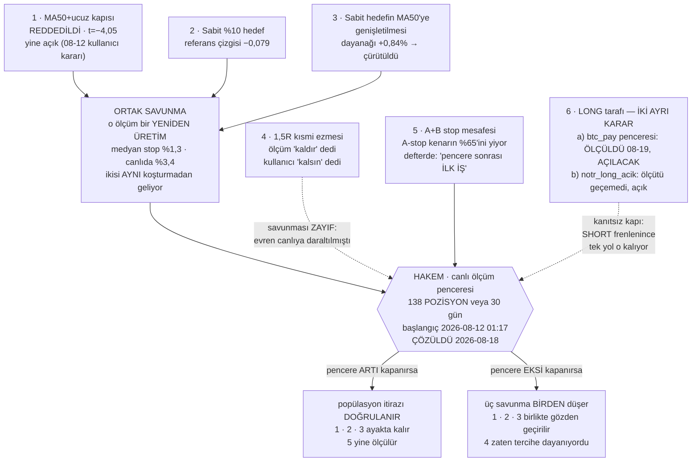

# Durum

Bu dosya **yavaş değişen** şeyleri tutar: kararlar, açık kapılar, bekleyen işler,
bilinen zayıflıklar. **Rakam tutmaz.**

> 🔴 **CANLI RAKAM BURADAN OKUNMAZ.** Kasa, açık pozisyon, PnL, fonlama — bunlar
> **7,5 dakikada bir** değişiyor. Bir kez yazılsa 7 dakika sonra yalan olur.
> Bu ders burada öğrenildi: 2026-08-17 sabahı yazılan rakamlar **aynı gün öğlen**
> bayattı (kasa 228 $ kaymış, 9 işlem geçmiş, bir pozisyon daha açılmıştı).
>
> **Kaynak `testbot_state.json`'dır.** Okumak için:
>
> ```bash
> python -c "import json; s=json.load(open('testbot_state.json',encoding='utf-8')); \
> print('kasa',round(s['equity'],2),'| efektif',s.get('efektif_equity'), \
> '| acik',len(s['acik_pozisyonlar']),'| funding',round(s.get('kumulatif_funding',0),2))"
> ```
>
> Son tur ve süre için `testbot_equity.jsonl`'in son satırı · dört defter için
> `golge_state.json` · `benim_state.json` · `ayna_state.json` · panel için
> `http://127.0.0.1:8787/`.

> Eski `memory/kripto-proje-durumu.md` **güncel değil** (son yazım 2026-08-03; hâlâ
> "Faz 4" ve 1000 $'lık testbot anlatıyor). Tarihsel kayıt olarak duruyor.

---

## Sabit çerçeve

| | |
|---|---|
| Çalışma biçimi | **kâğıt üstünde** — gerçek emir gönderen kod YOK |
| Yayın çıpası | **2026-08-11 12:48:31** — panel bundan sonrasını gösterir |
| 23 Temmuz dönemi | kasa sıfırlamasıyla kapatıldı (delta +1.005,94 $) |
| Süre sınırı | yok (`sure_gun = 0`) |
| Koruma | **düşüş freni** — zirveden %25 geri çekilirse yeni giriş durur, açık pozisyonlar yönetilmeye devam eder |
| Defterler | `testbot` (ölçünün temeli) · `golge` · `benim` · `ayna` — kırılım ve neden hüküm verilemediği `olcumler.md` → defterler |

> ❓ **AÇIK SORU — `benim` defteri dört gündür hareketsiz.** Son işlem 2026-08-13,
> N=6. **Bilinçli olarak mı bırakıldı, yoksa unutuldu mu — hiçbir dosyada yazmıyor.**
> N=6 ile hiçbir şey ölçülemez; dört defterin karar verilemeyecek tek olanı bu.
> Cevap yazılana kadar "çalışan dört defter" demek yanlış.

> ⚠️ **Gölge kasasına bakıp "bot iyi eliyor" DENMEZ.** Defter iki iş yapıyor:
> ~%68'i `pump_long_tezi` (hiç denenmemiş LONG tezi), ~%32'si reddedilen girişler.
> Kaybın büyük kısmı birinciden. Ayrıca gölge LONG ağırlıklı olduğu için fonlamayı
> **tahsil ediyor**, bot ödüyor → **iki kasa doğrudan kıyaslanamaz.**

## Açık kapılar

| kapı | ayar | not |
|---|---|---|
| A+B (funding ≤ −0,05 · oi24 ≥ %10 → SHORT) | **açık** | **ASKIDA** — kanıtlanamadı, çürütülmedi |
| MA50+ucuz (fiyat ≤ $0,07 · MA50 ≥ %3,72) | **açık** | **REDDEDİLDİ** ama kullanıcı kararıyla açık (08-12) |
| Sabit %10 hedef — **A+B *ve* MA50+ucuz** | açık | [testbot.py:1181](testbot.py#L1181) `SABIT_HEDEF_KAPILARI = ("A+B","MA50+ucuz")`. Kısmi kâr %40 payla, trailing kapalı. ⚠️ MA50'ye genişletmenin dayanağı **çürütüldü** — aşağıda madde 3 |
| 1,5R kısmi ezmesi | **açık** | ⚠️ ölçüm "kaldır" dedi, **kullanıcı KALSIN dedi** (08-12) — aşağıda |
| NÖTR LONG | açık | **ölçüm bunu desteklemiyor** — kaynak `fikir-defteri.md` s.1177: *"Ölçüm bunu desteklemiyor — kayda geçer."* 30 LONG hücresinin hiçbiri pozitif değil (s.1101) |
| Gölge LONG pump | açık | gölgede test, pencere dolmadı |
| NÖTR fade | **kapalı** | açıldığı gün ölçülüp kapatıldı |
| R/R kapısı | **kapalı** | ayırt etmiyordu |

## Zamanlı görevler

| görev | sıklık |
|---|---|
| KriptoTestBot | 7,5 dk · `ExecutionTimeLimit` **PT20M** |
| KriptoRadar | 15 dk |
| KriptoNobetci | 5 dk |
| KriptoIzleyici | 5 dk |
| KriptoPiyasa | günlük |

Bildirim: yalnız **giriş** olayı Telegram'a gider (`bildirim.olaylar = ["giris"]`).

---

## Bekleyen kararlar

> **ÖNCE BUNU OKU — 2026-08-12'de verilmiş bir karar var** (`fikir-defteri.md` s.2812).
> Ölçüm `MA50+ucuz`'u kapatmayı öneriyordu (2 yıl, üç rejim, 21.830 olay, t=−4,05).
> **Kullanıcı iki kapıyı da açık bırakmayı seçti.** Bilinçli bir karardı ve defterde
> *"kayda geçiyor ki pencere dolduğunda 'gözden kaçmış' sanılmasın"* diye yazılı.
> Gerekçe: o test bir **yeniden üretim** — medyan stop %1,3, canlıda %3,4. Ölçüm
> "kural geniş uygulanınca negatif" diyor, "canlı kapı negatif" demiyor.
> **Hakem canlı ölçüm penceresi** — tanım, taban (ÇÖZÜLDÜ 2026-08-18) ve sayım komutu aşağıdaki
> *"Üç karar tek hakeme bağlı"* bölümünde. Buraya sayı yazılmaz.

**1. A+B kapısı — nihai karar açık.** İki yıllık **fonlamalı** ölçüm "kapat" diyor
(kontrol sinyali geçti). Fonlamasız 2 yıllık ölçüm ise "kanıtlanamadı ama çürütülmedi"
diyordu (küme-dayanıklı t=+1,51). Canlı 16 işlemlik örnek "kapatmak %1,23 daha kötü
olurdu" diyor. Seçenekler: kapat (`ab_kapisi_acik: 0`) · fonlama-taban filtresi ekle
(ölçülebilir, veri elde) · pencere dolana kadar açık bırak.

**2. `MA50+ucuz` — çürütüldü ama açık, bilerek.** İki kapı **aynı statüde değil**:
A+B *askıda* (kanıtlanamadı, çürütülmedi), MA50+ucuz *reddedildi* (t=−4,05, üç rejimde
negatif). Aynı torbaya konmamalı. Fonlama yükü bu kapı için hiç hesaplanmadı — A+B'yi
bitiren hesap burada yapılmadı.

**3. 1,5R kısmi ezmesi — ölçüm "kaldır" dedi, kullanıcı "kalsın" dedi.** Karar
verilmiş, iş bitmiş; burada duruyor ki sonradan "gözden kaçmış" sanılmasın.

`kismi_pay = 0.40` ayarı fiilen çalışmıyor: [testbot.py:933](testbot.py#L933) her
turda yapısal TP1 ile 1,5×risk'ten **hangisi yakınsa** onu seçiyor (2026-07-04'ten
kalma). Ayrışma sınırı stop < %2,67; `asgari_stop_pct = %2,0` olduğu için bu dar bir
aralık değil — canlı girişlerin **%30'u** bu dilimde. Canlı kanıt: UMA'da stop %0,96
→ 1,5R = %1,43, %40 ayarını ezdi, yarısı **−%1,4'te** satıldı.

**Kullanıcı gerekçesi:** stop dar olduğunda kâr alma erken tetiklenir ve bu istenen
davranış. **Bedeli kayda geçti:** dar-stop diliminde işlem başına −0,016 sermaye,
`t_küme` −0,10 — yani gürültüden ayrışmıyor. Kanıt *"zararlı"* demiyor,
*"bedava değil"* diyor.

Geri dönmek gerekirse tek satır: `tp1_efektif_hesapla` çağrısını
`cikis_modu == "sabit_hedef"` pozisyonlarda atla. **`kismi_kar_r = 0` YAPMA** —
neden olmadığı `CLAUDE.md`'de yazılı (TP1 anında tetikleniyor).

### ⭐ ALTI İŞ TEK HAKEME BAĞLI — ayrı ayrı tartışılmasın



**Diyagramın söylediği tek şey:** 1, 2 ve 3 bağımsız kararlar değil — **aynı tek
savunmaya** yaslanıyorlar, çünkü 1 ve 2'nin −0,079'u **aynı koşturmadan** geliyor.
4 doğrudan hakeme bağlı ama savunması zayıf (evreni canlıya daraltılmıştı, yani
popülasyon itirazı orada geçerli değil). 5 bir savunma değil, pencereye kilitlenmiş
bir iş.

**Pratik sonuç: pencere dolunca altı ayrı tartışma değil, TEK tartışma yapılır.**

Yukarıdaki maddelerin **1, 2, 3'ü ve sabit %10 hedef** birbirinden bağımsız görünüyor.
Değil. Üçünün savunması **aynı tek argümana** yaslanıyor:

> *"O ölçüm bir yeniden üretim; popülasyonu canlıdan uzak — medyan stop %1,3,
> canlıda %3,4. Yani 'kural geniş uygulanınca negatif' diyor, 'canlı kapı negatif'
> demiyor."*

| ayar | ölçüm ne dedi | savunma |
|---|---|---|
| MA50+ucuz | −0,079 · t=−4,05 · üç rejimde negatif | popülasyon itirazı |
| Sabit %10 hedef | referans çizgisi −0,079 (s.2671) | **aynı koşturmadan** geliyor, aynı itiraz |
| 1,5R kısmi ezmesi | mevcut −0,011 vs kısmi yok +0,038 | kısmen — ama `kismi_15r.py` evreni canlıya **daraltılmıştı** (stop medyanı %3,27), yani burada metodolojik itiraz **zayıf**, karar tercihe dayanıyor |

**Hakem de aynı: canlı ölçüm penceresi.**

> ✅ **PENCERE BAŞLANGICI ÇÖZÜLDÜ [ÇÖZÜLDÜ 2026-08-18] — İKİ AYRI TABAN vardı,
> karıştırılmışlardı.** Defter tutarsız değildi; iki farklı soruya iki doğru cevap
> veriyordu ve ikisi tek soru sanılmıştı.
>
> | soru | taban | dayanağı |
> |---|---|---|
> | **Bot ne zaman başladı?** (muhasebe tabanı) | **2026-08-11 12:48** | Kullanıcının kendi kararı, `testbot_state.json` → `_kasa_sifirlama`: *"Eski bot (23 Tem – 11 Ağu 12:48)"*. Git: `34524ad` S9 12:46:24. Sayım: o tabandan **tam 12 pozisyon** hem açıldı hem kapandı = notun *"botun KENDİ 12 işlemi"* ifadesi |
> | **Hakem penceresi ne zaman başlıyor?** (parametre-kararlılık tabanı) | **2026-08-12 01:17** | Pencere kuralı *"parametre değişmez"* diyor. 12:48'den sonra **iki gerçek davranış değişikliği** var: `b5123b6` kısmi kâr (08-11 22:38) ve `0b3f3e3` cadence 10→7,5 dk (08-12 01:17). Son değişiklikten önce başlayan bir pencere kendi kuralını ihlal eder |
>
> **Eski üç aday (D/9 gereği silinmez):**
>
> | # | başlangıç | sebep | defter |
> |---|---|---|---|
> | 1 | 2026-08-11 12:45 | S9 yürürlüğe girdi | s.1807 |
> | 2 | 2026-08-11 18:42 | denetim düzeltmeleri | s.2510 |
> | 3 | **2026-08-12 ~01:17** | cadence 10 dk → 7,5 dk | s.2582 |
>
> **Kaydedilen "çelişki" neydi:** *"'12/138' yalnız 18:42 tabanıyla çıkıyor"* denmişti.
> **Yanlıştı** — o sayım yalnız *kapanan* işlemleri sayıyordu. Notun ifadesi *"botun
> **KENDİ** işlemi"*, yani **yeni botun kendi açtığı**. Doğru sayımla:
>
> | taban | pencerede kapanan | **açılıp kapanan** |
> |---|---|---|
> | 11 Ağu 12:45/12:48 | 13 | **12** ✅ |
> | 11 Ağu 18:42 | 12 | 9 |
> | 12 Ağu 01:17 | 9 | 5 |
>
> 18:42'nin "12"si **eski yapılandırmanın açtığı** pozisyonların kapanışlarını içerir —
> onlar tanımı gereği "botun kendi işlemi" değildir.
>
> **2 numaralı aday (18:42) düşer:** ne muhasebe tabanı (o 12:48), ne parametre-kararlılık
> tabanı (o 01:17). Denetim düzeltmeleri **bug onarımıydı** (D/8: tasarlanmış davranışı
> geri getiriyor), yeni bir pencere gerektirmiyordu.
>
> **Hüküm yazılırken kullanılacak taban: 2026-08-12 01:17.** Muhasebe tabanı (12:48)
> kasanın hangi bota ait olduğunu söyler, hakem penceresini değil.

| | |
|---|---|
| Bitiş ölçütü | **138 kapanmış POZİSYON VEYA 30 gün** — hangisi önce |
| GEÇTİ | toplam net > 0 **ve** ikinci yarı > 0 |
| KALDI | toplam net < 0 **ya da** fren tetiklendi |
| BELİRSİZ | toplam > 0 ama ikinci yarı < 0 → uzat |
| Pencere kuralı | **parametre değişmez, kapı eklenmez, eşik oynatılmaz** |

Sayım komutu — **taban 2026-08-12 01:17** (hakem penceresi):

```bash
python -c "import json; k=[json.loads(l) for l in open('testbot_islemler.jsonl',encoding='utf-8') if l.strip()]; ids={}; [ids.setdefault(x['id'],[]).append(x) for x in k]; print(len([i for i,v in ids.items() if any(not y.get('kismi') and y['ts']>='2026-08-12 01:17' for y in v)]),'/138 pozisyon')"
```

Rakam buraya **yazılmaz** — komut koşturulur. Muhasebe tabanını (2026-08-11 12:48)
merak eden aynı komutta tarihi değiştirir; ikisi **farklı soruların** cevabıdır.

> ⚠️ **İKİ KATLI SAYIM TUZAĞI — pencereyi vaktinden önce dolmuş ilan ettirir.**
> 1. **Yanlış taban:** muhasebe tabanından (12:48) sayarsan hakem penceresinden
>    **fazla** çıkar — hakem tabanı 01:17.
> 2. **Kayıt ≠ pozisyon:** kayıtların yaklaşık üçte biri `TP1_KISMI` — kısmi kâr
>    satırları pozisyonu bölüyor.
>
> İkisi birleşince *"pencere bugün doldu"* denir. `kismi` satırları **sayarken** her
> zaman düşülür, **toplarken düşülmez** (`CLAUDE.md` → süzgeç kuralı). Güncel sayı
> yukarıdaki komutla okunur, buraya yazılmaz.

> ⚠️ **Pencerenin ortasında kasa büyüdü — iki tarafı da yazıyorum, karar kullanıcının.**
>
> **2026-08-12 22:56'da** kasa sıfırlamasıyla equity'ye **+1.005,94 $** eklendi.
> Boyutlandırma efektif equity'yle ölçekleniyor ([testbot.py:1120](testbot.py#L1120)),
> yani **pencerenin ikinci yarısında yeni girişlerin boyutu büyüdü.**
>
> **Kararın kendi savunması** (`_kasa_sifirlama` kaydında yazılı): *"Ölçüm penceresi
> SIFIRLANMADI: getiri R ve yüzde ile ölçülüyor, hesap büyüklüğünden bağımsızdır.
> Açık 5 pozisyonun teminatı eski tabana göre hesaplanmıştı; onlar aynen devam eder,
> yalnız YENİ girişler büyür."* Bu savunma geçerli — R ve yüzde ölçek-bağımsızdır.
>
> **Kalan çekince:** dolar cinsinden toplam ve yarı-yarı kıyaslar ölçek-bağımsız
> **değil**; ikinci yarı daha büyük pozisyonlarla çalıştı. Ön-kayıtlı ölçüt
> *"ikinci yarı > 0"* diyor ve o kıyas dolar üzerinden yapılırsa etkilenir.
> **Hüküm yazılırken yarılar R ya da yüzde ile kıyaslanmalı**, dolarla değil.
>
> Buna karşılık **denetim düzeltmeleri ihlal DEĞİL** — 08-11 18:44'te, hakem
> tabanından (2026-08-12 01:17) **önce** girdiler. Aynı şekilde kısmi kâr (08-11 22:38)
> ve cadence (08-12 01:17) de tabandan önce ya da onunla eşzamanlı; pencere zaten
> **son davranış değişikliğinden** başlatıldığı için içeride parametre değişimi yok.

**Sonuç: tek bir çıktı ALTI işi birden çözer** — üç ayar kararı (MA50+ucuz · sabit %10
hedef · kısmen 1,5R) + A+B stop mesafesi yeniden ölçümü + sabit hedefin MA50'ye
genişletilmesi + **NOTR-belirsiz LONG kapısı** (2026-08-19 eklendi).

> ### 🟢 6a ÖLÇÜLDÜ (2026-08-19) — **KARAR: 21 Ağustos'ta kilit açılacak**
>
> `btc_pay` LONG penceresinin `AYI` kilidi **ölçümle sınandı ve haksız çıktı**: kenar
> `NOTR`'da da var ve aynı büyüklükte (**+0,306%** vs AYI **+0,344%**, iki-örneklemli
> **t=+3,13**, iki yarıda da pozitif). Dört ön-kayıtlı ölçütün dördü de geçti.
>
> 🔴 **AMA `BOGA`'da pencere ZARARLI: lift −2,043%, t=−9,95.** Yani kilit kaldırılmaz,
> **YERİ DEĞİŞİR:** `AYI` yerine **`BOGA` HARİÇ**. Bu, orijinal ölçümün kendi uyarısının
> (*"yükselen piyasada ilişki tersine dönebilir — ölçülmedi"*) doğrulanmasıdır.
>
> **Kullanıcı kararı (2026-08-19): 21 Ağustos'ta uygulanacak.** Ölçüm, sınırlar ve
> kümelenme uyarısı → `olcumler.md`. ⚠️ Uygulama **kapı değişikliğidir**, pencereyi
> etkiler.
>
> ### 6b hâlâ açık soru — `notr_long_acik`
>
> Soru *"LONG'u nasıl dengeleriz"* **DEĞİL**. `btc_pay` ölçümü LONG için de sonuç üretmişti (`UST + para durgun → LONG R
> +0,24/+0,16`, holdout) ama o kapı **AYI dalına gömülü**; şu an `bant=UST` ve
> `para=DURGUN` olduğu hâlde `rejim=NOTR` olduğu için erişilemiyor. Boşluğu **ölçülmemiş**
> `notr_long_acik` dolduruyor → 3 işlem, −450 $. Yani **elde güçlü kanıt varken zayıf
> kanıtla işlem açılıyor.** Doğru soru: *"kanıtsız kapıyı neden açık tutuyoruz?"*
> Ayrıntı ve asimetri tablosu `olcumler.md`. Pencere eksi kapanırsa savunmalar birden düşer; artı kapanırsa popülasyon
itirazı doğrulanır. **Pencere dolduğunda bunları ayrı ayrı tartışma** — aynı sorunun
altı yüzü.

**Aynı pencereye bağlı BEŞİNCİ iş — dayanağı çürütülmüş bir genişletme:**
**Sabit %10 hedefin `MA50+ucuz`'a genişletilmesi.** 08-10 kararı *"A+B'ye özel, diğer
dallar mevcut kısmi+trailing ile kalır"* idi (s.1249). 08-11'de MA50+ucuz da kapsama
alındı ve gerekçe koda yazıldı ([testbot.py:1179](testbot.py#L1179)):
*"ölçümü de %10 hedefle yapıldı (net **+0,84%**, A +0,99 / B +0,72)."*

**O +0,84%, ertesi gün 2 yıllık veride −0,079 · t=−4,05 ile çürütülen ölçümün ta
kendisi** (s.2790). Yani genişletmenin dayanağı çürük ve **bunu şimdiye kadar kimse
bağlamamış.** Pencere sonrası A+B kararıyla **birlikte** gözden geçirilmeli — ayrı
tartışılırsa aynı çürütülmüş ölçüme iki kez dayanılır.

**Aynı pencereye bağlı DÖRDÜNCÜ iş — ve defterde "ilk iş" diye yazılı:**
**A+B'nin stop mesafesi yeniden ölçülecek.** Ölü sinyal taraması A+B'nin ham
kenarının **%65'ini kendi A-stopumuzun yediğini** buldu (+6,10 → +2,14); MA50+ucuz'da
aynı kayıp **%0**. Defterin sözü: *"Pencere kuralı gereği ŞİMDİ UYGULANMAZ
(138 işlem / 30 gün dolana kadar parametre donuk). Pencere sonrası ilk iş bu."*
Ayrıntı ve tablo `olcumler.md` → *"A+B'nin ham kenarının %65'i"*.

Uyarı: 1,5R'nin savunması diğer ikisinden **zayıf.** Onu popülasyon itirazına
yaslamak yanlış olur; o karar açıkça bir tercihti ve bedeli kayıtlı (−0,016/işlem).

**4. `golge.py`'nin `kaydet`'i hâlâ atomik değil** — 2026-08-11'de defteri 314 $
saptıran çift kaydın kök nedeni. `ayna.py` ve `izleyici.py` ilk günden atomik yazıyor;
aynı desen kopyalanacak. Onarım önerildi, uygulanmadı.

⚠️ **2026-08-17'de AĞIRLAŞTI.** Gölge pozisyonları artık `funding_toplam` ve
`funding_yazilan` sayaçlarını taşıyor ve bu sayaçlar **yalnız state'te** yaşıyor —
işlem defterinde karşılıkları yok. Yırtık bir yazım artık sadece equity'yi değil,
**toplamı tutmayan fonlama dilimleri** üretebilir: `funding_yazilan` geri sararsa
aynı dilim iki kez yazılır, ileri kalırsa dilim kaybolur. Fonlama ölçümü gölge
defteri kapsayacaksa bu onarım **önce** yapılmalı.

**5. `ayna` dört defterin git'te izlenen TEK'i — muhtemelen gözden kaçmış.**
`ayna_state.json` · `ayna_islemler.jsonl` · `ayna_equity.jsonl` izleniyor;
`testbot_*` ve diğerleri `.gitignore`'da. **Şimdi karar verilmedi.** Diğerleri gibi
yok sayılacaksa `git rm --cached` gerekir **ve geçmişteki anlık görüntüler yine
kalır** → ilk push öncesi git geçmişi temizliğiyle (madde 6) **birlikte**
düşünülmeli. Not: izlenmesinin bir faydası çıktı — 2026-08-18'deki elle defter
düzeltmesinin tek kalıcı denetim izi git geçmişi oldu (yedek dosyaları
`*.jsonl.yedek-*` deseniyle gitignore'da).

**6. Git geçmişi temizliği** — ilk push'tan önce zorunlu (geçmişte ~920 MB veri).
Depo bugüne kadar hiç push edilmedi.

## Zamana bağlı — ~27 Ağustos

**`d_taker` ölçümü.** İzleyici 2026-08-13 akşamından beri dakika çözünürlüklü
hacim/agresör topluyor (`taker_15`, `taker_60`, `d_taker`, `hacim_x`). Bu veri
**geriye dönük üretilemez**, canlı birikmeli. Birkaç yüz satır olunca ön-kayıtlı
ölçüm yapılacak.

Önem: bugüne kadar ölçülen her şey **seviye** idi ve "erken fiyat hareketinin başka
bir ifadesi" çıktı. `d_taker` **değişim** ölçen ilk sütun.

**Pozisyon başına fonlama** (2026-08-17 eklendi). Aynı sınıf: geri üretilemez veri.
İşlem kaydına `funding_usdt` alanı eklendi; artık "hangi pozisyon ne kadar fonlama
ödedi" sorulabiliyor. **Bu tarihten önce açılmış pozisyonlar için cevap kalıcı
olarak yok.** Alanın tanımı, `null`/`0.0` ayrımı ve süzgeç → **`CLAUDE.md`**.

- **Neden pencere içinde yapıldı:** D/8 ölçütü — *"bu değişiklik botun hangi işlemi
  açacağını değiştiriyor mu?"* Hayır; sayaç ve kayıt alanı, karar dalına dokunmuyor.
  Bug-fix sınıfı, pencereyi beklemesi gerekmiyor.
- **Neden eski pozisyonlara sayaç TAKILMADI:** girişten bugüne kadarki fonlamaları
  kayıp; şimdi biriktirmeye başlasak **yarım ama tam görünen** bir sayı çıkardı.
- **Ne açıyor:** kapı × fonlama kırılımı (`MA50+ucuz` fonlama yükü artık backtest'e
  muhtaç değil), tutuş süresi × fonlama canlı doğrulaması, fonlamalı gerçek R.
- Doğrulama: `scratchpad/funding_pozisyon_testi.py` — 15 kontrol, diske yazım YOK.

## 🔴🔴 FREN — 2026-08-19'da ÜÇ KEZ DEĞİŞTİ (hepsi KULLANICI KARARI)

> **`esikler.btc_pay_short_freni`.** Config `.gitignore`'da olduğu için bu
> değişikliklerin **git izi YOK** — tek kalıcı kaydı burası ve config içindeki
> `_btc_pay_short_freni_not` alanı (üç kararı da sırayla taşır).
> **Geri alma:** o alanı `1` yap.

| saat | değişiklik | gerekçe (özet) | yedek |
|---|---|---|---|
| 13:44 | 1 → **0** | ölçüm akışı; 2 gündür SHORT girişi yoktu | `...yedek-20260819-134420` |
| 19:30 | 0 → **1** | ölçüm eşit ağırlıkta değil + frenlenen 13 aday −1,198% | `...yedek-20260819-192809` |
| 21:40 | 1 → **0** | ölçüm süreci frenin kararına bağlı kalmasın | `...yedek-20260819-214013` |

⚠️ **19:30 geri açma bu dosyaya 21:40'a kadar İŞLENMEMİŞTİ.** Yani `durum.md` iki
saat boyunca frenin kapalı olduğunu söylerken fren açıktı. Kaydedilmemiş indeks
yalan söyler — bu maddenin kendisi o kuralın kanıtı.

**Kullanıcının gerekçesi:** *"8 gündür fren açıktı ve bot poza giriyordu, devam etsin;
2 gün içinde oluşan pozlardan doğru sonuç çıkmaz."* Öncül **doğrulandı** — 7-17 Ağustos
arası **11 gün** fren hiç devreye girmedi; 18-19'da açıldı ve SHORT girişi sıfırlandı.

### ⚠️ BU BİR ÖLÇÜM PENCERESİ İHLALİDİR — hüküm yazan bunu okumak zorunda

Pencere kuralı: *"parametre değişmez, kapı eklenmez, eşik oynatılmaz."* Kural seti
**92 pozisyonda** değişti. Kullanıcıya üç seçenek sunuldu (sıfırla / devam / vazgeç);
**"pencereyi DEVAM ettir" seçildi.**

**[DEĞİŞTİ 2026-08-19 — D/9, eski ölçüt SİLİNMEDİ]** Pencere artık **tek sayı olarak
raporlanamaz.** Hüküm yazılırken iki dönem **ayrı** verilir:

```
12 Agu 01:17 - 19 Agu 13:44   FRENLI    (92 pozisyon)
19 Agu 13:44 - 19 Agu 19:30   FRENSIZ   (5 sa 46 dk, 4 SHORT, realize+acik -46,22)
19 Agu 19:30 - 19 Agu 21:40   FRENLI    (2 sa 10 dk, 14 aday vetolandi)
19 Agu 21:40 - pencere sonu   FRENSIZ   (yeni)
```

**Pencere artık DÖRT dilim taşıyor.** Hüküm yazan bu dilimleri ayrı raporlamak
zorundadır; tek sayı üretmek dört farklı kural setini toplamaktır.

Ön-kayıtlı *"toplam net > 0 **ve** ikinci yarı > 0"* ölçütü bu yüzden **belirsiz** hâle
geldi: "ikinci yarı" artık farklı bir botu ölçüyor. Ölçüt metni değiştirilmedi, ama
**uygulanabilirliği tartışmalı** — 21-22 tartışmasının ilk maddesi bu olmalı.

### ⚠️ Ölçüm frenin HAKLI olduğunu söylüyordu

2026-08-19'da frenlenen 13 aday ileri oynatıldı: **ortalama −1,198%, 9'u STOP**
(`olcumler.md`). Yani fren kapatmak **kaybettiren işlemleri açar.** Kullanıcı bunu
bilerek seçti; gerekçesi kâr değil **ölçüm akışı**.

Ayrıca `btc_pay`, projenin **tek gerçek out-of-sample sinyali** (12 ay · 37.271 gözlem ·
saklı dönem +0,46). **SHORT bacağı şu an devre dışı; LONG bacağı (AYI kolu) dokunulmadı.**

### Fren GERÇEKTEN gecikmeli mi? — ölçüldü (2026-08-19, `scratchpad/fren_gecikme.py`)

Üçüncü değişikliğin gerekçesi *"fren gecikmeli çalışıyor"* idi. 380 günlük
`btc_pay_log` üzerinde tanımsal çözümleme yapıldı — **önerme desteklenmedi:**

| soru | bulgu |
|---|---|
| UST günleri neyle tetikleniyor | **%44,7 bugünün kendi hareketi** · %25,5 dün · %29,8 iki gün önce |
| fren bırakırken ne oluyor | **%83,6 gerçek düşüş** · %16,4 referans yürümesi |
| UST serisinin ömrü | medyan **1 gün** · ortalama 1,7 · en uzun 4 |
| kalibrasyon | UST günleri %24,9 — tasarım %25, **doğru** |

**Gecikme genel değil, BU seriye özgü:** 19 Ağustos'un 3 günlük değişimi +0,4048'in
+0,3022'si 18 Ağustos adımından taşınıyor, günün kendi adımı yalnız +0,0658.

Karar bu bulguya **rağmen** alındı; kullanıcının ikinci gerekçesi (*ölçüm penceresi,
rejimde sınanmamış bir kapının kararına bağlı kalmasın*) bu ölçümden bağımsızdır.

### ✅ Frenin kendi sınırı ÖLÇÜLDÜ (2026-08-19 gece, ön-kayıt `43d2cf5`)

**Sonuç `olcumler.md`'de.** Karar açısından üç madde:

1. **Fren AYI ve NOTR'da GERÇEK.** Ay-kümeli, üç tohumda, baskın ay atılarak
   sınandı; ayakta kaldı (t −2,7 … −4,0).
   ⚠️ **[KAPSAM DARALDI 2026-08-19 gece]** Buraya önce *"şu anki rejim NOTR, yani
   ölçüm frenin şimdi çalışması gerektiğini söylüyor"* yazılmıştı — **fazla ileri
   gitmiş.** BTC'nin 3 günlük getirisi bugün **+8,95%**, bu NOTR gözlemlerinin
   **%99,3 dilimi**. O kuyrukta ölçüm **susuyor** (ham işaret dönüyor, ay-kümeli
   t=−0,79, 9 ay). Doğrusu: **NOTR ortalamasında fren desteklenir; bugünkü keskin
   hareket bölgesinde hüküm yoktur.** Ayrıntı `olcumler.md`. Fren 21:40'ta kapatıldı
   ve bu karar **ölçümle çelişmiyor.**
2. **Frenin BOĞA'da zararlı olduğu iddiası GÜRÜLTÜ.** Ham ölçüt geçti, karıştırıcı
   kontrolü çürüttü (tamamı tek aydan, 2024-12). Ön-kaydın *belirsiz* dalı
   uygulandı: **rejim sınırlaması önerilmiyor.**
3. 🔴 **BUGÜN SABAHKİ LONG KARARININ DAYANAĞI ÇÖKTÜ** → aşağıdaki maddeye bak.

### 🔴 YENİDEN AÇILDI — "21 Ağustos'ta btc_pay LONG kilidi açılacak" kararı

**Bu karar bugün sabah alındı**, dayanağı LONG/NOTR lifti **+0,306% (t=+3,13)** idi.
Aynı akşam ay-kümeli bakışla sınandı: **t = +0,36 / −0,10 / +0,02** (üç tohum) —
**saf gürültü.** Ham lift bile tohuma göre +0,306 → +0,098 → +0,080 oynuyor.

**Kararın "BOĞA HARİÇ" niteleyicisi doğruydu** (LONG BOĞA'da zararlı, t −2,2…−3,0
ayakta). **"AÇ" kısmının dayanağı yok.** 21-22 tartışmasına *karar* olarak değil
**yeniden açık soru** olarak gidiyor.

**Genel ders:** `btc_pay`'in **SHORT bacağı gerçek, LONG bacağı değil.** Aynı vekil,
aynı mekanik, aynı tohumlar — biri görünüyor, diğeri görünmüyor.

⚠️ İki kusur `olcumler.md`'de itiraf edildi: ön-kayıtta **kümelenmiş t** yerine
iki-örnekli t belirtilmişti, ve faz kaydırma **tekrarlanabilir değil**
(`random.seed` modül düzeyinde). Ay-kümeli hükümler üç tohumda kararlı; ham
gözlem-t değil.

### Fren kendiliğinden ne zaman düşecekti

**21 Ağustos.** `btc_d_xs` 17→18 Ağustos'ta tek günde +0,3022 sıçradı; sıçrama 3 günlük
pencereden 21'inde çıkıyordu. Yani ihlal **2 günlük** bir bekleme yerine yapıldı.

Kontrol komutu (rakam buraya yazılmaz, okunur):

```bash
python -c "import json,datetime; r=[json.loads(l) for l in open('btc_pay_log.jsonl',encoding='utf-8') if l.strip()]; d={x['gun']:x['btc_d_xs'] for x in r}; g=r[-1]['gun']; v=r[-1]['btc_d_xs']; ref=(datetime.date.fromisoformat(g)-datetime.timedelta(days=3)).isoformat(); print(g, round(v,4), 'degisim', round(v-d.get(ref,v),4), '-> UST(fren bandi)' if v-d.get(ref,v)>=0.287 else '-> serbest')"
```

## ~~🔴 BTC-pay SHORT freni AÇIK (2026-08-18'den beri)~~ [KAPATILDI 2026-08-19]

**Eski durum (kayıt için korundu):** SHORT girişi kapalıydı; bot yalnız
`NOTR-belirsiz long` kapısından girebiliyordu.

**Ne zaman kalkar:** fren *seviyeye* değil **3 günlük değişime** bakar. `btc_d_xs`
17→18 Ağustos'ta tek günde **+0,3022** sıçradı; sıçrama 3 günlük pencerede kaldığı
sürece fren açık. **21 Ağustos'ta referans noktası 18 Ağustos olur** → sıçrama
pencereden çıkar → fren düşer. Koşul: `btc_d_xs` bugünkü seviyesinde kalırsa
(BTC pay kazanmaya devam ederse fren sürer).

Kontrol komutu (rakam buraya yazılmaz, okunur):

```bash
python -c "import json,datetime; r=[json.loads(l) for l in open('btc_pay_log.jsonl',encoding='utf-8') if l.strip()]; d={x['gun']:x['btc_d_xs'] for x in r}; g=r[-1]['gun']; v=r[-1]['btc_d_xs']; ref=(datetime.date.fromisoformat(g)-datetime.timedelta(days=3)).isoformat(); print(g, round(v,4), 'degisim', round(v-d.get(ref,v),4), '-> FREN' if v-d.get(ref,v)>=0.287 else '-> SERBEST')"
```

**Ölçüldü — fren DOĞRU çalışıyor:** frenlenen 13 aday ileri oynatıldı, ortalama
**−1,198%**, 9'u stop. Kapıyı gevşetmek o işlemleri almak demek. Ayrıntı ve uyarılar
`olcumler.md`.

**KARAR (2026-08-19): hiçbir şey değiştirilmedi.** Gerekçe: (a) fren ölçümle haklı,
(b) pencere hâlâ artıda, (c) parametre değişikliği pencereyi sıfırlar ve **92
pozisyonluk kanıt** ile altı işin hakemi kaybolur, (d) fren iki gün içinde
kendiliğinden kalkıyor.

## Canlıya geçmeden

Tam liste: `memory/canliya-gecis-kontrol-listesi.md` — kullanıcı hatırlatılmasını
açıkça istedi. Beş madde: `d_taker` ölçümü · fonlamanın canlı doğrulaması · A+B
kararı · MA50 fonlama yükü · gölge atomik kayıt.

---

## Bilinen zayıflık

**⚠️ İKİ `panel_sunucu.py` süreci koşuyor** (2026-08-18'de görüldü): PID 17776
(14 Ağu 00:40) ve PID 29304 (15 Ağu 11:24). İkisi de aynı portu dinleyemez, yani
biri muhtemelen ölü ya da çakışıyor — **ayrı bir soru, araştırılmalı.**

> **Çözerken ÖNCE şunu kaydet: hangi PID gerçekten portu dinliyor?** O bilgi olmadan
> hangisinin öldürüleceği **tahmin** olur.
> ```powershell
> Get-NetTCPConnection -LocalPort 8787 -State Listen |
>   Select-Object LocalPort, OwningProcess
> ```
> **ÖLÇÜLDÜ 2026-08-18** — yanlışı öldürme:
> ```
> PID 29304 (15 Ağu 11:24)  ← 127.0.0.1:8787'yi DİNLİYOR, canlı olan bu
> PID 17776 (14 Ağu 00:40)  ← dinlemiyor, ÖLÜ olan bu
> ```
> Yeniden başlatma panele keep-alive'ı da getirir → iki işi birleştirmek mantıklı.
> Ama **ölçüm penceresi kapanana kadar bekleyebilir**; panel ölçümün parçası değil.

İkinci sonucu: her ikisi de `evren.py`'yi 14/15 Ağustos'ta yükledi, yani panel hâlâ
**eski `get`'i** kullanıyor; keep-alive'ı yeniden başlatılana kadar almayacak.
Gerileme değil (eski davranış korunuyor) ama `keepalive_testi.py`'nin *"panel deseni"*
maddesi **üretimde henüz koşmuyor** — testte geçti, canlıda doğrulanmadı.
Aynı sınıf: `CLAUDE.md` → *"tur ortasında yapılan kod değişikliği o turu etkilemez"*,
uzun ömürlü süreçlerde bu **süreç ömrü boyunca** sürer.

**İnternet/uyku kesintisi.** 13–16 Ağustos arasında toplam **~10 saat** veri akmadı
(en uzunu 124 dk). Makine uyandığında:

- **Dakika verisi geri geliyor** — izleyici son gördüğü bardan devam ediyor, sapma
  1–2 dk (yalnız oluşmakta olan dakika)
- **Bot stop/TP'yi doğru yakalıyor** — geçmiş mumları geri oynatıp stop fiyatından
  kapatıyor
- **Radar kareleri geri GELMİYOR** — noktasal veri (score, funding, oi, comp).
  Kayıp **önlenemez**, ama 2026-08-17'den beri **işaretleniyor**: radar her turda
  önceki arşiv damgasıyla arasındaki boşluğu ölçüyor, eşiği (2× tur = 30 dk) aşarsa
  `radar_bosluk.jsonl`'e kayıt düşüyor. Ayrı dosya — arşive karıştırılırsa onunla
  yapılmış tüm eski ölçümler geçersizleşirdi (`testbot.py:267` ilkesi).
  **Ölçülmüş kayıp oranları ve dönem kırılımı → `olcumler.md`.**

`kesilen_tur` — bitmeden öldürülen tur sayacı; `testbot_state.json`'da yaşıyor, **artar**
(17 Ağustos öğlen: 9). Tur süresi 08-14'ten beri equity satırında ölçülüyor
(`sure_sn`, `sure_yonet`, `sure_giris`, `verisiz_poz`).

**Tur süresi.** ⚠️ *"Yavaşlık tamamen dış kaynaklı"* diye yazılıydı — **2026-08-17'de
çürütüldü.** Ölçüldü: [evren.py:54](evren.py#L54) her çağrıda yeni bağlantı açıyor
(düz `urlopen`, keep-alive yok); günde ~72.000 TCP+TLS el sıkışması. Keep-alive
medyan çağrıyı 2,1 kat, medyan turu **298 → ~145 sn** indiriyor. Yavaşlığın yarısı
**bizim**. Rakamlar ve rate-limit bütçesi → `olcumler.md` "ağ çağrısı bütçesi".

## 🔴 ÖLÇÜM YÖNTEMİNDE KUSUR BULUNDU VE DÜZELTİLDİ (2026-08-20)

**Nasıl çıktı:** kullanıcı sordu — *"bu ölçümlerin doğruluğuna güvenmemi
gerektirecek sebep ne?"* Haklı çıktı.

**Kanıt:** aynı 117 işlem, ölçüm mekaniğiyle **−2.400 $**; botun gerçek sonucu
**−489 $**. Ölçümler botu değil **başka bir sistemi** tarif ediyordu.

**Kök sebep:** `CLAUDE.md`'nin *ham getiri → mekanik → portföy* sırası atlandı.
Kural yazılıydı; eksik olan **sınamaydı**. Sınama artık `CLAUDE.md`'de:
*karşılaştırılan hücrelerde stop genişliği eşit mi?*

### Karara etkisi — üç grup

| grup | durum |
|---|---|
| `chg24` bant hükümleri | **DÜZELTİLDİ** — `>40 LONG` yanlış öldürülmüştü; `0..20 SHORT` hükmü kaldırıldı. Ayrıntı `olcumler.md` |
| `btc_pay` hükümleri (dün gece) | ✅ **DENETİMDEN GEÇTİ** — hücreler oynaklıkta yalnız 1,2 kat ayrışıyor, ham getiri üç rejimde de aynı işaret. Tek düzeltme: *"BOĞA'da gürültü"* → **"aynı yönde ama zayıf"** |
| Canlı defter analizleri | ✅ **etkilenmedi** — gerçek sonuçlar kullanıldı, replay değil |

### Ortaya çıkan asıl soru — 21-22 tartışmasına

**Stop, sinyalin üçte ikisini yiyor.** Ölçüldü (`olcumler.md`): stop 1,5 ATR
uzakta, 72 saatlik ufkun doğal menzilinin **%17,7'si**; işlemlerin **%15,1'i**
kazanacakken stopla ölüyor ve bunların **%64'ü ilk 6 saatte**.

Proje 30 çıkış varyantı denedi, hepsi **hedef** ve **kısmi kâr** tarafındaydı.
**Stopun kendisi hiç sorgulanmadı.** Bu, altı bağlı işin yanına yedinci olarak
gidiyor — **karar değil, açık soru.**
